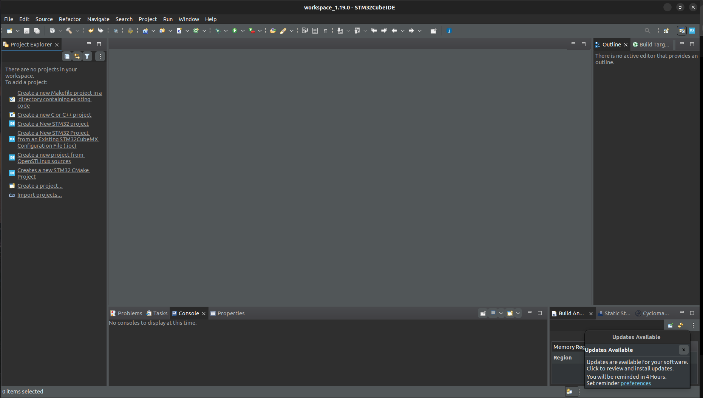
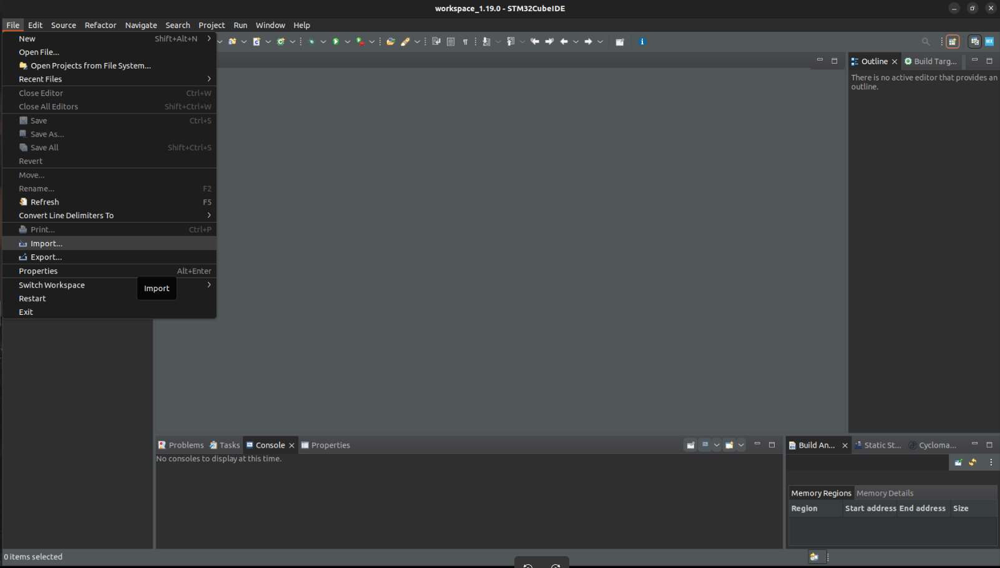
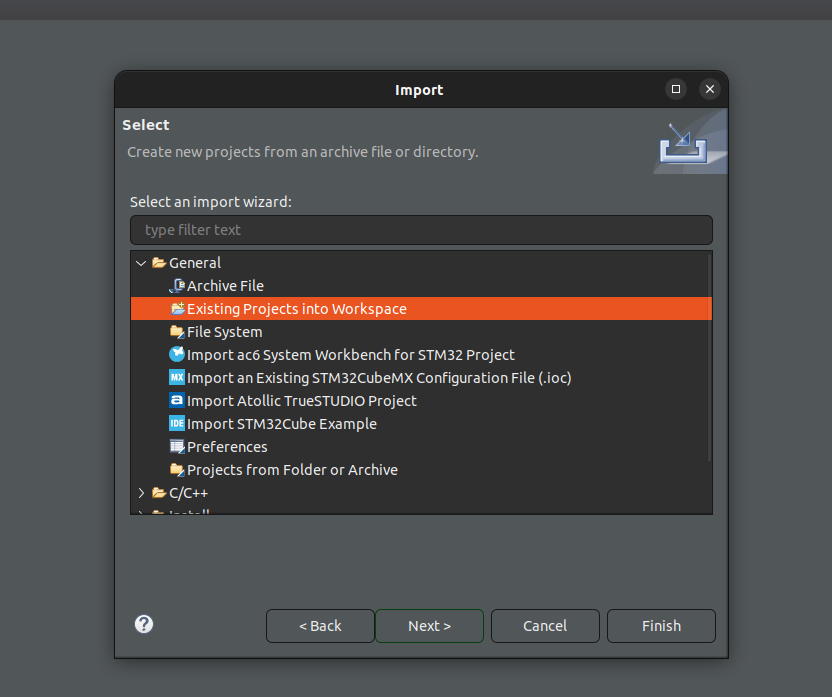
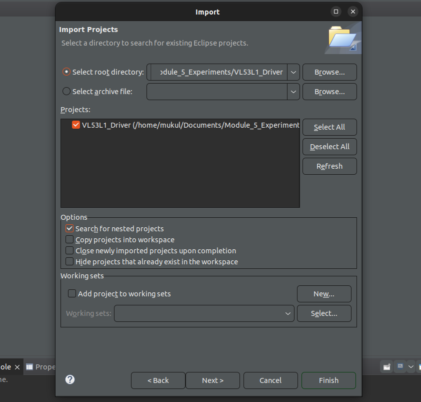
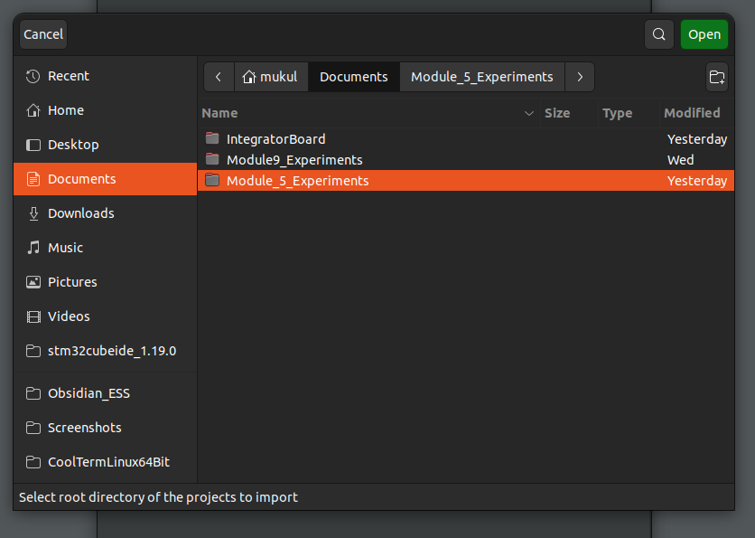
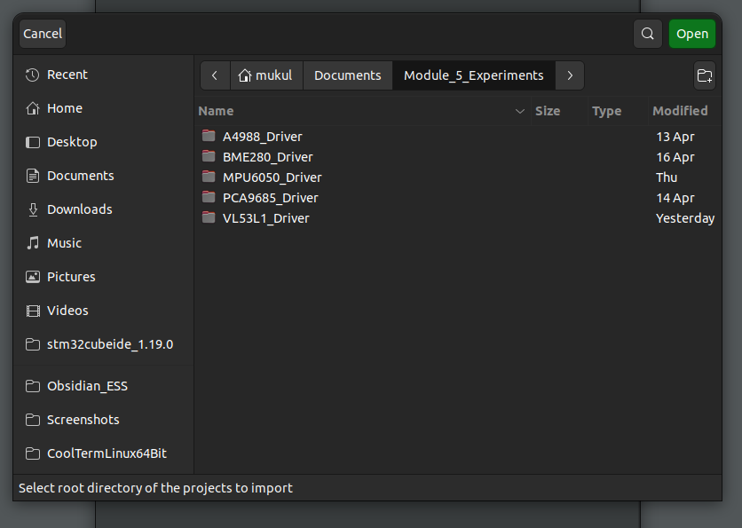
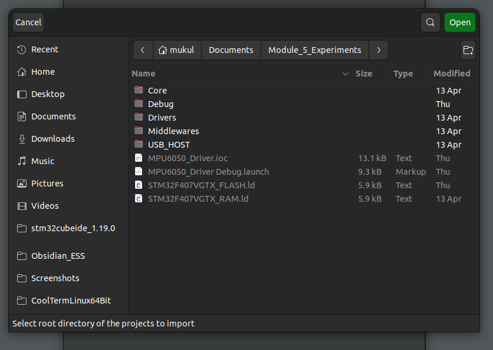
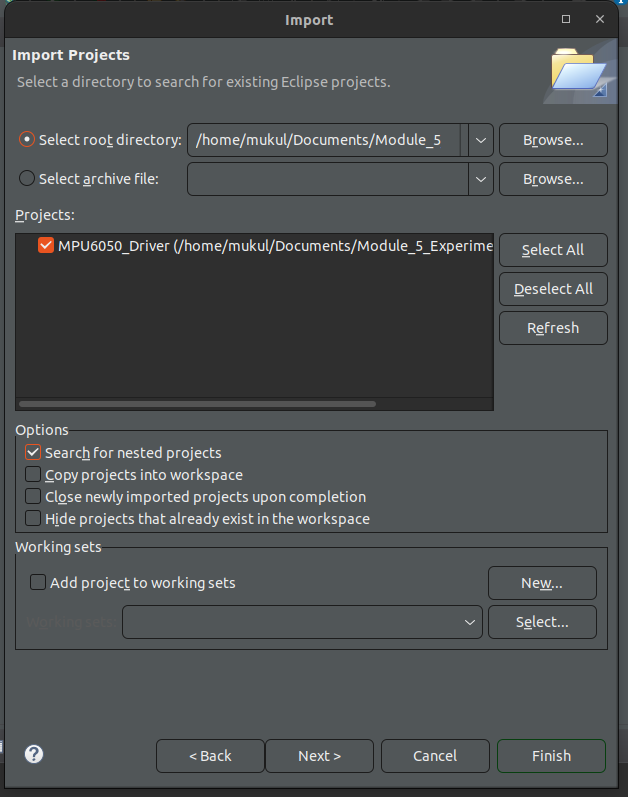
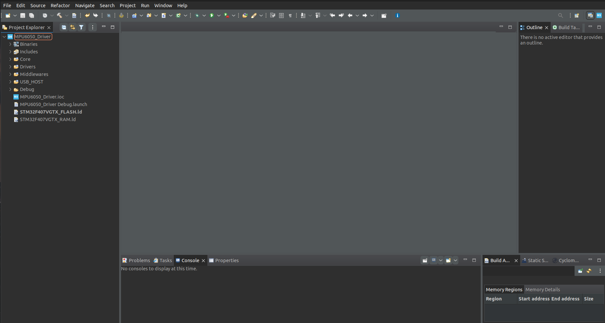

Throughout this course, you'll encounter many embedded projects running on my STM32 Discovery Board, and you have the option to follow along in your own workspace. 
In some of the modules, I'll provide my STM32 project files -- packaged as a zip.

In this guide, I'll tell you how to correctly import my project files into your own workspace. 
In an upcoming chapter, I'll tell you how to install and run the STM32CubeIDE. Keep this guide in mind when that time comes. 

### 01. Here's the Landing Page of the IDE

### 02. Click on the Import Button as Shown.

### 03. Click on this Option

### 04. Select the "Root Directory" Bullet, and Click on Browse

### 05. Navigate through your file system to the project You wish to import. Ensure the contents of the .zip have been extracted. 

### 06. Navigate to where a .ioc is present. Click on open. 

### 07. Click on "Finish"

### 08. Done! The project is now part of your workspace. Take a look at the .ioc file to ensure it matches the experiment you're reading. 

---