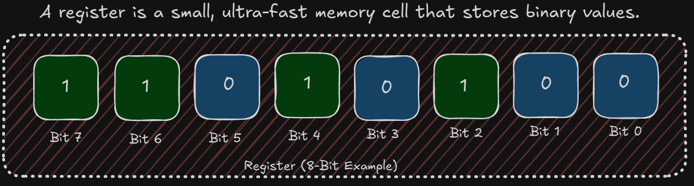
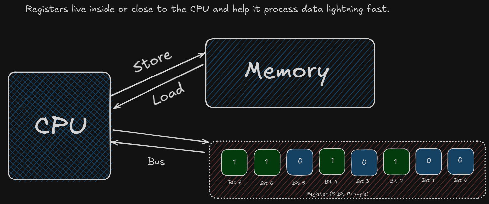
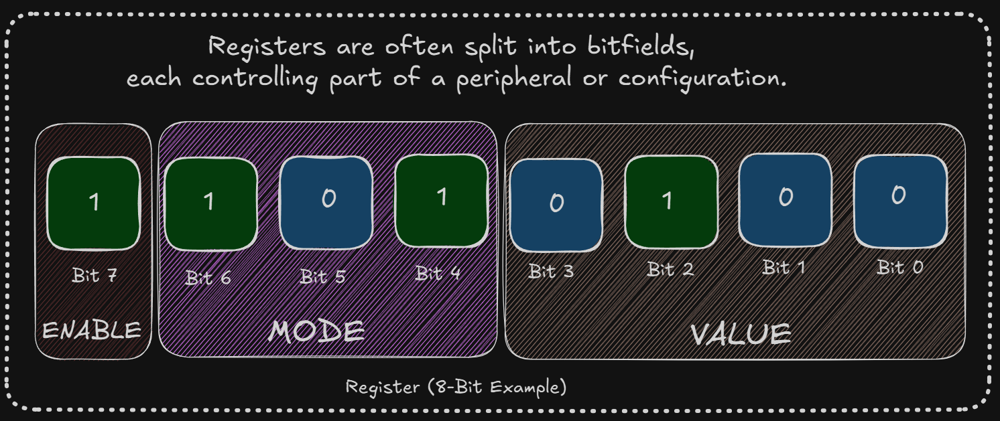
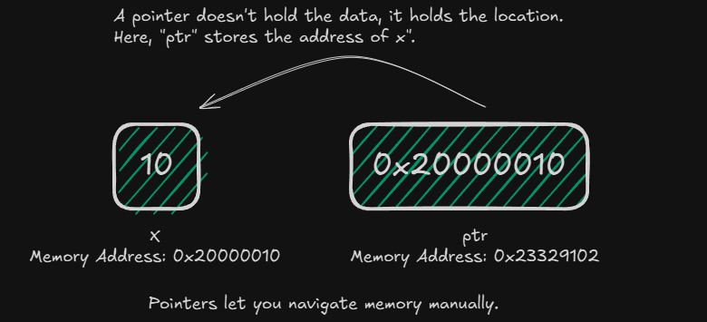
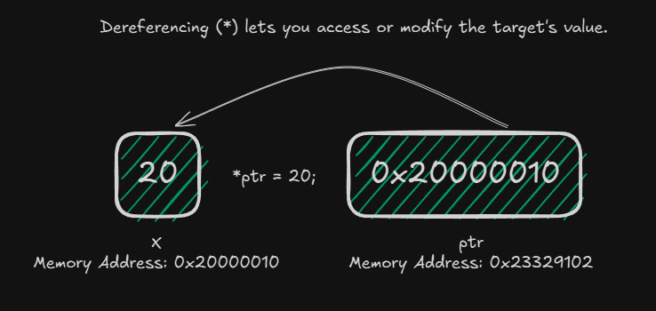
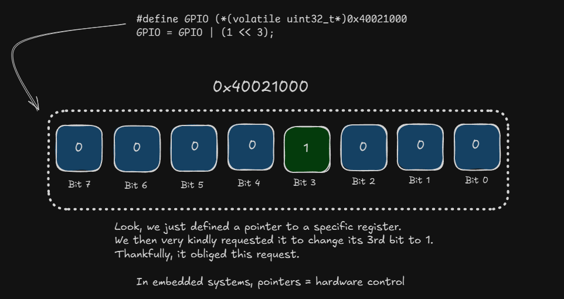
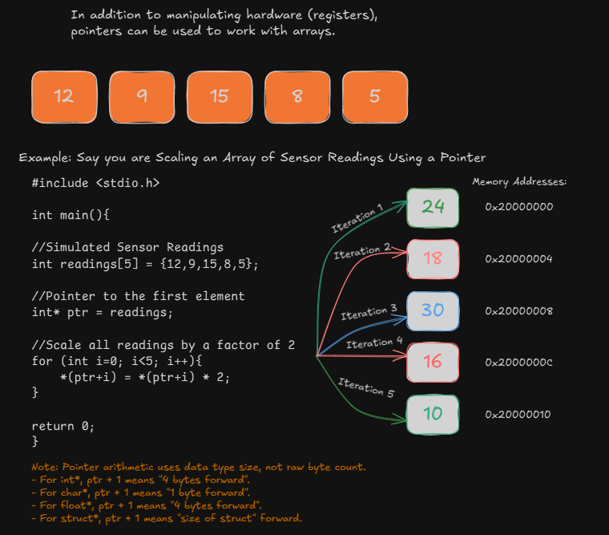

<h3>Navigation Menu</h3>
<ul>
<li><a href="Learning%20Outcomes.md">Learning Outcomes</a></li>
  <li><a href="P1_WhatIsBareMetalProgramming.md">P1_WhatIsBareMetalProgramming</a></li>
  <li><a href="P2_AnatomyOfAMicrocontroller.md">P2_AnatomyOfAMicrocontroller</a></li>
  <li><a href="P3_Registers&MemoryMap.md">P3_Registers&MemoryMap</a></li>
  <li><a href="P4_Datasheets&RefManuals.md">P4_Datasheets&RefManuals</a></li>
  <li><a href="P5_ToolchainOverview.md">P5_ToolchainOverview</a></li>
  <li><a href="CodeExamples.md">CodeExamples</a></li>
</ul>

### Skip to Module 2:  <a href="Module_2/Learning%20Outcomes.md">Module 2 - Learning Outcomes</a>

---

# PART 1: What is Bare-Metal Programming?

When you write **bare-metal code**, you're writing software that runs directly on the hardware—no operating system, no abstraction layers. It's as close to the metal as you can get.

Most developers begin their embedded journey with Arduino or similar platforms. These frameworks are great for quick prototyping, but they hide many details that are essential for real-world embedded systems engineering.

Bare-metal programming forces you to understand the internal architecture of microcontrollers: registers, memory layout, peripheral configuration, and timing.

---

## Why Should We Care About Bare-Metal Programming?

- **Full control over the hardware**
- **Better performance and predictability**
- **Essential for safety-critical or resource-constrained systems** (robotics, for example)
- **Makes you a better embedded engineer overall**

| Feature         | Arduino Framework                                 | Bare-Metal                          |
|-----------------|---------------------------------------------------|-------------------------------------|
| Abstraction Level | High (easy-to-use functions like `digitalWrite`) | Low (direct register access)        |
| Portability     | High                                              | Low                                 |
| Performance     | Moderate                                          | High                                |
| Control         | Limited                                           | Full                                |
| Debugging       | Simplified                                        | Manual and precise                  |
| Dependencies    | Arduino core libraries                            | None (except startup/runtime code)  |

## What’s Going On Inside the Arduino When You Blink an LED?

### 1. The Microcontroller Doesn’t Know What an LED Is

At its core, a microcontroller (MCU) is just a tiny computer with:
- A CPU
- Memory (RAM and Flash)
- A bunch of electrical input/output pins

It doesn’t "understand" what an LED is or even that you're trying to turn something on or off. All it can do is control voltages on specific pins.

---

### 2. You Select a Pin (GPIO) and Tell It to Output a Voltage

LEDs are usually connected to a GPIO (General-Purpose Input/Output) pin. You have to:
- Enable the GPIO peripheral (usually through a peripheral clock register)
- Set the pin mode to "output"
- Drive the pin "high" (voltage) or "low" (no voltage)

Think of it like flipping a light switch — except you’re doing it by writing values into memory-mapped registers.

---

### 3. You’re Writing to a Register That Controls That Pin

The microcontroller has registers (special memory locations) that:
- Control how each pin behaves
- Turn pins on or off by setting/clearing bits

So when you say “turn on LED,” what you’re really doing is:
- Writing a `1` to a specific bit in a register that controls your chosen pin
- This bit controls whether that pin outputs a voltage

> In English, your commands would read like this:  
> “Set bit 5 of the GPIO Output Data Register to 1” → This sets Pin 5 to 3.3V → That voltage flows to the LED → The LED turns on.

---

### 4. You Wait (Delay)

To make the LED blink, not just flicker:
- You insert a delay (usually via a simple loop or a timer)
- Then turn the pin off by writing `0` to that same bit
- Wait again
- Repeat

This gives the effect of the LED blinking every second, for example.

---

## When to Use Bare-Metal Programming?

Use it when:
- You need **low latency** or **hard real-time behaviour**.
- Your application is **resource-constrained** (tiny memory/CPU). Most engineering projects you’re a part of have stringent budgets. It is your job to identify low-cost options and implement your functions as efficiently as possible.
- You want **tight control over every aspect of the system**. System clocks, timers, and interrupts are incredibly powerful if used well.
- You're **learning embedded systems** and want to understand what's under the hood. Because let’s face it, all competent mechanics know what’s going on under the hood.


## Not Convinced? These Examples Will Help You Understand

### 1. Precise Motor Control (PWM & Timing)

**What it requires:**  
Generating accurate Pulse Width Modulated (PWM) signals for controlling DC motors or servos.

**Why bare-metal?**  
- Generate custom PWM frequencies  
- Adjust duty cycles on the fly for smooth speed or angle control  
- Ensure a deterministic response without framework-induced delays

**Example:**  
You use a timer peripheral to produce a 50 Hz PWM signal with 1 ms–2 ms pulse width for a servo motor — all done by directly configuring registers.

---

### 2. Sensor Communication via Bit-Banging

**What it requires:**  
Implementing protocols (like I2C, SPI, UART) for sensors.

**Why bare-metal?**  
- Bit-bang communication manually using GPIO and delay loops  
- Get full control over protocol timing, which is useful for custom or unusual sensors

**Example:**  
A custom force-sensing resistor with a strange serial protocol can be read by toggling GPIO lines manually, something most frameworks can’t handle easily.

---

### 3. Real-Time Reaction (Interrupts & ISR Tuning)

**What it requires:**  
Immediate response to sensor inputs (e.g., proximity, limit switches).

**Why bare-metal?**  
- Set up hardware interrupts with fine-tuned priorities  
- Avoid framework overhead that could add latency  
- Keep interrupt handlers lightweight and efficient

**Example:**  
A robot stops immediately when an obstacle is detected by an IR sensor, triggering an external interrupt.

---

### 4. Tightly Synchronised Multi-Actuator Systems

**What it requires:**  
Running multiple motors or servos in exact sync.

**Why bare-metal?**  
- Configure multiple timer channels directly  
- Achieve cycle-level timing precision  
- Avoid jitter introduced by scheduling in high-level frameworks

**Example:**  
A 6-legged walking robot uses synchronised PWM channels for coordinated gait generation.

---

### 5. Low-Power Autonomous Systems

**What it requires:**  
Running from battery for extended periods.

**Why bare-metal?**  
- Enter and exit sleep modes manually  
- Shut down unused peripherals  
- Use timer wakeups and watchdogs efficiently

**Example:**  
A sensor-activated mobile robot only wakes up the MCU when motion is detected, staying in sleep mode otherwise.

---

Before we move on to the anatomy of a microcontroller, it would be prudent to understand a bunch of foundational concepts in embedded systems, which will make the upcoming sections a ton more digestible.


# Foundational Concepts in Embedded Systems

---

## Registers

**What are they?**  
Registers are special memory locations inside the microcontroller that control its hardware. Each register is just a fixed-size number (usually 8, 16, or 32 bits) mapped to a specific function.



**What do they do?**  
They let you talk to the hardware. Want to set a pin high? Turn on a timer? Read a sensor? You write to or read from a register.





---
## Bit Math in Embedded Systems: A Deeper Dive

### What Is Bit Math?

"Bit math" (or bitwise operations) refers to operations that manipulate individual bits (0s and 1s) within an integer.

Microcontrollers control hardware features by setting, clearing, or checking bits in registers. Registers are just binary numbers, and bit math is how we selectively manipulate them.

---

### The Bitwise Operators

Here’s a breakdown of each operation, with examples:

#### 1. Bit Shifting (`<<` and `>>`)

**Use:** Move bits left or right. Common for creating bit masks.

```
(1 << 0) = 0b00000001 // Bit 0
(1 << 3) = 0b00001000 // Bit 3
```

### 2. Bitwise AND (`&`)

**Use:** Check if a bit is *set* (i.e., is **1**)

```
uint8_t status = 0b01010101;

if (status & (1 << 3)) {  
// Bit 3 is set  
}
```

**Explanation:**

- `1 << 3` → `0b00001000`
- `0b01010101 & 0b00001000 = 0b00000000` → Bit 3 is not set.

### 3. Bitwise OR (`|`)

**Use:** Set a bit to 1.

```
**reg |= (1 << 2); // Sets bit 2**
```

**Explanation:**

`Before: 0b00000000`  
`1 << 2: 0b00000100`  
`Result: 0b00000100`

#### 4. Bitwise AND with NOT (`& ~`)

**Use:** Clear a bit (set it to 0)

```
reg &= ~(1 << 2); // Clears bit 2
```

**Explanation:**

- `1 << 2` → `0b00000100`
- `~(1 << 2)` → `0b11111011`
- `reg & 0b11111011` → Bit 2 cleared.

#### 5. Bitwise XOR (`^`)

**Use:** Toggle (flip) a bit

```
reg ^= (1 << 4); // Flips bit 4
```

If bit 4 was 1, it becomes 0. If it was 0, it becomes 1.

### Real Embedded Example

**Goal:** Turn on LED connected to GPIO Pin 5

**Step 1:** Set Pin 5 as an output  

```
GPIO_DIR_REG |= (1 << 5); // Set direction: output
```

**Step 2:** Set Pin 5 high  

```
GPIO_OUT_REG |= (1 << 5); // Set pin high
```

**Step 3:** Clear Pin 5 (turn off)  

```
GPIO_OUT_REG &= ~(1 << 5); // Set pin low
```

**Step 4:** Toggle Pin 5  

```
GPIO_OUT_REG ^= (1 << 5); // Flip pin state
```

**In Summary:**

- **Set bit 3:**  
  `reg |= (1 << 3);`  
  Sets bit 3 to 1.

- **Clear bit 3:**  
  `reg &= ~(1 << 3);`  
  Forces bit 3 to 0.

- **Toggle bit 3:**  
  `reg ^= (1 << 3);`  
  Flips the current state of bit 3.

- **Check bit 3:**  
  `reg & (1 << 3)`  
  The result is non-zero if bit 3 is set.

---------------------------
### Memory Map

**What is it?**  
A memory map tells you how your microcontroller’s memory is organised — what address range controls what.

Sections usually include:
- **Flash memory** (where your code lives)
- **SRAM** (your variables and stack)
- **Peripheral registers** (GPIO, timers, UART, etc.)

**Example:**

```
0x00000000 - 0x0003FFFF : Flash  
0x20000000 - 0x2000FFFF : SRAM  
0x40000000 - 0x4000FFFF : Peripheral Registers
```

**Why it matters:**  
When you access `0x40020018`, you’re not reading RAM — you’re talking directly to hardware.

---

### Pointers

**What is it?**  
A pointer is a variable that holds a memory address. In embedded C, pointers are how you access hardware registers directly.

**Example:**

```
volatile uint32_t* reg = (uint32_t*)0x48000014;  
*reg |= (1 << 5); // Sets a bit in the GPIO register
```


**Why it matters:**  
Registers are just memory locations. Pointers let you modify them in C.










---
### The `volatile` Keyword

**What is it?**  
Tells the compiler: “Don’t optimize this — it may change unexpectedly.”

**Why it matters:**  
Hardware registers can change anytime due to interrupts or hardware events. You must prevent the compiler from caching their values.

**Example:**

```
volatile uint32_t* gpio = (uint32_t*)0x48000014;
```

Now you know that bare-metal programming gives you direct control over microcontroller hardware by working without an operating system or abstraction layers. Understanding foundational concepts like registers, bitwise operations, memory maps, pointers, and the `volatile` keyword is essential for building efficient, reliable, and high-performance embedded systems.

Next Up: <a href="P2_AnatomyOfAMicrocontroller.md">Module 1 - Part 2 | Anatomy of a Microcontroller</a>

---


