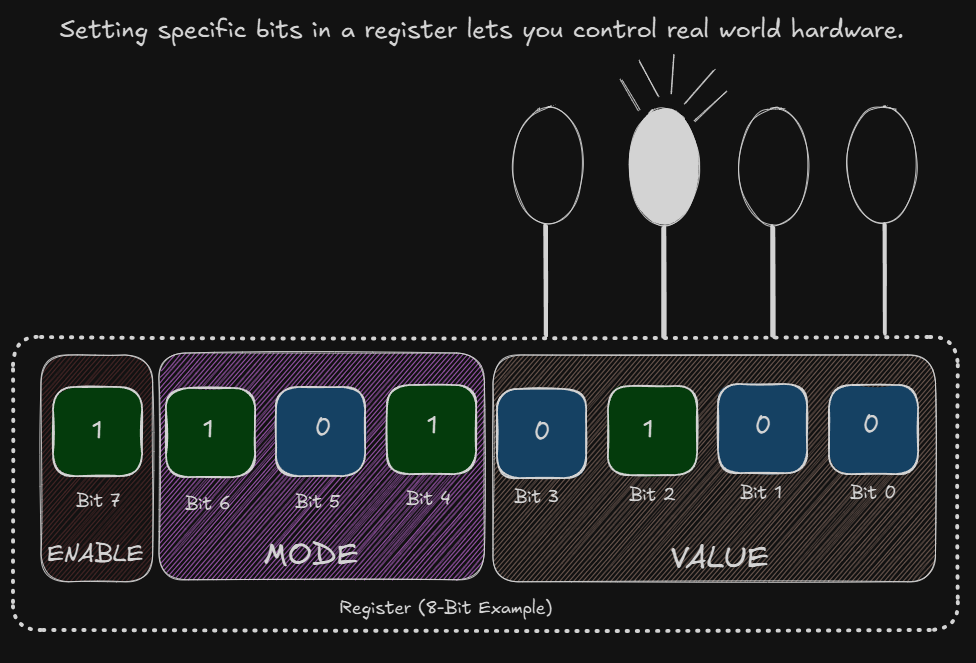
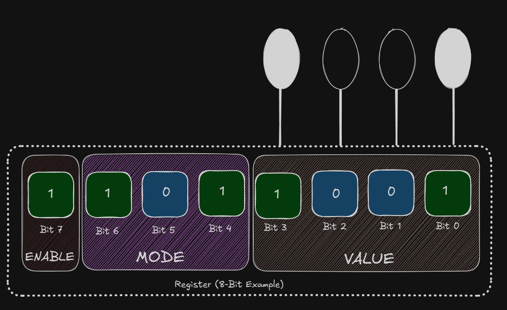
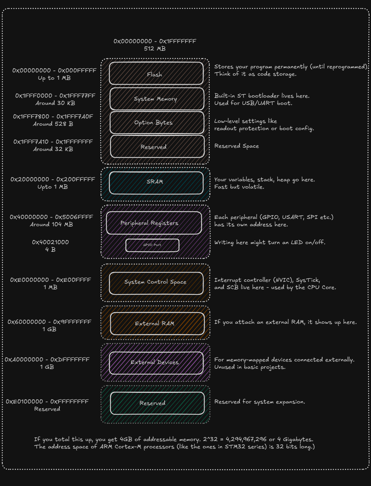
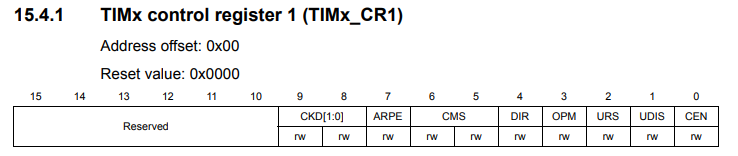
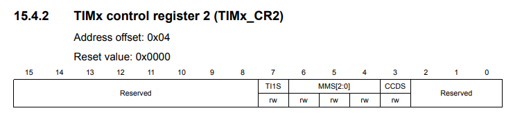
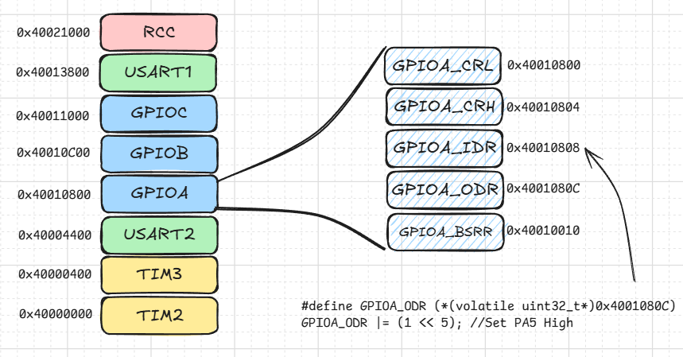

<h3>Navigation Menu</h3>
<ul>
<li><a href="Learning%20Outcomes.md">Learning Outcomes</a></li>
  <li><a href="P1_WhatIsBareMetalProgramming.md">P1_WhatIsBareMetalProgramming</a></li>
  <li><a href="P2_AnatomyOfAMicrocontroller.md">P2_AnatomyOfAMicrocontroller</a></li>
  <li><a href="P3_Registers&MemoryMap.md">P3_Registers&MemoryMap</a></li>
  <li><a href="P4_Datasheets&RefManuals.md">P4_Datasheets&RefManuals</a></li>
  <li><a href="P5_ToolchainOverview.md">P5_ToolchainOverview</a></li>
  <li><a href="CodeExamples.md">CodeExamples</a></li>
</ul>

### Skip to Module 2:  <a href="Module_2/Learning%20Outcomes.md">Module 2 - Learning Outcomes</a>

---
# PART 3: Registers and the Memory Map

We've already taken a look at the registers and the memory map in P1. Here, we'll see a different perspective. To control a microcontroller at the bare-metal level, you must interact with registers—special memory addresses that directly control hardware behavior. Understanding the memory map of your microcontroller is what lets you blink an LED, configure a timer, or read from a sensor.

---
## Again, What Is a Register?

A register is a fixed-size (usually 8-, 16-, or 32-bit) chunk of memory mapped to a hardware peripheral.

- Writing to or reading from a register changes how the microcontroller behaves.
- **Example:** Writing `1` to a GPIO output register turns a pin high. Reading from an ADC result register gives you the last analog value.





---
## What Is the Memory Map?

Each peripheral and memory region (Flash, SRAM, GPIO, etc.) lives at a fixed address. This layout is called the memory map.



---

## How Registers Control Peripherals

Each peripheral is controlled by one or more registers. You read/write to these to configure behaviour.

**Example: Controlling a GPIO pin**

```
#define GPIO_MODER (_(volatile unsigned int_)0x48000000)  
#define GPIO_ODR (_(volatile unsigned int_)0x48000014)

int main(void) {  
GPIO_MODER |= (1 << (2 * 5)); // Set pin 5 to output mode  
GPIO_ODR |= (1 << 5); // Set pin 5 high  
}
```

### Register Structure Example

Let’s say we have a 32-bit register controlling a timer:





| Bit(s) | Name      | Description                  |
| ------ | --------- | ---------------------------- |
| 0      | ENABLE    | Enable or disable the timer  |
| 1–3    | MODE      | Choose timer mode            |
| 4      | INTERRUPT | Enable interrupt on overflow |
| 8–15   | PRESCALER | Set speed of timer ticks     |

**To enable the timer:**

```
TIMER_CTRL |= (1 << 0); // Set ENABLE bit
```

**To set prescaler to 0x25:**

```
TIMER_CTRL &= ~(0xFF << 8); // Clear bits 8–15  
TIMER_CTRL |= (0x25 << 8); // Set bits 8–15 to 0x25
```

---

## Pin Multiplexing & Alternate Functions

Most microcontroller pins are multi-function. A single pin can be used for:
- Digital I/O
- UART transmit
- SPI clock
- ADC input
- etc.

Which function is active depends on:
- The peripheral clock (is it enabled?)
- The pin mode registers
- The alternate function selection registers

---

**Example: Selecting a UART TX pin**

Let’s say Pin A2 can be either GPIO or UART_TX.

**Steps to configure it as UART TX:**
1. Set the mode to Alternate Function
2. Select the correct AF number in the AFR register
3. Enable the UART peripheral clock
4. Set UART baud rate, enable UART

### Internal Peripherals You'll Commonly Configure

| Peripheral   | Purpose                                      |
|--------------|----------------------------------------------|
| GPIO         | Digital input/output                         |
| USART/UART   | Serial communication                         |
| SPI/I2C      | Communicate with other chips                 |
| TIMERS       | Delay generation, PWM, capture events        |
| ADC/DAC      | Analog input/output                          |
| NVIC         | Interrupt controller                         |
| SysTick      | System timer for delays                      |
| RCC          | Reset and clock control                      |
| SCB          | System Control Block (for exceptions, faults)|

### Where to Find All This?

- The reference manual tells you how registers behave.  
- The datasheet tells you what features the chip has and how pins are mapped.  



---
### Summary

| Concept                    | Description                                 |
|----------------------------|---------------------------------------------|
| Register                   | A memory-mapped control unit                |
| Memory Map                 | Layout of memory and peripherals            |
| Peripheral                 | Hardware blocks controlled by registers     |
| Pin Multiplexing           | One pin, many possible roles                |
| Datasheet vs Reference Manual | Hardware features vs Register-level detail |

We’ll soon learn how to navigate datasheets and interpret the register maps with confidence.

Next Up: <a href="P4_Datasheets&RefManuals.md">Module 1 - Part 4 | Datasheets and Reference Manuals</a>

---
