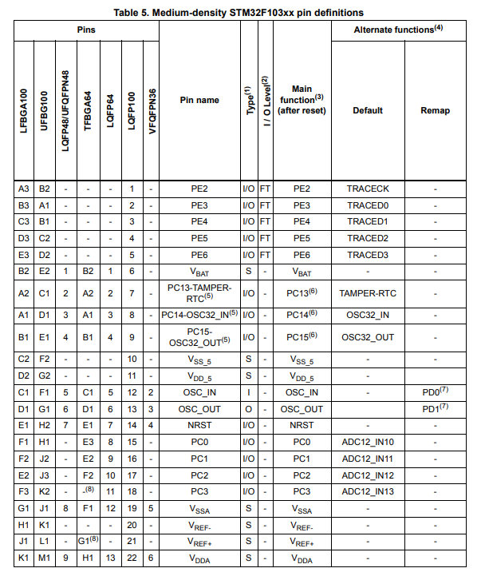
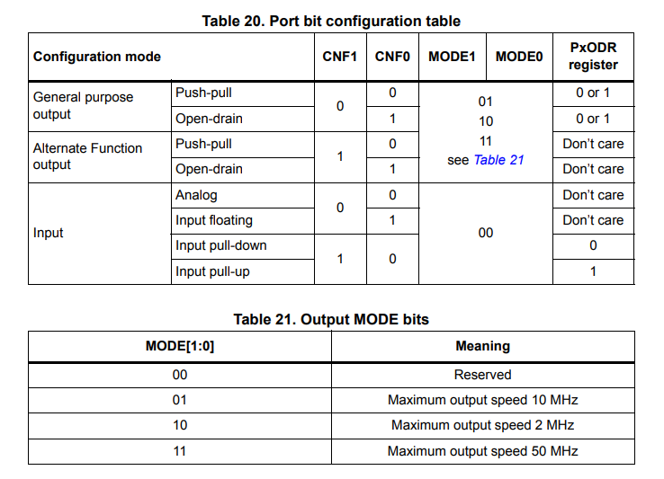
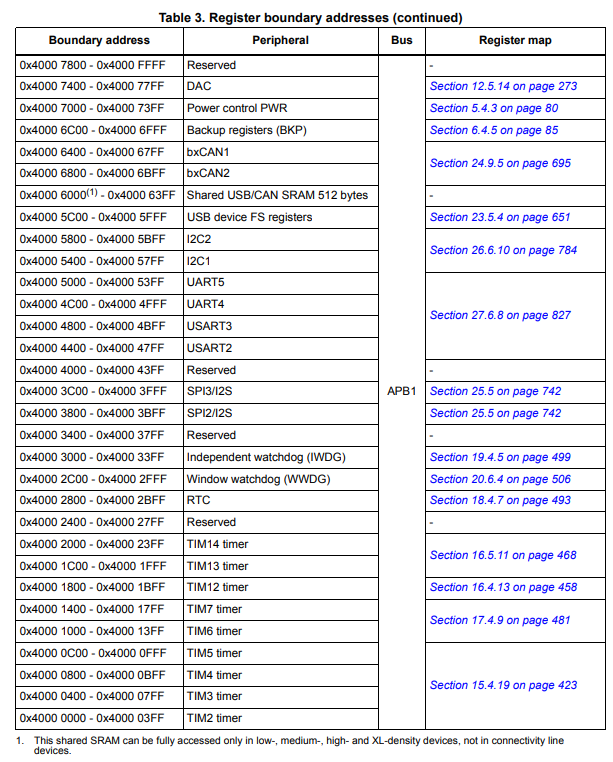

<h3>Navigation Menu</h3>
<ul>
<li><a href="Learning%20Outcomes.md">Learning Outcomes</a></li>
  <li><a href="P1_WhatIsBareMetalProgramming.md">P1_WhatIsBareMetalProgramming</a></li>
  <li><a href="P2_AnatomyOfAMicrocontroller.md">P2_AnatomyOfAMicrocontroller</a></li>
  <li><a href="P3_Registers&MemoryMap.md">P3_Registers&MemoryMap</a></li>
  <li><a href="P4_Datasheets&RefManuals.md">P4_Datasheets&RefManuals</a></li>
  <li><a href="P5_ToolchainOverview.md">P5_ToolchainOverview</a></li>
  <li><a href="CodeExamples.md">CodeExamples</a></li>
</ul>

### Skip to Module 2:  <a href="Module_2/Learning%20Outcomes.md">Module 2 - Learning Outcomes</a>

---
# PART 4: Understanding Datasheets and Reference Manuals

Let’s demystify datasheets and reference manuals—arguably the two most important documents in embedded development. I’ll use the STM32F103C8T6 microcontroller (used in the popular "Blue Pill" board) as our reference example because its datasheet and reference manual are both freely available and well-documented.

---

## Example Datasheet: STM32F103C8T6

- [STM32F103C8T6 Datasheet (ST)](https://www.st.com/resource/en/datasheet/stm32f103c8.pdf)

---

## Reference Manual: STM32F103xx

- [STM32F103 Reference Manual (RM0008)](https://www.st.com/resource/en/reference_manual/cd00171190.pdf)

| Document         | Purpose                                                                                  |
|------------------|------------------------------------------------------------------------------------------|
| Datasheet        | Summary of features, electrical specs, pinouts, memory                                   |
| Reference Manual | Detailed technical info, including registers, peripherals, and configuration steps        |

## Navigating the Datasheet

The datasheet gives you a high-level overview. Here’s what to focus on:

### Pinouts & Alternate Functions

Look for the "Pin Descriptions" table and multipurpose functions.



| Pin | Label | Function 1 | Function 2   |
|-----|-------|------------|--------------|
| A9  | TX    | GPIO       | USART1_TX    |
| A10 | RX    | GPIO       | USART1_RX    |

**Tip:** This helps you know which pins can be used for which peripherals.

## Memory Layout

Found in the datasheet’s "Memory Mapping" section:

| Region          | Start Address   | Size        |
|-----------------|----------------|-------------|
| Flash           | 0x08000000      | 64 KB       |
| SRAM            | 0x20000000      | 20 KB       |
| Peripherals     | 0x40000000      | (varies)    |
| System Control  | 0xE000E000      | (NVIC, SCB) |

## Electrical Characteristics

- **Voltage:** 2.0V to 3.6V
- **I/O levels:** (for logic HIGH/LOW)
- **Max current per pin:** Important for driving loads

---

## Navigating the Reference Manual

This is where you’ll spend most of your time for bare-metal programming.

### Registers Overview

Every peripheral has:
- A base address (e.g., `0x4001 0800` for GPIOA)
- Several offsets (e.g., MODER, ODR, IDR, etc.)

### From RM0008 (STM32F103), GPIO Registers

| Name  | Offset  | Function                        |
|-------|---------|---------------------------------|
| CRL   | 0x00    | Config for pins 0–7             |
| CRH   | 0x04    | Config for pins 8–15            |
| IDR   | 0x08    | Input Data Register             |
| ODR   | 0x0C    | Output Data Register            |
| BSRR  | 0x10    | Bit Set/Reset Register          |
| BRR   | 0x14    | Bit Reset Register              |
| LCKR  | 0x18    | Lock Configuration Register     |

### How to Read a Register Definition

**Example:** GPIOx_CRL (GPIO Configuration Register Low)



| Bits | Field Name | Description         |
| ---- | ---------- | ------------------- |
| 3:2  | CNF0       | Input/output config |
| 1:0  | MODE0      | Input/output mode   |

### To Configure Pin A5

- Locate **CRL** (pins 0–7)
- Pin 5 starts at bit 20 → bits 20–23

You need to:

1. **Clear existing bits:**

```
GPIOA->CRL &= ~(0xF << 20);
```

2. **Set new mode:**

```
GPIOA->CRL |= (0x2 << 20); // Output, push-pull
```

## Exploring the SFR (Special Function Register) Map

The SFR map tells you which memory addresses control which peripherals.  
These are standard across STM32 devices (with minor variation).



| Peripheral | Base Address     |
|------------|-----------------|
| GPIOA      | 0x4001 0800     |
| GPIOB      | 0x4001 0C00     |
| RCC        | 0x4002 1000     |
| USART1     | 0x4001 3800     |

These addresses are used in your code like this:

```
#define GPIOA_CRH (_(volatile unsigned int_)0x40010804)
```

## Tools to Help You Navigate

| Tool                        | Use                                         |
|-----------------------------|---------------------------------------------|
| STM32CubeMX                 | Visual pin/peripheral planner               |
| Datasheet + Reference Manual| Core technical docs                         |
| CMSIS headers               | Contain all register addresses as names     |
| `stm32f10x.h`               | Auto-defines base addresses and register structs |

## Summary

| Item            | Use                                         |
|-----------------|---------------------------------------------|
| Datasheet       | Learn pinouts, features, memory sizes       |
| Reference Manual| Program the MCU at the register level       |
| SFR Map         | Match address with function/peripheral      |
| Register Fields | Control and configure hardware behaviour    |


Next Up: <a href="P5_ToolchainOverview.md">Module 1 - Part 5 | Introduction to the Embedded Toolchain</a>

---
