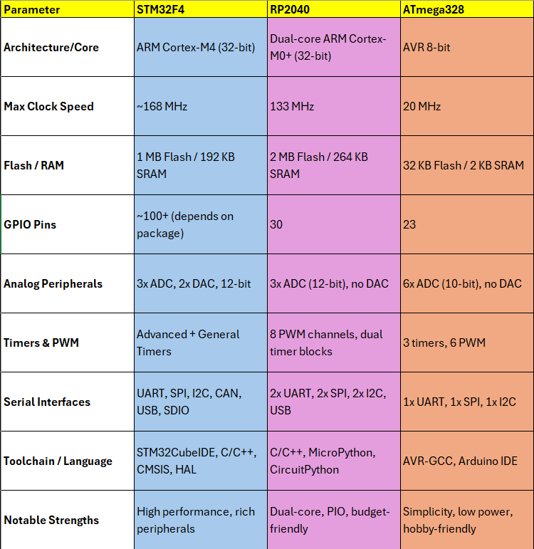
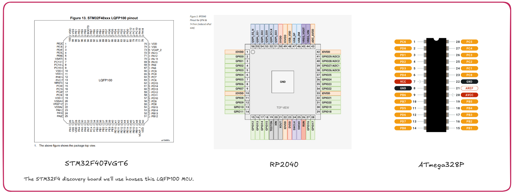
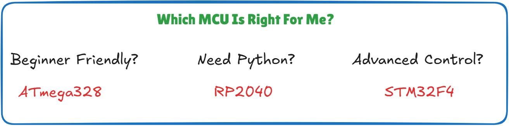
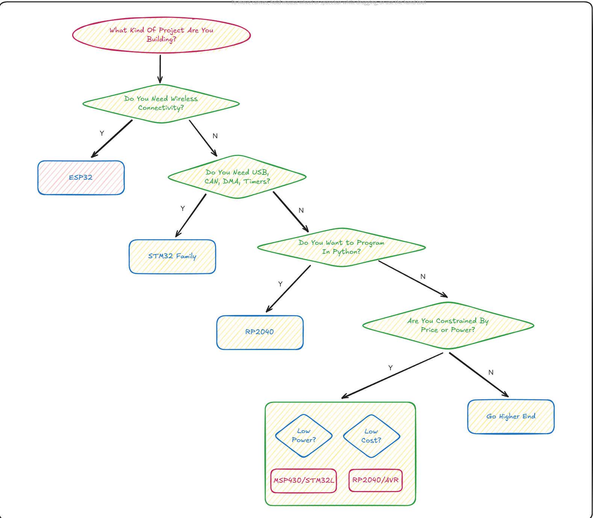

<h3>Navigation Menu</h3>
### **Back to  Module 1:** <a href="Module_1/Learning%20Outcomes.md">Module 1 - Learning Outcomes</a>

### **Module 2:**
<ul>
  <li><a href="Learning%20Outcomes.md">Learning Outcomes</a></li>
  <li><a href="P1_Choosing%20a%20Microcontroller%20Family.md">P1 - Choosing a Microcontroller Family</a></li>
  <li><a href="P2_Introduction%20to%20the%20Embedded%20Toolchain.md">P2 - Introduction to the Embedded Toolchain</a></li>
  <li><a href="P3_Introduction%20to%20the%20STM32CubeIDE.md">P3 - Introduction to the STM32CubeIDE</a></li>
  <li><a href="P4_Becoming%20Familiar%20With%20the%20Embedded%20Workflow.md">P4 - Becoming Familiar With the Embedded Workflow</a></li>
  <li><a href="P5_Embedded%20Engineering%20In%20Practice.md">P5 - Embedded Engineering In Practice</a></li>
</ul>
<h3>Supplementary Guides</h3>
<ul>
  <li><a href="Timer_PrescalerMath.md">Timer Math</a></li>
  <li><a href="Flashing%20The%20Blue%20Pill%20With%20A%20Cheap%20STLink%20Clone.md">Flashing The Blue Pill With A Cheap ST-Link Clone</a></li>
</ul>

**A microcontroller family refers to a group of microcontrollers that share the same core architecture (like ARM Cortex-M or AVR), development tools, instruction set, and often peripheral naming conventions. Choosing a family early on helps you build transferable skills and consistent development habits.**

| Factor                       | Why It Matters                                                     | Example                                             |
| ---------------------------- | ------------------------------------------------------------------ | --------------------------------------------------- |
| Architecture (8-bit, 32-bit) | Affects performance, memory capacity, instruction set              | 8-bit AVR vs. 32-bit ARM Cortex-M                   |
| Community & Resources        | Easier learning curve if tutorials, code samples, and forums exist | STM32 and Arduino have massive online support       |
| Toolchain & IDE Support      | Your productivity depends on solid, reliable tools                 | STM32CubeIDE, PlatformIO, Arduino IDE               |
| Cost & Availability          | Especially important for hobbyists and students                    | RP2040 (Raspberry Pi Pico) is very affordable       |
| Peripheral Set               | Depends on your application: Do you need ADC? USB? CAN? PWM?       | STM32 has rich peripherals; ATmega328 has fewer     |
| Power Consumption            | Critical for battery-powered systems                               | ARM Cortex-M0+ is designed for ultra-low power      |
| Learning Curve               | Some MCUs are more beginner-friendly than others                   | Arduino (AVR) has lowest barrier to entry           |
| Ecosystem                    | Dev boards, libraries, third-party tools                           | ST has Nucleo boards; RP2040 uses TinyUSB, Pico SDK |

*Figure: Comparision chart for 3 popular MCUs*

## Popular Microcontroller Families at a Glance

### 1. AVR (Atmega328, etc.)

- **Architecture:** 8-bit RISC
- **Famous For:** Arduino Uno
- **Toolchain:** avr-gcc, Arduino IDE
- **Strengths:** Extremely beginner-friendly, simple memory model, easy register access
- **Limitations:** Limited RAM and Flash, no native debug support, slower clock speeds
- **Ideal for:** Hobbyist projects, beginners, learning digital I/O, small-scale robotics

---

### 2. STM32 (ARM Cortex-M0/M3/M4)

- **Architecture:** 32-bit ARM Cortex-M
- **Toolchain:** arm-none-eabi-gcc, STM32CubeIDE, OpenOCD
- **Strengths:** Rich set of peripherals (DMA, SPI, I2C, USB, CAN, etc.), high performance, scalable family
- **Limitations:** Steeper learning curve, complex datasheets
- **Ideal for:** Intermediate-to-advanced projects, real-time systems, robotics, commercial products

---

### 3. RP2040 (Raspberry Pi Pico)

- **Architecture:** Dual-core ARM Cortex-M0+
- **Toolchain:** Pico SDK (C/C++), MicroPython
- **Strengths:** Powerful for its price, PIO (Programmable IO), active community
- **Limitations:** Newer ecosystem, smaller peripheral set compared to STM32
- **Ideal for:** Makers, custom IO protocols, learning multi-core and real-time programming

---

*Figure: MCU pinout of 3 popular families*

- STM32F4 Datasheet: https://www.st.com/resource/en/datasheet/dm00037051.pdf
- RP2040 Datasheet: https://datasheets.raspberrypi.com/rp2040/rp2040-datasheet.pdf
- ATmega328 Datasheet: https://ww1.microchip.com/downloads/en/DeviceDoc/Atmel-7810-Automotive-Microcontrollers-ATmega328P_Datasheet.pdf

**Note: The ATmega Datasheet does not showcase the typical DIP package found on Arduinos, probably because it is legacy documentation; it is linked here: https://docs.arduino.cc/retired/hacking/hardware/ATMEGA328P/**

## Decision-Making Flowchart

*Figure: A handy decision chart for your development needs*

## Have you seen these boards before?

1. This is the STM32F407 Discovery board. It is the board which will serve as our testbed throughout this course. 

.jpg)

*Figure: The STM32F407VGT6 Discovery Board*

2. RPi Pico: This is an incredibly powerful board in its own right, particularly because it allows programming in micro python.

*Figure: The RPi Pico*

3. Below is the humble Arduino Uno. It is an 8 bit unit and has served hobbyists for 2 decades now.

*Figure: Everyone's favorite blue Lego brick.*

---
## In Summary

- Start with a dev board to avoid hardware setup frustrations.
- Stick to one family until you're confident with peripherals, registers, and toolchains.
- If unsure, go with STM32 — it's widely used, well-supported, and scales from beginner to professional use. That’s what I’ll be doing throughout the remainder of this course.

Next Up: <a href="P2_Introduction%20to%20the%20Embedded%20Toolchain.md">Module 2 - Part 2 | Dive Into the Embedded Toolchain</a>

---