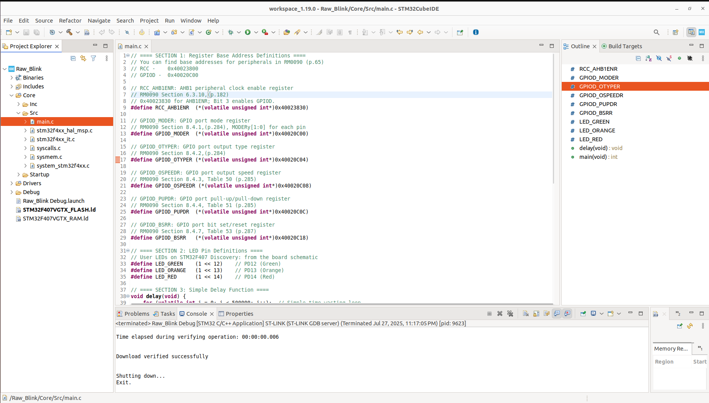

<h2>Navigation Menu</h2>

### **Back to  Module 1:** <a href="../Module_1/Learning%20Outcomes.md">Module 1 - Learning Outcomes</a>

### **Module 2:**
<ul>
  <li><a href="Learning%20Outcomes.md">Learning Outcomes</a></li>
  <li><a href="P1_Choosing%20a%20Microcontroller%20Family.md">P1 - Choosing a Microcontroller Family</a></li>
  <li><a href="P2_Dive%20Into%20the%20Embedded%20Toolchain.md">P2 - Dive Into the Embedded Toolchain</a></li>
  <li><a href="P3_Introduction%20to%20the%20STM32CubeIDE.md">P3 - Introduction to the STM32CubeIDE</a></li>
  <li><a href="P4_Becoming%20Familiar%20With%20the%20Embedded%20Workflow.md">P4 - Becoming Familiar With the Embedded Workflow</a></li>
  <li><a href="P5_Embedded%20Engineering%20In%20Practice.md">P5 - Embedded Engineering In Practice</a></li>
</ul>
<h3>Supplementary Guides</h3>
<ul>
  <li><a href="Timer_PrescalerMath.md">Timer Math</a></li>
  <li><a href="Flashing%20The%20Blue%20Pill%20With%20A%20Cheap%20STLink%20Clone.md">Flashing The Blue Pill With A Cheap ST-Link Clone</a></li>
</ul>

Welcome to the forge.
This is where we peel off the HAL abstraction and deal with the microcontroller as it really is:
A massive pile of silicon and registers — waiting for your instructions, bit by bit.

This guide walks you through a real workflow: starting from an idea (e.g., blink an LED) to a working embedded program on your STM32F407 Discovery board — all from scratch.

No HAL. No CubeMX. Just register-level control using the reference manual, datasheet, and STM32CubeIDE as your code editor and debugger. This is how embedded developers learn to work with new hardware.

---

## Project Setup in STM32CubeIDE

Let’s start by setting up a clean project:

**Create a New Project**

1. Open STM32CubeIDE
2. Go to File → New → STM32 Project
3. Search for STM32F407VG or your specific variant
4. Choose Board or MCU, click Next
5. Name your project something like _LED_Blink_Manual_
6. When prompted to initialise peripherals via CubeMX, decline. 

**Configure Project Settings**

- Toolchain: STM32CubeIDE
- Language: C

**Click Finish. STM32CubeIDE will generate:**

- A startup file
- A linker script
- An empty main.c

### How to Think Like an Embedded Programmer

Imagine you want to turn on PD12 (green LED on the F407 board). Ask yourself:

What do I need to control this LED?

| Question                    | What You Need          |
| --------------------------- | ---------------------- |
| Where is the LED connected? | GPIOD, Pin 12          |
| What powers GPIOD?          | RCC (AHB1ENR register) |
| How do I make PD12 output?  | Set MODER register     |
| How do I toggle the LED?    | Use the ODR register   |

Now let's put that into action.

### Open the Reference Manual

Go to RM0090 Reference Manual – STM32F407. By the way, you can find all documentation for these boards (reference files, datasheets) while selecting the target board in the CubeIDE.

[STM32F407 Reference Manual (PDF)](https://www.st.com/resource/en/reference_manual/dm00031020-stm32f405-415-stm32f407-417-stm32f427-437-and-stm32f429-439-advanced-arm-based-32-bit-mcus-stmicroelectronics.pdf)

Use Ctrl+F to search the keywords in the following sketch.

We’re going to use these register addresses directly.


*Figure: Building from an empty main.c*

Write the Code – Fully Manual. The sketch below blinks 3 LEDs in turn. You'll see how we find out hardware details from the reference manual.

```
// ==== SECTION 1: Register Base Address Definitions ====

// You can find base addresses for peripherals in RM0090 (p.65)
// RCC - 0x40023800
// GPIOD - 0x40020C00

  

// RCC_AHB1ENR: AHB1 peripheral clock enable register
// RM0090 Section 6.3.10, p.182
// 0x40023830 for AHB1ENR; Bit 3 enables GPIOD.

#define RCC_AHB1ENR (*(volatile unsigned int*)0x40023830)

  

// GPIOD_MODER: GPIO port mode register
// RM0090 Section 8.4.1, p.284, MODERy[1:0] for each pin

#define GPIOD_MODER (*(volatile unsigned int*)0x40020C00)

  

// GPIOD_OTYPER: GPIO port output type register
// RM0090 Section 8.4.2, p.284

#define GPIOD_OTYPER (*(volatile unsigned int*)0x40020C04)

  

// GPIOD_OSPEEDR: GPIO port output speed register
// RM0090 Section 8.4.3, p.285

#define GPIOD_OSPEEDR (*(volatile unsigned int*)0x40020C08)

  

// GPIOD_PUPDR: GPIO port pull-up/pull-down register
// RM0090 Section 8.4.4, p.285

#define GPIOD_PUPDR (*(volatile unsigned int*)0x40020C0C)

  

// GPIOD_BSRR: GPIO port bit set/reset register
// RM0090 Section 8.4.7, p.287

#define GPIOD_BSRR (*(volatile unsigned int*)0x40020C18)

  

// ==== SECTION 2: LED Pin Definitions ====

// User LEDs on STM32F407 Discovery: from the board schematic

#define LED_GREEN (1 << 12) // PD12 (Green)
#define LED_ORANGE (1 << 13) // PD13 (Orange)
#define LED_RED (1 << 14) // PD14 (Red)

  

// ==== SECTION 3: Simple Delay Function ====

void delay(void) {
	for (volatile int i = 0; i < 500000; i++); // Simple time-wasting loop
}

// ==== SECTION 4: Main Program Entry Point ====

int main(void) {

// --- 4.1: Enable Peripheral Clock for GPIOD ----------------------------------
RCC_AHB1ENR |= (1 << 3); // Bit 3 enables port D clock

// --- 4.2: Configure PD12, PD13, PD14 as Outputs -------------------------------
// Each GPIO pin uses 2 bits in MODER; 01 = output mode for those bits

GPIOD_MODER &= ~((0x3 << (12*2)) | (0x3 << (13*2)) | (0x3 << (14*2))); // Clear pin mode bits

GPIOD_MODER |= ((0x1 << (12*2)) | (0x1 << (13*2)) | (0x1 << (14*2))); // Set to output mode

// --- 4.3: Optional: Set Output Type, Output Speed, and Pull Configuration -----
GPIOD_OTYPER &= ~((1 << 12) | (1 << 13) | (1 << 14));

// Output speed: 00 = low speed.
GPIOD_OSPEEDR &= ~((0x3 << (12*2)) | (0x3 << (13*2)) | (0x3 << (14*2)));
  
// Pull-up/down: 00 = no pull.
GPIOD_PUPDR &= ~((0x3 << (12*2)) | (0x3 << (13*2)) | (0x3 << (14*2)));

  

// --- 4.4: Infinite LED Toggle Loop --------------------------------------------

while (1) {
	// Atomically set/clear outputs via BSRR
	GPIOD_BSRR = LED_GREEN | ((LED_ORANGE | LED_RED) << 16);
	delay();
	GPIOD_BSRR = LED_ORANGE | ((LED_GREEN | LED_RED) << 16);
	delay();
	GPIOD_BSRR = LED_RED | ((LED_GREEN | LED_ORANGE) << 16);
	delay();
	}
}
```

**You'll see that it works. Of course, I did this in a needlessly arcane fashion. But now, I've taken you through the embedded workflow. You may use this process to learn microcontrollers which don't have a thriving ecosystem like the STM32.**


---

## When setting up any peripheral, follow this ritual:

1. **Enable its clock in RCC**
2. **Configure GPIOs** (mode, AF, speed, pull)  
3. **Set registers of the peripheral** (baud rate, mode, control bits)  
4. **Enable the peripheral**  
5. **Read/write/check flags to interact**

**Don't memorize the register values — memorize the process.**

Next Up: <a href="P5_Embedded%20Engineering%20In%20Practice.md">Module 2 - Part 5 | Embedded Engineering In Practice</a>

---