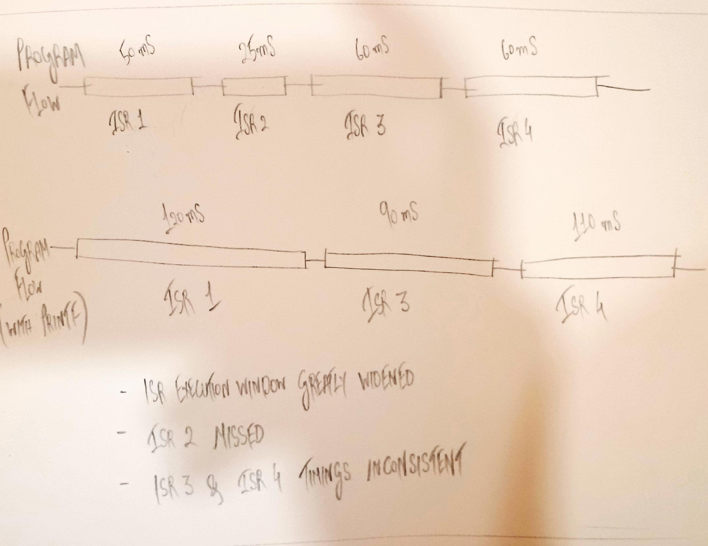
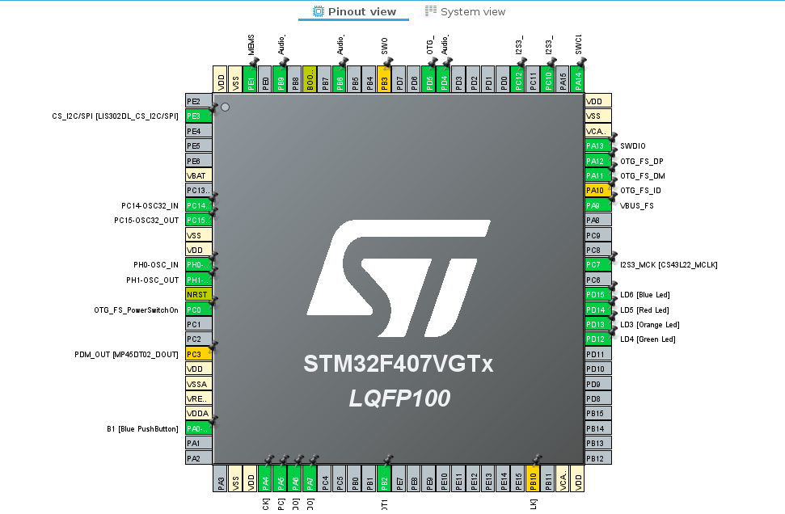
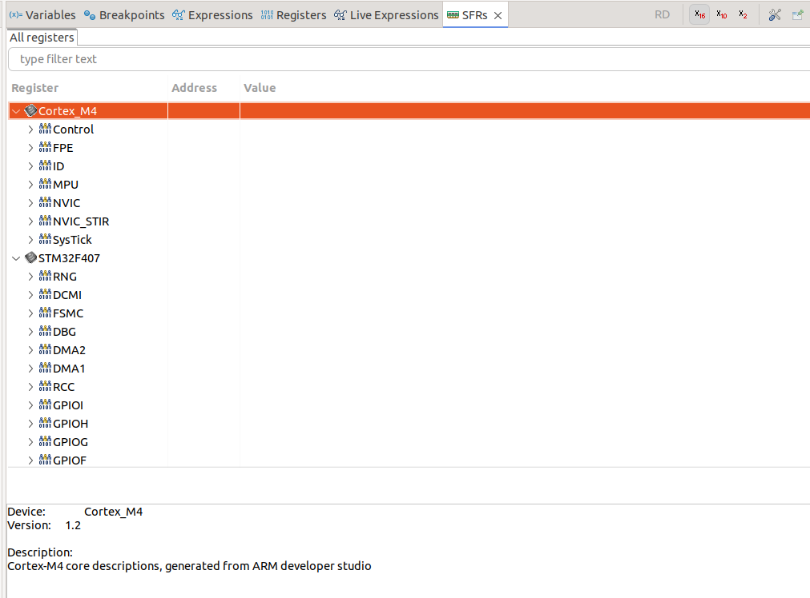

In this module, we understand why debugging embedded systems differs fundamentally from debugging regular software, and learn how to approach the problem systematically.

## 1. What Makes Embedded Debugging Unique

When you debug a desktop program, you usually have a rich set of tools: logs, stack traces, breakpoints, and full visibility into memory and variables. Embedded systems are nothing like that. 
They run on microcontrollers with limited resources, often without an operating system, and they interact directly with hardware peripherals and the physical world. 

An embedded program's failure may not crash dramatically. It may simply stop responding, generating wrong sensor readings, or subtly miss timing constraints. In such cases, even determining what went wrong may be non-trivial.

Generally, you'll come across some of these challenges:
- No OS or stdout: No easy logging or console output.
- Limited Memory: Difficult to buffer debug data.
- Real-Time Constraints: Debugging actions can alter system timing.
- Interdependent Hardware: Software errors may look like electrical faults, and vice-versa.

These constraints make embedded debugging a discipline of observation and inference, rather than pure code inspection.

---

## 2. The Visibility Problem

A major difficulty is limited observability. You can't just print everything like you would in a desktop app.

Consider a single interrupt handler in a real-time system. Adding a printf() inside it might delay interrupt response or break timing or distort the behaviour we're trying to analyse. You may have heard of Thomas Young's double slit experiment. It's kind of like that.

Thus, embedded engineers rely on carefully chosen observation points. They may toggle a GPIO pin, steam concise UART messages, or use a hardware trace mechanism. The idea is to observe with minimal intrusion.

---

## 3. Understanding the Debugging Pyramid

Debugging embedded systems often follows a bottom-up pyramid of techniques. 

1. Visible Indicators: LEDs, GPIO Pins, Buzzers for rough feedback.

2. Serial Output: Text-based logs over UART or USB-CDC

3. In-Circuit Debugging: Breakpoints, single-stepping, and variable inspection via SWD/JTAG

4. Real-Time Trace: High-speed event capture without halting the system.

5. Automated Diagnostics: Firmware-level assertions or watchdog reports.

Each level offers better insight, but typically with greater setup complexity. A skilled engineer moves up and down this pyramid depending on the problem. Simple indicators for quick tests, deep trace analyses for timing issues.

---

## 4. Debugging Is a Systemic Process

Debugging in embedded systems must be deliberate. A scattered trial-and-error approach often leads nowhere. The methodology often used for debugging looks something like this:

1. Isolate the problem: Determine whether the issue lies in software, hardware, configuration, or communication. For example, if an inertial measurement unit returns all zeroes -- is the problem in the I2C driver, sensor wiring, or the clock setup?

2. Instrument the code: Add minimal signals to observe what the system is actually doing. GPIO toggles, counters, or brief UART messages can reveal execution flow without disturbing timing.

3. Observe the System: Use oscilloscopes, logic analyzers, or the debugger to gather real data rather than making assumptions.

4. Interpret Results and Refine Hypothesis: Check whether timing, register values, or state transitions align with expectations.

5. Verify and Remove Debug Artifacts: Once fixed, remove temporary debug logic to restore normal operation -- leaving diagnostic hooks only where useful for future issues.

---

## 5. Understanding the Hardware-Software Boundary

Embedded debugging is complicated by the blurry interface between code and hardware. A wrong peripheral configuration may mimic a software bug, while a hardware fault might appear as erratic firmware behaviour.

**Examples:**

- Incorrect GPIO mode configuration (input vs. alternate function) may disable communication peripherals.
- Floating input pins may cause random interrupts.
- A missing pull-up on I²C lines can make the bus “lock up.”

To handle this, always verify hardware assumptions first:

- Is the peripheral clock enabled?
- Are the pins configured correctly?
- Are the signals observable at the pin (use oscilloscope or logic analyzer)?
- Are the power rails stable?

---

## **6. The Role of the Debug Interface**

The STM32F4 microcontroller supports Serial Wire Debug (SWD) and JTAG, which allow external debuggers (like the ST-Link on the Discovery board) to control the MCU while it runs.

Through SWD, you can:

- Halt or step through code.
- Inspect memory and register states.
- Set hardware breakpoints (don’t rely on software execution).
- View peripheral states in CubeIDE’s “Registers” view.   

This gives near-complete visibility, but remember, halting the MCU can distort timing-sensitive behaviors. Hence, in real-time systems, non-intrusive debugging (like SWO trace) is preferred.

---

## 7. Planning for Debugging

Good debugging is not an afterthought, it’s engineered in.  
From the start of a project, plan how you will observe, measure, and verify behavior.

Recommended design habits:

- Define assertion macros for sanity checks (stack overflow, invalid states).
- Centralize logging infrastructure (UART or ITM) that can be toggled on/off via compile flags.
- Maintain LED/GPIO signaling conventions (e.g., “heartbeat” LED for system health).
- Allocate diagnostic buffers even in production firmware for post-mortem data.
   

By making debugging infrastructure part of the design, you reduce time spent guessing during bring-up and validation.

---

## **8. Non-Intrusive Observation**

In many real-time applications (motor control, signal processing), halting or slowing the CPU is unacceptable.  
Here, you must rely on non-intrusive methods:

- SWO (Serial Wire Output): Stream trace data without halting execution.
- Event counters and timers: Measure duration and frequency of key code paths.
- External tools: Oscilloscope or logic analyzer to correlate firmware actions with hardware behavior.

These methods let you monitor what’s happening while the system runs at full speed.

Refer to this tutorial to know more: https://youtu.be/j-GaEZKrkbQ?si=UgxZ98Os00J9xrN6

---

## **9. The Debugging Mindset**

Perhaps the most crucial skill isn’t tool use, but mindset.  
Effective embedded debugging is grounded in:

- Observation, not assumption.
- Hypothesis, not random trial.
- Incremental validation, not wholesale rewriting.

Debugging teaches you to think like the machine: What exact conditions led to this state? What sequence of events could produce it? How can I prove or disprove each hypothesis with minimal intrusion?

Over time, experienced engineers develop “debug intuition” --  knowing which small, safe probes yield the most information.

---

In the next chapter, we’ll move from theory to practice: Starting with basic hardware-level debugging using GPIOs, LEDs, and UART output on the STM32F4 Discovery board. You’ll see how to visualize internal states and timing without any specialized tools beyond CubeIDE.