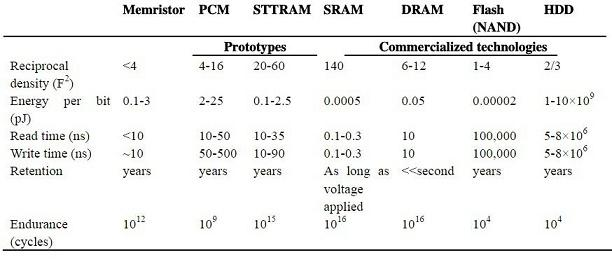

When working with a microcontroller like the STM32F4, memory is not an abstract pool of bytes but a physically structured resource with constraints that directly shape system behavior. Many embedded bugs arise not because the code is “wrong,” but because the developer’s mental model of memory does not match how the microcontroller actually organizes, accesses, and protects it. This chapter establishes that physical and architectural reality, grounding later discussions of runtime behavior and debugging in a concrete understanding of where code and data truly live.

At the highest level, a microcontroller’s memory is divided into distinct regions, each designed for a specific purpose. These regions are mapped into a unified address space, but they are not interchangeable.
- Flash memory stores program instructions and read-only data.
- SRAM holds mutable runtime data.
- System memory contains bootloaders and factory code.
- Peripheral memory exposes hardware registers.

Although the CPU can access all of these through load and store instructions, their electrical characteristics, performance, and failure modes differ significantly.


### Flash Memory: Where Code Lives

Flash memory is **non-volatile storage** used primarily for program instructions and constant data. On the STM32F4, internal Flash is memory-mapped starting at address `0x08000000`. When the CPU fetches instructions, it typically does so directly from Flash, executing code “in place” **without copying it to RAM**. This is efficient in terms of memory usage, but it introduces important performance considerations.

Flash memory is typically **slower** than SRAM. While modern STM32 devices mitigate this with instruction prefetch buffers and caches, Flash accesses still incur wait states, especially at higher clock frequencies. This is why performance-critical routines such as interrupt handlers or control loops are sometimes placed explicitly in SRAM.

In HAL-based projects, code placement is mostly handled by the linker, but the developer can influence it. For example:

```
__attribute__((section(".ramfunc")))
void FastControlLoop(void)
{
    // Time-critical control code
}
```

The corresponding linker script ensures that `.ramfunc` sections are copied from Flash to SRAM at startup. This illustrates a key point: **Flash is optimized for density and persistence, not speed**.

### SRAM: Where Execution State Lives

Static Random Access Memory (SRAM) is **volatile memory** used for data that changes at runtime. On the STM32F4 Discovery board, SRAM is typically mapped starting at `0x20000000`. This region holds the stack, heap, global variables, static variables, and any dynamically allocated buffers.

Unlike Flash, SRAM offers **single-cycle access** at core speed, making it ideal for frequently accessed data. However, SRAM is limited in size. A typical STM32F4 might have only tens or hundreds of kilobytes of SRAM, and every byte must be budgeted carefully.

A global variable defined in C:

```
uint32_t systemTickCount;
```

will reside in SRAM, even though it appears “static” in source code. This distinction between _language-level_ and _hardware-level_ meaning is critical: in embedded systems, “static” does not imply permanence, only storage duration.

### System Memory and Peripheral Memory

System memory is a special region that typically **contains the manufacturer’s bootloader** and factory-provided routines. On STM32 devices, this memory is used for features like UART or USB-based firmware flashing. It is usually mapped at `0x1FFF0000` (exact address varies by device) and is rarely accessed during normal application execution.

Peripheral memory, by contrast, is accessed constantly. This region **contains memory-mapped hardware registers** for GPIOs, timers, ADCs, DMA controllers, and communication peripherals. Writing to these addresses directly manipulates hardware.

For example, while HAL abstracts GPIO access:

```
HAL_GPIO_WritePin(GPIOA, GPIO_PIN_5, GPIO_PIN_SET);
```
under the hood this translates into a write to a peripheral register in the `0x40000000` region. Peripheral memory is neither Flash nor SRAM, it is a window into hardware itself. Treating it as “just memory” is a common conceptual error.

More information about the STM32F407 memory blocks can be found here (Section 2):
file:///home/mukul/Downloads/dm00031020-stm32f405-415-stm32f407-417-stm32f427-437-and-stm32f429-439-advanced-arm-based-32-bit-mcus-stmicroelectronics.pdf

### Instruction Memory and Data Memory

Conceptually, microcontrollers distinguish between instruction memory and data memory, even if they share the same address space. Instruction memory is where the CPU fetches opcodes; data memory is where load/store operations read and write values. On ARM Cortex-M cores, this distinction is logical rather than strictly physical, but it still matters.

Certain regions are optimized for instruction fetch (Flash), while others are optimized for data access (SRAM). Executing code from SRAM is faster, but consumes valuable RAM. Attempting to execute instructions from peripheral memory or invalid regions triggers a fault. Understanding this separation explains why some bugs manifest as HardFaults rather than incorrect values -- the CPU is enforcing architectural rules, not merely reporting a software error.

### Why Memory Speed Differ

Memory speed differences are rooted in physics and design trade-offs. Flash memory stores data as **charge trapped in floating-gate transistors**, which takes longer to read and much longer to write. SRAM uses **bistable circuits** that can be accessed rapidly but consume more silicon area and power.

On the STM32F4, Flash access latency increases as system clock frequency increases, requiring wait states. SRAM access remains fast regardless of clock speed. This discrepancy explains why high-frequency systems are more sensitive to Flash performance and why cache and prefetch configuration matters.



Source: https://www.elinfor.com/knowledge/comparison-between-different-memoriespcm-stt-ram-sram-dram-flash-nand-hdd-p-10908

### Stack, Heap and Global Memory

The SRAM region is subdivided conceptually into several areas: global/static data, heap, and stack. These are not enforced by hardware but by the linker script and runtime conventions.

Global and static variables are allocated at fixed addresses determined at link time. The stack is typically placed at the top of SRAM and grows downward. The heap is placed below global data and grows upward. The linker script defines these boundaries explicitly.

A simplified linker script excerpt might look like this:

```
_estack = ORIGIN(RAM) + LENGTH(RAM);

.data :
{
    *(.data)
} >RAM

.bss :
{
    *(.bss)
} >RAM
```

The stack pointer is initialized to `_estack` during startup. Every function call, interrupt, and context switch consumes stack space by pushing registers and local variable

The heap, if enabled, is used by `malloc` and related functions. In many embedded systems, heap usage is discouraged or tightly controlled because fragmentation and unpredictable allocation times can destabilize real-time behavior.

### What Happens if the Heap and the Stack Collide?

Stack and heap collisions are among the most dangerous failures in embedded systems because they often produce delayed, non-deterministic symptoms. When the stack grows downward and the heap grows upward, nothing inherently prevents them from colliding. The hardware does not enforce a boundary.

When a collision occurs, memory corruption begins silently. A stack frame may overwrite heap metadata, or a heap allocation may overwrite a return address. The resulting behavior may include random crashes, corrupted variables, or inexplicable HardFaults far removed from the actual cause.

On STM32 systems, stack overflow often manifests during interrupts, where additional stack space is consumed unexpectedly. This is why conservative stack sizing and careful interrupt design are critical.


Source: https://arduino.stackexchange.com/questions/19127/avr-how-to-know-that-there-is-collision-between-stack-and-heap-or-the-memory-h

### Common Misconceptions About Microcontroller Memory

- One common misconception is that “free RAM” reported by a tool is a single, flexible resource. In reality, stack space and heap space are not interchangeable without explicit configuration.

- Another is that global variables are “cheap” because they are allocated once. In practice, excessive global usage permanently reduces available stack space.

- Finally, many developers assume that memory errors will always cause immediate crashes. In embedded systems, memory corruption often causes _plausible but incorrect behavior_, making it far more dangerous than a clean failure.

### Closing Perspective

Understanding memory architecture is not about memorizing addresses or linker syntax, it is about building a correct mental model of how code and data inhabit physical space inside the microcontroller. Flash, SRAM, system memory, and peripheral memory each exist for a reason, and misuse of any one of them propagates through the entire system. As later chapters will show, most severe embedded bugs are not logical errors but violations of memory assumptions. By grounding yourself in where memory exists and why it is structured the way it is, you establish the foundation for reasoning about performance, reliability, and failure with clarity rather than guesswork.

---