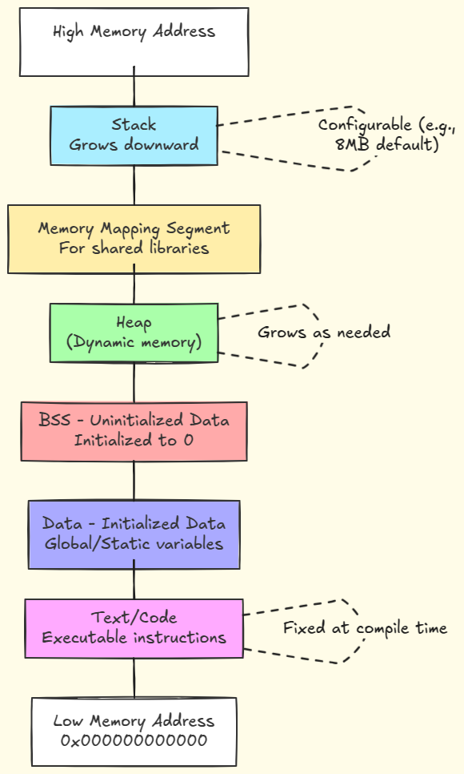
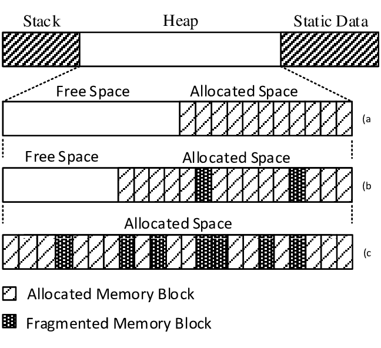

Understanding how memory behaves while a microcontroller is running is critical for building reliable embedded systems. While Chapter 1 established the static architecture of Flash, SRAM, system, and peripheral memory, runtime memory use introduces dynamic behaviors that can make or break a system. Memory is no longer a passive repository of bits; it becomes an active participant in computation, interrupts, and peripheral interactions. Each function call, local variable, and hardware interaction consumes memory in ways that must be carefully planned. In STM32-based systems, mismanagement at this level is often the source of seemingly random crashes, corrupted data, or subtle timing anomalies.

### Stack Growth, Function Calls, and Context Switching

At the heart of runtime memory management is the stack. On the STM32F4, the stack resides in SRAM and typically grows downward from the top of the available memory region. Every function call consumes stack space by pushing the return address, saved registers, and local variables. For instance, consider a simple HAL-based function controlling an LED blink:

```
void BlinkLED(void)
{
    uint32_t i;
    for(i = 0; i < 100000; i++) {} // Busy-wait delay
    HAL_GPIO_TogglePin(GPIOA, GPIO_PIN_5);
}
```

Each call to `BlinkLED` reserves a small stack frame to store the local variable `i` and the return address. While trivial in isolation, when multiple functions call one another in nested sequences, stack usage grows rapidly. The compiler may also optimize registers, but interrupts introduce additional complexity. When an interrupt occurs, the CPU automatically pushes certain registers onto the stack to preserve context. For example, if a SysTick interrupt triggers every millisecond to update a system tick counter:

```
void SysTick_Handler(void)
{
    HAL_IncTick();
}
```

The processor pushes the `R0-R3`, `LR`, `PC`, and `xPSR` registers. If multiple nested interrupts occur, the stack usage multiplies. Context switching in an RTOS environment, such as FreeRTOS running on STM32F4, adds further layers. Each task has its own stack; the kernel must save and restore the CPU state when switching tasks, including general-purpose registers and floating-point registers if enabled. A small task stack can quickly overflow under load, leading to data corruption, unpredictable behavior, or HardFaults.


*A call stack diagram showing how function calls push frames onto the stack and return pops them off -- this is the basic mechanism behind nested calls. Source: https://loonytek.com/2015/04/28/call-stack-internals-part-1/*




*A memory layout with a stack segment that grows downward (useful background for understanding where the stack lives). Source: https://blog.codingconfessions.com/p/linux-context-switching-internals*

### Heap Allocation, Fragmentation, and Dynamic Memory

Dynamic memory allocation via the heap introduces a separate runtime consideration. On STM32F4 systems, heap memory resides in SRAM, growing upward from a defined starting point. Functions like `malloc` and `free` manipulate the heap, allowing the creation of buffers and data structures at runtime:

```
uint8_t *buffer = (uint8_t*)malloc(128);
if(buffer != NULL)
{
    memset(buffer, 0, 128);
    // Use buffer for temporary storage
    free(buffer);
}
```

While convenient in desktop programming, dynamic allocation is often avoided or tightly controlled in embedded systems for several reasons. First, heap fragmentation can occur when multiple allocations and frees of varying sizes happen over time. Small gaps between allocated blocks may become unusable, reducing effective memory even if the total free space appears sufficient. Second, `malloc` and `free` can take non-deterministic time to execute, which is problematic for real-time loops or interrupt service routines. In safety-critical applications, these timing uncertainties can cause missed deadlines, jitter, or race conditions. As a result, embedded developers often preallocate memory statically, use memory pools, or implement custom allocators with predictable behavior.



*This diagram shows a continuous memory space divided into free and allocated blocks — and how over time the free areas get split up into smaller unused holes between allocated chunks. This external fragmentation makes it harder to satisfy new allocation requests even if there’s enough free memory overall.  Source: https://www.researchgate.net/publication/305333536_Adaptive_memory_management_scheme_for_MMU-less_embedded_systems**

### DMA and Independent Peripheral Access

Memory usage at runtime is not limited to CPU-managed operations. Direct Memory Access (DMA) allows peripherals to read and write memory independently, without CPU intervention. On the STM32F4, DMA controllers can transfer data between memory and peripherals such as ADCs, UARTs, or SPI devices:

```
HAL_ADC_Start_DMA(&hadc1, adc_buffer, ADC_BUFFER_LENGTH);
```

In this example, the ADC continuously samples input channels and stores results directly into `adc_buffer` in SRAM. The CPU remains free to perform other tasks. While DMA improves performance and reduces CPU load, it introduces concurrency hazards: the CPU and peripheral share memory, so proper synchronization is required. Reading a buffer while a DMA transfer is in progress can produce inconsistent or corrupted data unless proper flags, interrupts, or memory barriers are used.

Cache behavior, present in high-end STM32F4 variants, adds another layer. The instruction and data caches accelerate memory access but can cause stale data reads if software does not properly flush or invalidate caches when DMA or peripheral writes modify memory.


*The DMA controller takes control of the memory bus from the CPU when it needs to transfer data, either blocking the CPU temporarily or interleaving transfers so the CPU still gets cycles. Source: https://witscad.com/course/computer-architecture/chapter/dma-controller-and-io-processor*

### Concurrency Hazards and Memory Consistency

Concurrency hazards are a major source of runtime memory errors. Shared buffers accessed by both main code and interrupt routines can experience race conditions if not handled correctly. In STM32 HAL projects, using the `volatile` qualifier signals to the compiler that a variable may be modified asynchronously:

```
volatile uint8_t dataReadyFlag = 0;

void HAL_ADC_ConvCpltCallback(ADC_HandleTypeDef* hadc)
{
    dataReadyFlag = 1;
}
```

Without `volatile`, the compiler might optimize away repeated reads, assuming the variable cannot change outside the current context, leading to missed updates. Alignment is another subtle consideration: certain STM32 cores require memory accesses to be aligned to word boundaries. Misaligned accesses can either generate faults or incur performance penalties.

Finally, memory consistency between CPU and DMA, or across cores in multi-core systems, requires careful management. Using synchronization primitives, explicit cache invalidation, and disabling interrupts briefly can prevent corrupted reads or writes.


*This diagram illustrates the general race condition concept: two contexts accessing the same shared data and producing incorrect results because the timing/order of operations overlaps.*
*Source: https://www.geeksforgeeks.org/operating-systems/race-condition-in-operating-systems/***

### Runtime Consequences of Design Decisions

Small design decisions at runtime can cascade into severe problems. Underestimating stack requirements for deep call hierarchies or frequent interrupts leads to stack overflow, which can silently overwrite global variables or function return addresses. Excessive use of heap allocation risks fragmentation, slowing down real-time tasks or causing allocation failures. Improperly synchronized DMA access can produce corrupted sensor data that propagates through control loops, destabilizing motors or other actuators. Even seemingly minor optimizations, such as inlining functions to reduce call overhead, can inadvertently increase stack usage and trigger faults under load.

Consider a robotics scenario: an STM32F4-based robot uses DMA to read an IMU and an encoder simultaneously while running a PID control loop in the main task. If the control loop reads the DMA buffer without checking the transfer-complete flag, or if the stack for the control task is too small, the robot may occasionally misread orientation, causing motors to oscillate unexpectedly. The fault may appear intermittent and difficult to reproduce, illustrating the importance of understanding memory usage at runtime.

```
if(__HAL_DMA_GET_FLAG(&hdma_adc, DMA_FLAG_TCIF0_4))
{
    ProcessSensorData(adc_buffer);
}
```

This example demonstrates proper synchronization, ensuring that the CPU only processes fully transferred data.

### Integration of Stack, Heap, and Peripheral Memory

At runtime, stack, heap, and peripheral memory interact continuously. Stack frames are pushed for function calls, DMA writes update buffers asynchronously, and heap allocations dynamically expand to accommodate temporary data. Each of these layers is bounded by the physical SRAM available on the STM32F4. Overlapping or mismanaged memory regions can lead to silent corruption, crashes, or unpredictable behavior.

### Summary and Perspective

In summary, runtime memory management is where theory meets reality in embedded systems. The static architectural understanding from Chapter 1 forms the foundation, but real behavior emerges only when the CPU executes instructions, interrupts fire, DMA transfers occur, and multiple tasks contend for limited resources. Stack, heap, and peripheral memory each have unique growth patterns and failure modes. Concurrency hazards, cache coherence, and alignment issues further complicate memory use. Small oversights: 

- Insufficient Stack Size
- Improper Synchronisation
- Excessive Dynamic Allocation

Can escalate into severe runtime faults. By mastering runtime memory behavior, developers gain the insight needed to design robust, deterministic systems, preempt subtle bugs, and use advanced debugging tools effectively.

---