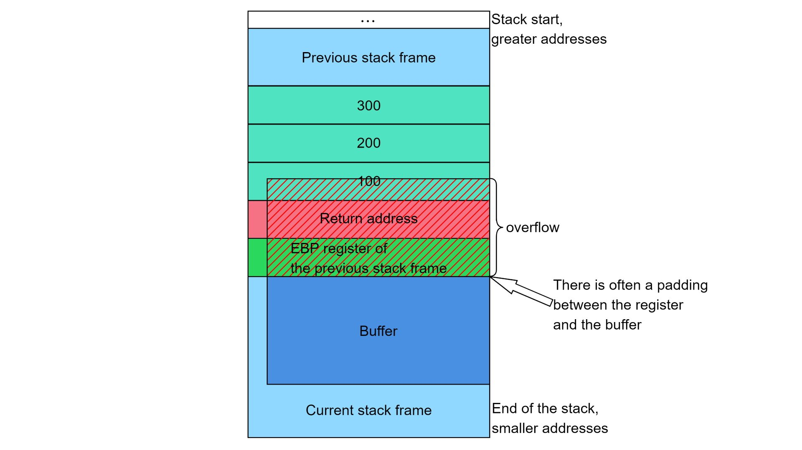
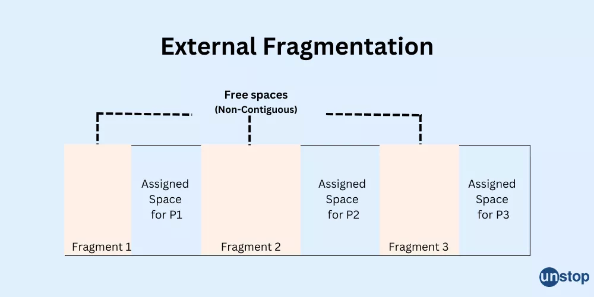

By the time memory bugs surface in an embedded system, the damage is often already done. Unlike syntax errors or logic mistakes, memory failures rarely announce themselves clearly. Instead, they manifest as intermittent resets, unstable control loops, corrupted sensor readings, or behavior that changes when a debugger is attached. In robotics systems built on STM32 microcontrollers, these failures are especially dangerous because they occur at the intersection of real-time control, hardware interaction, and constrained memory. This chapter focuses on the most common ways memory fails at runtime and, more importantly, how to diagnose those failures using a disciplined debugging framework.

### Stack Overflow: The Silent System Killer

Stack overflow is one of the most common and least understood memory failures in embedded systems. On STM32 devices, there is no automatic stack protection unless explicitly configured. The stack simply grows downward in SRAM until it collides with other data. When this happens, the system does not necessarily crash immediately. Instead, the stack begins overwriting adjacent memory, which are often global variables, heap data, or DMA buffers.

In a robotics context, stack overflows frequently occur in control tasks or interrupt handlers. Consider a motor control function that allocates large local arrays:

```
void MotorControlLoop(void)
{
    float pidHistory[128];  // Large local buffer
    ComputePID(pidHistory);
    UpdateMotors(pidHistory);
}
```

Each invocation of `MotorControlLoop` pushes this array onto the stack. If the function is called from a high-frequency timer interrupt, or if interrupts nest, stack usage grows quickly. The system may appear to work under light load but fail unpredictably when motors draw current or sensor processing increases.



*This example shows the stack growing into unused memory until it passes its limit and overrides other memory areas: a stack overflow condition. Source: https://zerobone.net/blog/cs/call-stack-buffer-overflow/***

The debugging approach begins with inspection, not speculation. When a HardFault occurs, the Cortex-M processor provides valuable information through fault status registers. A custom HardFault handler allows you to extract the stack frame at the time of failure:

```
void HardFault_Handler(void)
{
    __asm volatile
    (
        "TST lr, #4        \n"
        "ITE EQ            \n"
        "MRSEQ r0, MSP     \n"
        "MRSNE r0, PSP     \n"
        "B HardFault_C_Handler \n"
    );
}

void HardFault_C_Handler(uint32_t *stack)
{
    volatile uint32_t pc = stack[6];  // Program counter
    volatile uint32_t lr = stack[5];
    while(1);
}
```

By inspecting the program counter and stack pointer at the moment of failure, you can determine whether the stack pointer has moved outside the expected SRAM range. In robotics projects, this often correlates with specific motion patterns or sensor bursts that increase call depth or interrupt frequency.

### Heap Corruption and Fragmentation

Heap-related failures are subtler but equally destructive. Fragmentation occurs when memory is repeatedly allocated and freed in varying sizes, leaving unusable gaps. In long-running robotic systems such as autonomous rovers or drones this can lead to gradual degradation rather than immediate failure.

Consider a vision-processing task that dynamically allocates buffers based on frame size:

```
uint8_t* frameBuffer = malloc(frameSize);
if(frameBuffer == NULL)
{
    // Allocation failed
}
ProcessFrame(frameBuffer);
free(frameBuffer);
```
Even if `malloc` succeeds initially, repeated allocation cycles can fragment the heap. Eventually, allocation fails or overwrites memory metadata, causing crashes far from the allocation site.

A common debugging technique is to instrument heap usage by tracking the current and minimum free heap size. In STM32 projects using newlib, this can be done by examining linker symbols:

```
extern char _end;      // End of BSS
extern char _estack;   // Top of stack

uint32_t GetFreeHeap(void)
{
    char top;
    return &top - &_end;
}
```

If free heap space steadily decreases during robot operation, fragmentation or leaks are likely. In practice, many robotics systems avoid `malloc` entirely in favor of statically allocated buffers or fixed-size memory pools.



*Source: https://unstop.com/blog/difference-between-internal-and-external-fragmentation*

### Buffer Overruns and Data Corruption

Buffer overruns occur when code writes beyond the bounds of an allocated array. In embedded systems, there is no memory protection unit (MPU) enabled by default to catch these errors. Overruns can corrupt adjacent data structures, leading to incorrect behavior rather than immediate faults.

In robotics, buffer overruns often occur in communication code. For example, receiving UART data into a fixed buffer:

```
uint8_t rxBuffer[64];

void HAL_UART_RxCpltCallback(UART_HandleTypeDef *huart)
{
    ProcessCommand(rxBuffer);
    HAL_UART_Receive_IT(huart, rxBuffer, 64);
}
```

If the sender transmits more than 64 bytes, or if `ProcessCommand` assumes a null-terminated string that does not exist, memory beyond `rxBuffer` may be overwritten. The robot might then misinterpret commands, drift, or lock up.

A powerful debugging technique here is the use of **watchpoints**. On STM32, hardware watchpoints can be set on specific memory addresses to halt execution when a buffer is modified unexpectedly. This allows the developer to catch the exact instruction that caused corruption.


### Use-After-Free and Dangling Pointers

Although less common in tightly controlled embedded systems, use-after-free errors can occur when dynamic memory is mismanaged. A pointer may reference memory that has already been freed and potentially reallocated for another purpose.

```
uint8_t *sensorData = malloc(32);
ReadSensor(sensorData);
free(sensorData);

// Later
ProcessSensor(sensorData);  // Dangling pointer
```

In robotics, this can cause sensor fusion algorithms to process stale or corrupted data, leading to unstable control decisions. Debugging such issues often requires correlating memory access patterns with timing behavior and using breakpoints or logging to detect invalid accesses.

### DMA-Related Memory Failures

DMA introduces a unique class of memory failures because it operates asynchronously. If the CPU and DMA access the same buffer without coordination, data corruption can occur even if the code is logically correct.

Consider an ADC reading motor current while a control loop reads the buffer:

```
HAL_ADC_Start_DMA(&hadc1, adcBuffer, 16);

void ControlLoop(void)
{
    float current = adcBuffer[0]; // May be mid-transfer
}
```

If `ControlLoop` reads `adcBuffer` while DMA is updating it, inconsistent values result. The robot may apply incorrect torque corrections, causing oscillations or instability.

The fix is synchronization, typically via DMA completion callbacks:

```
void HAL_ADC_ConvCpltCallback(ADC_HandleTypeDef* hadc)
{
    dataReady = 1;
}

if(dataReady)
{
    ProcessADC(adcBuffer);
    dataReady = 0;
}
```

### Fault Registers as Diagnostic Tools

When memory access violations occur, the Cortex-M core provides detailed fault registers. The Configurable Fault Status Register (CFSR) indicates whether the fault was due to invalid address access, alignment issues, or permission violations.

```
uint32_t cfsr = SCB->CFSR;
uint32_t bfar = SCB->BFAR;
```

In robotics systems, BusFaults often indicate invalid DMA addresses or corrupted pointers, while UsageFaults may point to stack corruption or invalid instruction execution. Reading these registers transforms debugging from guesswork into evidence-based analysis.

### Example of Motor Control

Consider a two-wheeled robot that intermittently veers off course under heavy load. The control algorithm appears correct, and sensor data seems valid when logged. However, the issue only appears after several minutes of operation.

Investigation reveals that the control task allocates a temporary buffer on the stack for logging data. Over time, nested interrupts and logging calls increase stack usage until it collides with a DMA buffer holding encoder counts. The resulting corruption causes occasional incorrect encoder readings, destabilizing the control loop.

```
static float controlLogBuffer[64];
```

This example demonstrates how memory failures often masquerade as algorithmic flaws.

### Prevention Strategies

Preventing memory failures is more effective than reacting to them. Common strategies include static allocation, conservative stack sizing, avoiding dynamic memory in real-time paths, using guard patterns to detect overflow, and enabling the MPU where available. In STM32 projects, careful linker script configuration and regular inspection of map files provide early warning signs.

### Closing Perspective

Memory failures are not exotic edge cases; they are a natural consequence of constrained resources, concurrency, and real-time behavior. In robotics, where physical systems amplify small software errors, memory bugs can have visible and sometimes dangerous consequences. Debugging these issues requires a structured approach: understanding memory layout, observing runtime behavior, interpreting fault registers, and correlating failures with system load. Mastery of these techniques transforms memory from an opaque source of bugs into a predictable, debuggable component of the system.

---