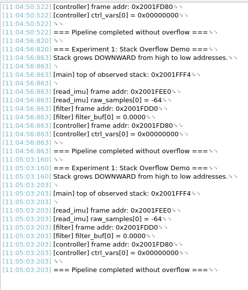

## Experiment 1 — Sensor Buffer Overflow via Unchecked Stack Allocation

When a robotics system fails, it rarely announces why. A motor may stop responding, a sensor pipeline may freezes, or the board may reset without warning. One of the most common and least obvious causes is a **stack overflow**.

Every time a function is called, the processor pushes a new **stack frame** onto it containing:
- The function's **local variables**
-  The **return address**:  where execution should resume when the function exits.
-  **Saved register values** that need to be restored afterwards.

On the STM32F4, the stack lives in SRAM and grows **downward**, from a high address toward lower addresses. The current position is tracked by the **Stack Pointer (SP)**, a dedicated CPU register that decrements with every push and increments with every pop.

The total stack space available is defined in your **linker script** (`STM32F407VGTx_FLASH.ld`) via `_Min_Stack_Size`. On a default STM32CubeIDE project this is typically 1KB -- a number that sounds reasonable until you start allocating large local arrays inside nested function calls.

Robotics firmware is almost never a single flat loop. A typical embedded robotics system is organised as a **pipeline**, which is a chain of functions where raw sensor data flows through processing stages before producing an actuator command:

read_imu() → low_pass_filter() → motor_controller()

Each stage in this pipeline tends to work on a buffer of data: raw samples, filtered values, computed outputs. The natural instinct for a programmer coming from desktop C is to declare these buffers as **local arrays** inside each function. On a desktop machine with gigabytes of virtual memory this is harmless. On a microcontroller with 192KB of SRAM and a 1KB stack, it is a ticking clock.

Consider what happens when each function in the pipeline allocates even a modest local buffer:

| Pipeline Stage | Local Buffer | Stack Cost |
|---|---|---|
| `read_imu()` | `int16_t raw_samples[128]` | 256 bytes |
| `low_pass_filter()` | `float filter_buf[64]` | 256 bytes |
| `motor_controller()` | `uint32_t ctrl_vars[16]` | 64 bytes |
| Function call overhead | Return addresses, saved registers | ~32 bytes |
| **Total** | | **~608 bytes** |

These frames all exist on the stack **simultaneously** while the pipeline is executing. Each function must keep its frame alive until it returns. With a 1KB default stack, this pipeline consumes over half of it before a single line of application logic runs. Add an interrupt handler firing mid-pipeline, a FreeRTOS task context switch, or one more processing stage, and the stack quietly runs into the heap, corrupting memory.

The insidious part is that **this often appears to work** during early testing. The corruption is non-deterministic: it only manifests when the call depth and buffer sizes align badly at runtime, which may only happen under specific sensor conditions or timing. By then the root cause is extremely difficult to trace.

### What This Experiment Demonstrates

This experiment makes the stack overflow problem **visible and reproducible** on real hardware. Rather than waiting for it to appear accidentally in a complex system, you will deliberately construct the conditions that cause it, observe the MCU crashing, and then apply the correct fix. By the end you will be able to:

- Read stack frame addresses from UART output and observe the stack growing downward in real time
- Identify how much stack a given pipeline consumes before it runs
- Trigger a controlled HardFault by reducing stack size in the linker script
- Implement a HardFault handler that makes crashes visible on the Discovery board's LEDs
- Refactor the pipeline to eliminate stack pressure using static allocation

This is not a contrived scenario, it is a simplified version of a class of bugs that appears regularly in production robotics firmware. Learning to recognise and prevent it now, on a controlled example, is significantly less painful than debugging it later inside a running robot.

### What You'll Need

- STM32F4 Discovery board
- STM32CubeIDE installed
- USB Mini-B cable (for ST-LINK)
- A serial terminal (STM32CubeIDE's built-in console, or PuTTY/CoolTerm via a USB-UART adapter on PA2)

## Part 1 — Project Setup

**1.** Open STM32CubeIDE → _File → New → STM32 Project_

**2.** In the board selector, search for `STM32F407VG` and select the Discovery board. Click _Next_, name your project (e.g. `Exp1_StackOverflow`), keep defaults, click _Finish_.

**3.** In the `.ioc` configurator that opens:

- Under _Connectivity_, enable **USART2**. Set mode to _Asynchronous_, baud rate `115200`, 8N1. This routes to PA2/PA3 which are already wired on the Discovery board.
- Under _System Core → SYS_, set Debug to **Serial Wire**.
- Click _Save_ and generate code when prompted.

## Part 2 — Retarget printf to UART

STM32 doesn't route `printf` to UART by default. Add this retargeting code to `Core/Src/main.c`, just below the includes:

```
/* USER CODE BEGIN Includes */
#include <stdio.h>
#include <string.h>
/* USER CODE END Includes */
```

Then add the `_write` syscall redirect in the user code section below the private variables:

```
/* USER CODE BEGIN 0 */
int _write(int file, char *ptr, int len) {
    HAL_UART_Transmit(&huart2, (uint8_t*)ptr, len, HAL_MAX_DELAY);
    return len;
}
/* USER CODE END 0 */
```

## Part 3 — The Experiment Code

This simulates a three-stage robotics pipeline: IMU reader → low-pass filter → motor controller. Each stage allocates a local buffer on the stack. Paste all of this into the appropriate user code sections in `main.c`.

### Stack address printer helper

```
/* USER CODE BEGIN 0 */

// Helper: prints current stack pointer approximation
// via the address of a local variable in each frame
void print_stack_usage(const char *stage, void *frame_addr) {
    printf("[%s] frame addr: 0x%08lX\r\n", stage, (uint32_t)frame_addr);
}

/* USER CODE END 0 */
```

### The pipeline functions

Place these before `main()`, inside a user code section:

```
/* USER CODE BEGIN PFP */

void motor_controller(void) {
    // Simulates a controller working on processed motion commands
    volatile uint32_t ctrl_vars[16];   // 64 bytes — control state
    volatile uint32_t marker = 0xCCCCCCCC;

    ctrl_vars[0] = 0xDEADBEEF;        // Sentinel value — visible in debugger
    print_stack_usage("controller", (void*)&marker);

    // Simulate some controller work
    for (int i = 0; i < 16; i++) {
        ctrl_vars[i] = i * 10;
    }

    printf("[controller] ctrl_vars[0] = 0x%08lX\r\n", ctrl_vars[0]);
}

void low_pass_filter(void) {
    // Simulates a FIR/low-pass filter stage on raw IMU data
    volatile float filter_buf[64];     // 256 bytes — filter history window
    volatile uint32_t marker = 0xBBBBBBBB;

    print_stack_usage("filter", (void*)&marker);

    // Populate with simulated accelerometer noise
    for (int i = 0; i < 64; i++) {
        filter_buf[i] = (float)i * 0.01f;
    }

    printf("[filter] filter_buf[0] = %.4f\r\n", filter_buf[0]);

    motor_controller();  // Call deeper into the pipeline
}

void read_imu(void) {
    // Simulates reading a burst of raw samples from MPU-6050 via I2C
    volatile int16_t raw_samples[128]; // 256 bytes — raw 6-axis sample burst
    volatile uint32_t marker = 0xAAAAAAAA;

    print_stack_usage("read_imu", (void*)&marker);

    // Populate with simulated raw gyro/accel data
    for (int i = 0; i < 128; i++) {
        raw_samples[i] = (int16_t)(i - 64);
    }

    printf("[read_imu] raw_samples[0] = %d\r\n", raw_samples[0]);

    low_pass_filter();   // Pass down the pipeline
}

/* USER CODE END PFP */
```

### main() loop

```
int main(void) {
    HAL_Init();
    SystemClock_Config();
    MX_GPIO_Init();
    MX_USART2_UART_Init();

    /* USER CODE BEGIN 2 */
    printf("\r\n=== Experiment 1: Stack Overflow Demo ===\r\n");
    printf("Stack grows DOWNWARD from high to low addresses.\r\n\n");

    // Print the initial stack pointer region for reference
    volatile uint32_t top_marker = 0xFFFFFFFF;
    printf("[main] top of observed stack: 0x%08lX\r\n\n", (uint32_t)&top_marker);

    read_imu();   // Kick off the pipeline

    printf("\r\n=== Pipeline completed without overflow ===\r\n");
    /* USER CODE END 2 */

    while (1) {
        HAL_GPIO_TogglePin(GPIOD, GPIO_PIN_12);  // Green LED heartbeat
        HAL_Delay(500);
    }
}
```

## Part 4 — Expected Serial Output (Normal Run)

Connect your serial terminal at `115200 8N1` on the correct COM port. You should see:

```
=== Experiment 1: Stack Overflow Demo ===
Stack grows DOWNWARD from high to low addresses.

[main]       top of observed stack: 0x2001FFC8
[read_imu]   frame addr:            0x2001FE80
[filter]     frame addr:            0x2001FD70
[controller] frame addr:            0x2001FD60

[read_imu]   raw_samples[0] = -64
[filter]     filter_buf[0]  = 0.0000
[controller] ctrl_vars[0]   = 0xDEADBEEF

=== Pipeline completed without overflow ===
```

The address drops with each function call; the stack is visibly marching downward through SRAM. The gap between frames corresponds directly to each buffer allocation.



## Part 5 — Inducing the Stack Overflow

Now deliberately shrink the stack to force a HardFault.

**1.** Open your linker script: in the project tree, find `STM32F407VGTx_FLASH.ld`

**2.** Find this line:

```
_Min_Stack_Size = 0x400;   /* default: 1KB */
```

**3.** Reduce it to something that cannot accommodate your pipeline:

```
_Min_Stack_Size = 0x100;   /* 256 bytes — too small */
```

**4.** Rebuild and flash. The board will now HardFault somewhere inside the pipeline with no useful error message, just a crash. The green LED heartbeat will never start.

## Part 6 — Making the HardFault Visible (Bonus)

Add a basic HardFault handler that blinks the red LED (PD14 on the Discovery board) so the crash is visually obvious:

```c
/* USER CODE BEGIN 4 */
void HardFault_Handler(void) {
    // Override the weak default handler
    printf("!!! HARDFAULT — Stack overflow likely !!!\r\n");

    // Blink red LED (PD14) rapidly to signal crash
    while (1) {
        HAL_GPIO_TogglePin(GPIOD, GPIO_PIN_14);
        for (volatile int i = 0; i < 500000; i++);  // Crude delay
    }
}
/* USER CODE END 4 */
```

You now have a concrete visual signal that distinguishes a stack overflow crash from normal operation, a far better experience than staring at a frozen board.

## Part 7 — The Fix

Show the corrected version: move the large buffers out of the stack entirely.

```c
// Promoted to static — lives in SRAM .bss, not on the stack
static volatile int16_t raw_samples[128];
static volatile float   filter_buf[64];
static volatile uint32_t ctrl_vars[16];
```

Rebuild with the reduced stack size. The pipeline now completes successfully because nothing large is being pushed onto the stack at call time. The reader can verify this by comparing the frame addresses — they barely move between function calls now.

### Takeaway

| Observation                                            | Lesson                                                                  |
| ------------------------------------------------------ | ----------------------------------------------------------------------- |
| Frame addresses decrease with call depth               | The stack grows downward — it is a finite region with a hard floor      |
| Each buffer allocation subtracts from remaining stack  | Local arrays are expensive — their cost is invisible until it isn't     |
| Reducing `_Min_Stack_Size` triggers a silent HardFault | The MCU has no stack guard by default — overflow is catastrophic        |
| Promoting buffers to `static` fixes the crash          | Static allocation removes the runtime cost from the call stack entirely |
| HardFault handler catches the crash visually           | Always override `HardFault_Handler` in debug builds                     |

---