The PCA9685 is a 16-channel 12-bit PWM controller produced by NXP Semiconductors, communicating over I2C. Rather than generating PWM signals directly from the microcontroller's timer peripherals, the PCA9685 offloads PWM generation entirely to a dedicated IC, freeing up STM32 timer channels and allowing up to 16 independent PWM outputs to be controlled through a single I2C bus. Each channel has 12-bit resolution, giving 4096 possible duty cycle steps per channel. It is widely used in robotics for driving servo arrays, LED brightness control, and motor speed control via ESCs.

Writing a driver for the PCA9685 is an exercise in understanding oscillator-based PWM frequency calculation, the ON/OFF tick register model, and the mathematical relationship between a desired servo angle and a 12-bit register value. Unlike the A4988 which has no communication protocol, the PCA9685 has a register map that must be navigated carefully -- particularly the prescaler register which controls the PWM frequency for all 16 channels simultaneously.

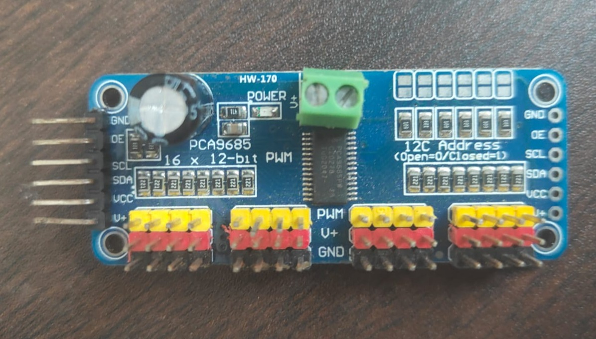

Since no servos are available for this chapter, all outputs are verified entirely with the logic analyzer. The I2C transactions are captured to confirm correct register writes, and the PWM signals on the output channels are measured to verify frequency, duty cycle, and pulse width.

Datasheet/Reference Manual: [https://www.nxp.com/docs/en/data-sheet/PCA9685.pdf](https://www.nxp.com/docs/en/data-sheet/PCA9685.pdf)

Keep the datasheet open throughout this chapter. The sections you will refer to most are Section 7.3 (I2C bus protocol), Section 7.3.5 (PWM frequency and prescaler calculation), and the register map in Section 7.

## Section 1 -- Reading the Datasheet

### 1.1 Device Overview

Open the datasheet and read the product description and features list. Note the following:

The PCA9685 operates on a supply voltage of 2.3V to 5.5V. The STM32F4 Discovery's 3V3 rail is within this range and is the correct supply. The I2C logic level is referenced to VDD, so at 3.3V the logic levels are compatible with the STM32F4 without a level shifter.

The device has a 6-bit hardware address configuration via pins A0 through A5, allowing up to 64 PCA9685 devices on the same I2C bus. The base address is 0x40. With all address pins tied low the device address is 0x40.

The PCA9685 has an internal 25MHz oscillator that drives the PWM generator. An external clock can be used instead but the internal oscillator is sufficient for servo control.

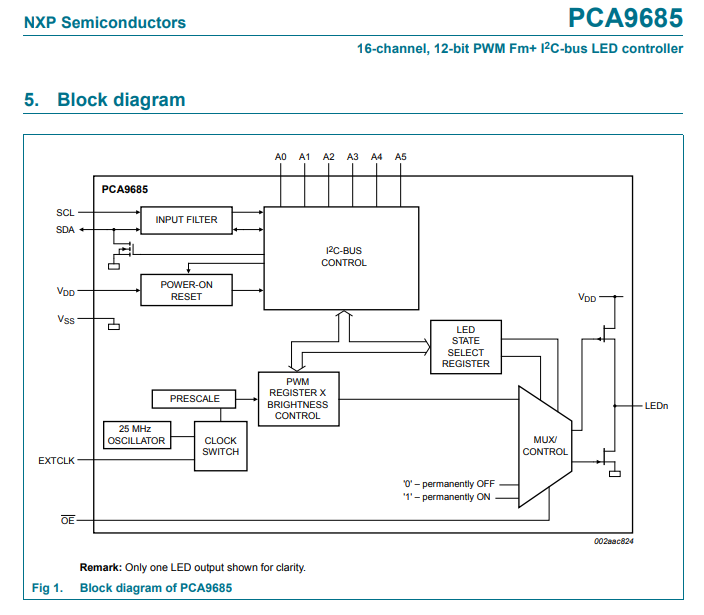
*Figure: PCA9685 datasheet block diagram showing internal oscillator, prescaler, PWM generator and output channels.*

### 1.2 Register Map Overview

Navigate to Section 7 of the datasheet and study the register map. The key registers are:

MODE1 at address 0x00 controls sleep mode, auto-increment, and external clock selection. The device must be put to sleep before writing the prescaler register and woken afterward.

MODE2 at address 0x01 controls output driver configuration -- totem pole or open drain, output enable polarity, and whether outputs change on I2C STOP or ACK.

PRE_SCALE at address 0xFE sets the PWM frequency prescaler. This is the register that determines the PWM frequency for all 16 channels. It can only be written while the device is in sleep mode.

LED0_ON_L through LED15_OFF_H are the per-channel registers. Each channel has four registers: ON_L, ON_H, OFF_L, OFF_H. The ON registers set the tick count at which the output goes high. The OFF registers set the tick count at which the output goes low. Each value is 12 bits wide spanning the low and high registers.

ALL_LED_ON_L through ALL_LED_OFF_H at addresses 0xFA through 0xFD apply a setting to all 16 channels simultaneously. Writing to these registers is useful for resetting all channels at once.

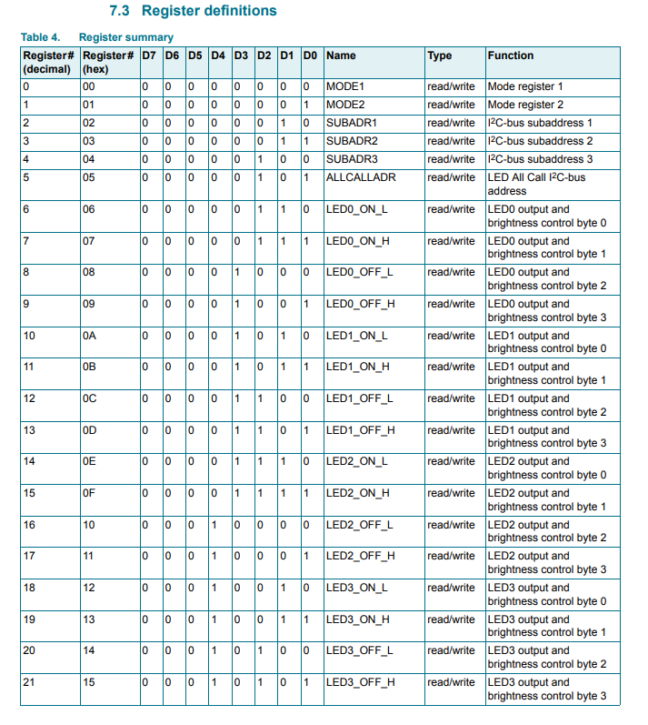
*Figure: PCA9685 register map table from datasheet showing LED channel register layout.*

### 1.3 The ON/OFF Tick Model

This is the most important concept for understanding the PCA9685. Rather than specifying a simple duty cycle percentage, each channel is programmed with two 12-bit values: the tick count at which the output turns on, and the tick count at which the output turns off. The PWM counter runs from 0 to 4095 continuously. When the counter reaches the ON value the output goes high. When it reaches the OFF value the output goes low.

This means the pulse can be positioned anywhere within the PWM period, not just at the beginning. For servo control you typically set ON to 0 and vary only the OFF value to control pulse width.

```
Counter: 0                    4095
         |____________________|
Output:  |    |‾‾‾‾‾‾|        |
              ^      ^
             ON     OFF
```

The register layout for each channel is:

- LED_ON_L -- bits 7:0 of the ON value
- LED_ON_H -- bits 11:8 of the ON value (bits 3:0 used)
- LED_OFF_L -- bits 7:0 of the OFF value
- LED_OFF_H -- bits 11:8 of the OFF value (bits 3:0 used)

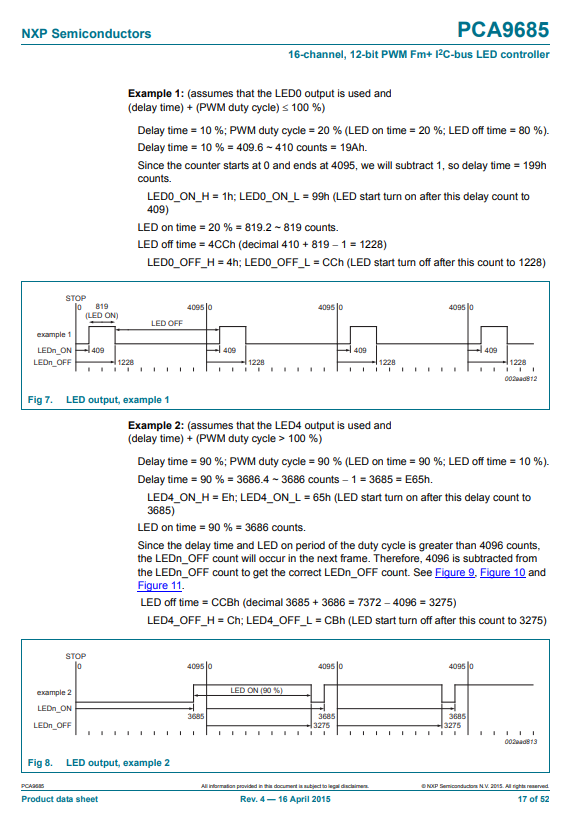
*Figure: PCA9685 datasheet diagram showing ON/OFF tick model with counter waveform.*


### 1.4 Prescaler and PWM Frequency Calculation

Navigate to Section 7.3.5. The PWM frequency is determined by the PRE_SCALE register according to this formula from the datasheet:

```
prescale = round(osc_clock / (4096 * update_rate)) - 1
```

Where osc_clock is 25,000,000 Hz for the internal oscillator and update_rate is the desired PWM frequency in Hz.

For standard servo control the PWM frequency is 50Hz (20ms period):

```
prescale = round(25,000,000 / (4096 * 50)) - 1
         = round(25,000,000 / 204,800) - 1
         = round(122.07) - 1
         = 122 - 1
         = 121
```

So writing 121 to PRE_SCALE gives a 50Hz PWM frequency suitable for servo control.

The minimum prescale value is 3, corresponding to a maximum frequency of approximately 1526Hz. The maximum prescale value is 255, corresponding to a minimum frequency of approximately 24Hz.

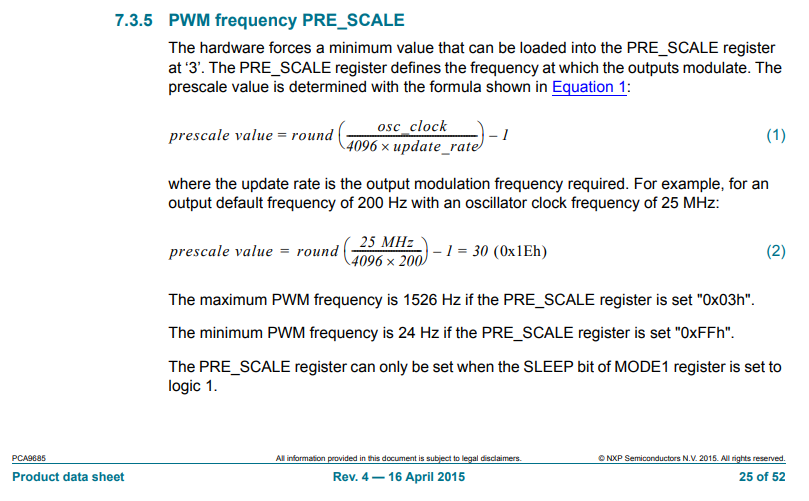
*Figure: PCA9685 datasheet Section 7.3.5 showing prescaler formula.*


### 1.5 Servo Pulse Width to Tick Calculation

A standard servo expects a PWM signal at 50Hz with a pulse width between 1ms and 2ms. 1ms corresponds to 0 degrees and 2ms corresponds to 180 degrees. The total PWM period at 50Hz is 20ms.

To convert a pulse width in milliseconds to a 12-bit OFF tick value:

```
ticks = (pulse_ms / period_ms) * 4096
      = (pulse_ms / 20.0) * 4096
```

For 1ms (0 degrees):

```
ticks = (1.0 / 20.0) * 4096 = 204.8 ≈ 205
```

For 1.5ms (90 degrees):

```
ticks = (1.5 / 20.0) * 4096 = 307.2 ≈ 307
```

For 2ms (180 degrees):

```
ticks = (2.0 / 20.0) * 4096 = 409.6 ≈ 410
```

To convert a desired angle directly to ticks:

```
pulse_ms = 1.0 + (angle / 180.0)
ticks    = (pulse_ms / 20.0) * 4096
```

These calculations are implemented in the driver's angle-to-tick conversion function.

## Section 2 -- Wiring

Connect the PCA9685 breakout board to the STM32F4 Discovery board as follows:

- PCA9685 VCC connects to Discovery 3V3 
- PCA9685 GND connects to Discovery GND
- PCA9685 SDA connects to Discovery PB7
- PCA9685 SCL connects to Discovery PB6 
- PCA9685 OE connects to Discovery PB8 
- **(Optional, this is true by default)** PCA9685 A0 through A5 connect to GND (sets I2C address to 0x40)   
- PCA9685 V+ is left unconnected (servo power rail, not needed without servos)

PB6 and PB7 are the I2C1 pins used in Chapter 1. If you are building on the same project as the MPU6050 chapter, the I2C1 peripheral is already configured.

OE is the output enable pin, active low. Driving it high disables all PWM outputs. Driving it low enables them. This is wired to PB8 as a GPIO output for software control.

Logic analyzer connections:

- Connect logic analyzer channel 0 to PB6 (SCL)
- Connect logic analyzer channel 1 to PB7 (SDA)
- Connect logic analyzer channel 2 to PCA9685 output channel 0 (pin labelled PWM0 or CH0 on the breakout board) 
- Connect logic analyzer channel 3 to PCA9685 output channel 1 Connect logic analyzer channel 4 to PB8 (OE)
- Connect logic analyzer GND to Discovery GND

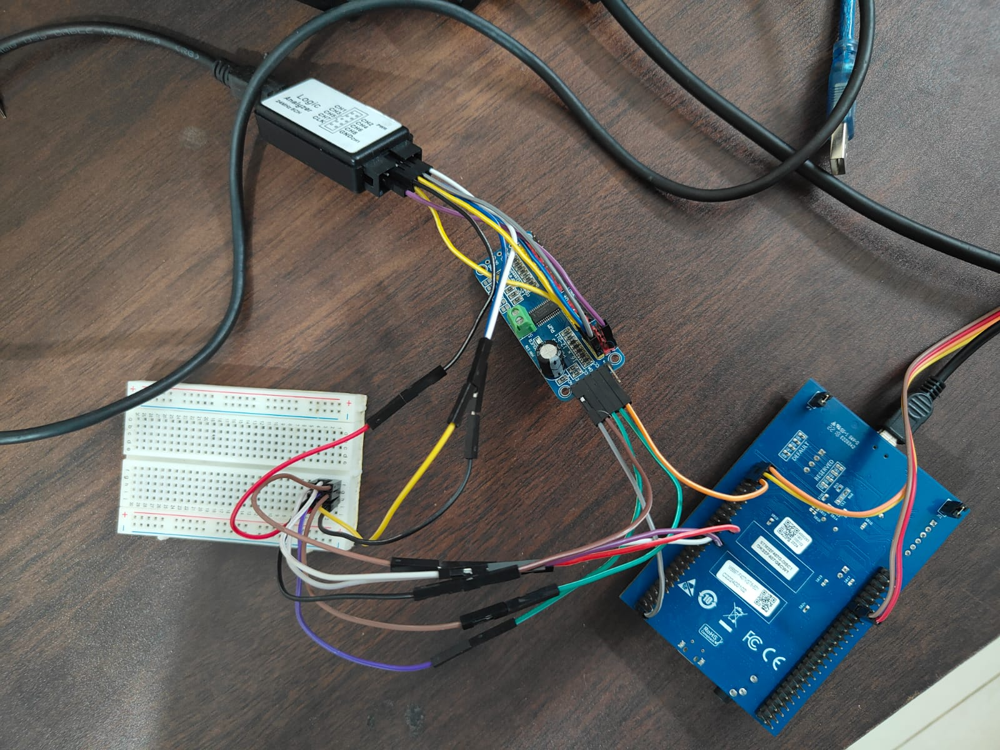
*Figure: Photograph of physical wiring.*


## Section 3 -- STM32CubeIDE Project Setup

### 3.1 Create the Project

Open STM32CubeIDE and create a new STM32 project targeting the STM32F407VG Discovery board. Name it PCA9685_Driver.

### 3.2 Configure I2C1

Open the .ioc file and navigate to Connectivity, I2C1. Set Mode to I2C, Speed Mode to Fast Mode, and Fast Mode Clock Speed to 400000. Assign PB6 and PB7 to I2C1, if it doesn't happen automatically. 

### 3.3 Configure GPIO for OE Pin

Navigate to System Core, GPIO. Configure PB8 as GPIO Output, Push-Pull, No Pull, Low Speed. Set the User Label to OE.

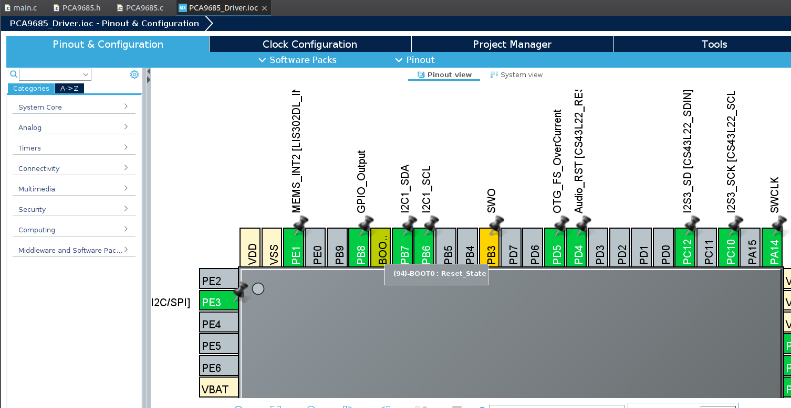
*Figure: STM32CubeIDE IOC configurator showing PB8 configured as GPIO output with OE label.*

### 3.4 Configure USART2

Enable USART2 under Connectivity. Set mode to Asynchronous, baud rate 115200, 8N1.

### 3.5 Generate Code

Save the .ioc file and generate code.

### 3.6 Retarget printf

```c
/* USER CODE BEGIN Includes */
#include <stdio.h>
#include <math.h>
/* USER CODE END Includes */

/* USER CODE BEGIN 0 */
int _write(int file, char *ptr, int len) {
    HAL_UART_Transmit(&huart2, (uint8_t*)ptr, len, HAL_MAX_DELAY);
    return len;
}
/* USER CODE END 0 */
```


## Section 4 -- Driver Implementation

Create PCA9685.h in Core/Inc and PCA9685.c in Core/Src.

### 4.1 PCA9685.h

```c
#ifndef PCA9685_H
#define PCA9685_H

#include "stm32f4xx_hal.h"
#include <stdint.h>

// Default I2C address with all address pins low
#define PCA9685_ADDR          (0x40 << 1)

// Register addresses
#define PCA9685_REG_MODE1     0x00
#define PCA9685_REG_MODE2     0x01
#define PCA9685_REG_LED0_ON_L 0x06
#define PCA9685_REG_ALL_ON_L  0xFA
#define PCA9685_REG_PRE_SCALE 0xFE

// MODE1 bit masks
#define PCA9685_MODE1_SLEEP   0x10
#define PCA9685_MODE1_AI      0x20    // Auto-increment
#define PCA9685_MODE1_RESTART 0x80

// Internal oscillator frequency
#define PCA9685_OSC_CLOCK     25000000.0f

// PWM resolution
#define PCA9685_RESOLUTION    4096

// Servo pulse width limits in milliseconds
#define SERVO_MIN_MS          1.0f    // 0 degrees
#define SERVO_MAX_MS          2.0f    // 180 degrees

// Driver handle
typedef struct {
    I2C_HandleTypeDef *hi2c;
    GPIO_TypeDef      *oe_port;
    uint16_t           oe_pin;
    float              pwm_freq;      // Configured PWM frequency in Hz
    float              period_ms;     // PWM period in milliseconds
} PCA9685_Handle;

// Function prototypes
HAL_StatusTypeDef PCA9685_Init(PCA9685_Handle *dev,
                                I2C_HandleTypeDef *hi2c,
                                GPIO_TypeDef *oe_port,
                                uint16_t oe_pin,
                                float pwm_freq);

HAL_StatusTypeDef PCA9685_SetChannel(PCA9685_Handle *dev,
                                      uint8_t channel,
                                      uint16_t on_ticks,
                                      uint16_t off_ticks);

HAL_StatusTypeDef PCA9685_SetServoAngle(PCA9685_Handle *dev,
                                         uint8_t channel,
                                         float angle);

HAL_StatusTypeDef PCA9685_SetAllOff(PCA9685_Handle *dev);

void PCA9685_Enable(PCA9685_Handle *dev);
void PCA9685_Disable(PCA9685_Handle *dev);

uint16_t PCA9685_AngleToTicks(PCA9685_Handle *dev, float angle);

#endif
```

### 4.2 PCA9685.c

```c
#include "PCA9685.h"

static HAL_StatusTypeDef write_reg(PCA9685_Handle *dev,
                                    uint8_t reg,
                                    uint8_t val) {
    uint8_t buf[2] = { reg, val };
    return HAL_I2C_Master_Transmit(dev->hi2c, PCA9685_ADDR,
                                    buf, 2, HAL_MAX_DELAY);
}

static HAL_StatusTypeDef read_reg(PCA9685_Handle *dev,
                                   uint8_t reg,
                                   uint8_t *val) {
    HAL_StatusTypeDef s;
    s = HAL_I2C_Master_Transmit(dev->hi2c, PCA9685_ADDR,
                                  &reg, 1, HAL_MAX_DELAY);
    if (s != HAL_OK) return s;
    return HAL_I2C_Master_Receive(dev->hi2c, PCA9685_ADDR,
                                   val, 1, HAL_MAX_DELAY);
}

HAL_StatusTypeDef PCA9685_Init(PCA9685_Handle *dev,
                                I2C_HandleTypeDef *hi2c,
                                GPIO_TypeDef *oe_port,
                                uint16_t oe_pin,
                                float pwm_freq) {
    dev->hi2c     = hi2c;
    dev->oe_port  = oe_port;
    dev->oe_pin   = oe_pin;
    dev->pwm_freq = pwm_freq;
    dev->period_ms = 1000.0f / pwm_freq;

    HAL_StatusTypeDef s;

    // Step 1 -- Disable outputs during initialisation
    PCA9685_Disable(dev);

    // Step 2 -- Reset the device
    // Write 0x06 to the general call address 0x00 to trigger software reset
    uint8_t reset_cmd = 0x06;
    s = HAL_I2C_Master_Transmit(dev->hi2c, 0x00,
                                  &reset_cmd, 1, HAL_MAX_DELAY);
    HAL_Delay(10);

    // Step 3 -- Enable auto-increment and clear restart bit
    // AI bit allows writing multiple channel registers in one transaction
    s = write_reg(dev, PCA9685_REG_MODE1, PCA9685_MODE1_AI);
    if (s != HAL_OK) return s;
    HAL_Delay(1);

    // Step 4 -- Put device to sleep before writing prescaler
    // PRE_SCALE can only be written when SLEEP bit is set
    uint8_t mode1;
    s = read_reg(dev, PCA9685_REG_MODE1, &mode1);
    if (s != HAL_OK) return s;

    s = write_reg(dev, PCA9685_REG_MODE1,
                   (mode1 | PCA9685_MODE1_SLEEP) & ~PCA9685_MODE1_RESTART);
    if (s != HAL_OK) return s;
    HAL_Delay(1);

    // Step 5 -- Calculate and write prescaler
    // Formula from datasheet Section 7.3.5:
    // prescale = round(osc_clock / (4096 * update_rate)) - 1
    uint8_t prescale = (uint8_t)(roundf(PCA9685_OSC_CLOCK
                       / (PCA9685_RESOLUTION * pwm_freq)) - 1);
    s = write_reg(dev, PCA9685_REG_PRE_SCALE, prescale);
    if (s != HAL_OK) return s;

    printf("[PCA9685] prescale = %u (target freq = %.1f Hz)\r\n",
           prescale, pwm_freq);

    // Step 6 -- Wake the device
    s = write_reg(dev, PCA9685_REG_MODE1,
                   mode1 & ~PCA9685_MODE1_SLEEP);
    if (s != HAL_OK) return s;
    HAL_Delay(1);

    // Step 7 -- Trigger restart to apply new prescaler
    s = write_reg(dev, PCA9685_REG_MODE1,
                   mode1 | PCA9685_MODE1_RESTART | PCA9685_MODE1_AI);
    if (s != HAL_OK) return s;
    HAL_Delay(1);

    // Step 8 -- Set all channels off
    s = PCA9685_SetAllOff(dev);
    if (s != HAL_OK) return s;

    return HAL_OK;
}

HAL_StatusTypeDef PCA9685_SetChannel(PCA9685_Handle *dev,
                                      uint8_t channel,
                                      uint16_t on_ticks,
                                      uint16_t off_ticks) {
    if (channel > 15) return HAL_ERROR;

    // Each channel has 4 registers starting at LED0_ON_L + (channel * 4)
    uint8_t reg = PCA9685_REG_LED0_ON_L + (channel * 4);

    uint8_t buf[5];
    buf[0] = reg;
    buf[1] = on_ticks  & 0xFF;          // ON_L
    buf[2] = (on_ticks  >> 8) & 0x0F;   // ON_H
    buf[3] = off_ticks & 0xFF;          // OFF_L
    buf[4] = (off_ticks >> 8) & 0x0F;   // OFF_H

    // Auto-increment allows all 4 registers to be written in one transaction
    return HAL_I2C_Master_Transmit(dev->hi2c, PCA9685_ADDR,
                                    buf, 5, HAL_MAX_DELAY);
}

uint16_t PCA9685_AngleToTicks(PCA9685_Handle *dev, float angle) {
    // Clamp angle to valid servo range
    if (angle < 0.0f)   angle = 0.0f;
    if (angle > 180.0f) angle = 180.0f;

    // Convert angle to pulse width in milliseconds
    // 0 degrees = SERVO_MIN_MS, 180 degrees = SERVO_MAX_MS
    float pulse_ms = SERVO_MIN_MS
                     + (angle / 180.0f)
                     * (SERVO_MAX_MS - SERVO_MIN_MS);

    // Convert pulse width to 12-bit tick count
    // ticks = (pulse_ms / period_ms) * 4096
    uint16_t ticks = (uint16_t)((pulse_ms / dev->period_ms)
                                * PCA9685_RESOLUTION);

    return ticks;
}

HAL_StatusTypeDef PCA9685_SetServoAngle(PCA9685_Handle *dev,
                                         uint8_t channel,
                                         float angle) {
    uint16_t ticks = PCA9685_AngleToTicks(dev, angle);
    printf("[PCA9685] ch%u angle=%.1f deg  pulse=%.3f ms  ticks=%u\r\n",
           channel, angle,
           SERVO_MIN_MS + (angle / 180.0f) * (SERVO_MAX_MS - SERVO_MIN_MS),
           ticks);
    return PCA9685_SetChannel(dev, channel, 0, ticks);
}

HAL_StatusTypeDef PCA9685_SetAllOff(PCA9685_Handle *dev) {
    // Write 0x1000 to ALL_LED_OFF_H to force all outputs off
    // Bit 12 of OFF_H is the full-off bit
    uint8_t buf[5];
    buf[0] = PCA9685_REG_ALL_ON_L;
    buf[1] = 0x00;   // ALL_ON_L
    buf[2] = 0x00;   // ALL_ON_H
    buf[3] = 0x00;   // ALL_OFF_L
    buf[4] = 0x10;   // ALL_OFF_H -- bit 4 is full-off bit
    return HAL_I2C_Master_Transmit(dev->hi2c, PCA9685_ADDR,
                                    buf, 5, HAL_MAX_DELAY);
}

void PCA9685_Enable(PCA9685_Handle *dev) {
    // OE is active low
    HAL_GPIO_WritePin(dev->oe_port, dev->oe_pin, GPIO_PIN_RESET);
}

void PCA9685_Disable(PCA9685_Handle *dev) {
    HAL_GPIO_WritePin(dev->oe_port, dev->oe_pin, GPIO_PIN_SET);
}
```


## Section 5 -- Mathematical Manipulation

### 5.1 Prescaler to Actual PWM Frequency

The prescaler register value is an integer. The rounding in the prescaler calculation introduces a small frequency error. The actual PWM frequency produced by the device for a given prescaler value is:

```
actual_freq = osc_clock / (4096 * (prescale + 1))
            = 25,000,000 / (4096 * (121 + 1))
            = 25,000,000 / 499,712
            = 50.028 Hz
```

The error is 0.028Hz or 0.056 percent. For servo control this is negligible. For applications requiring precise frequency matching the external clock input can be used with a more accurate oscillator.

### 5.2 Angle to Pulse Width to Ticks

The full conversion chain from angle to register value is:

```
Step 1: pulse_ms = 1.0 + (angle / 180.0)
Step 2: ticks    = (pulse_ms / period_ms) * 4096
                 = (pulse_ms / 20.0) * 4096
```

Worked examples:

```
0 degrees:   pulse = 1.0ms   ticks = (1.0  / 20.0) * 4096 = 205
90 degrees:  pulse = 1.5ms   ticks = (1.5  / 20.0) * 4096 = 307
180 degrees: pulse = 2.0ms   ticks = (2.0  / 20.0) * 4096 = 410
```

### 5.3 Reverse Calculation -- Ticks to Pulse Width

To verify a measured tick value from the logic analyzer against the expected pulse width:

```
pulse_ms = (ticks / 4096.0) * period_ms
         = (ticks / 4096.0) * 20.0
```

For ticks = 307:

```
pulse_ms = (307 / 4096.0) * 20.0 = 1.499ms  (expected 1.5ms for 90 degrees)
```

The small error is due to integer rounding in the tick calculation. This is acceptable for servo control where mechanical tolerances far exceed this level of precision.

### 5.4 Duty Cycle Percentage

To express the output as a duty cycle percentage:

```
duty_cycle = (off_ticks / 4096.0) * 100
```

For 90 degrees with off_ticks = 307:

```
duty_cycle = (307 / 4096.0) * 100 = 7.5%
```

This matches the well-known rule of thumb for servo control: 0 degrees is approximately 5 percent duty cycle, 90 degrees is approximately 7.5 percent, and 180 degrees is approximately 10 percent.

Dronebot Workshop (https://dronebotworkshop.com/) is one of my favourite outlets for learning electronics. They have a chapter covering how servo motors work with the Arduino. If you can spare more time, do check them out. 
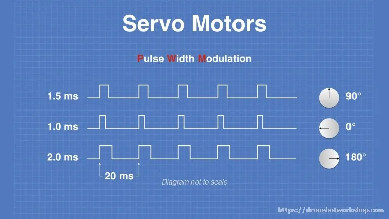
*Figure: Angle v Pulse Width (Source: https://dronebotworkshop.com/servo-motors-with-arduino/ )*

## Section 6 -- Main Application

```c
/* USER CODE BEGIN PV */
PCA9685_Handle pca;
/* USER CODE END PV */
```

```c
/* USER CODE BEGIN Includes */
#include <stdio.h>
#include <math.h>
#include "PCA9685.h"
/* USER CODE END Includes */
```

```c
/* USER CODE BEGIN 2 */

printf("\r\n=== PCA9685 Driver ===\r\n\n");

HAL_StatusTypeDef status = PCA9685_Init(&pca, &hi2c1,
                                          GPIOB, GPIO_PIN_8,
                                          50.0f);
if (status != HAL_OK) {
    printf("PCA9685 init failed. Check wiring.\r\n");
    while (1);
}

printf("PCA9685 initialised successfully.\r\n\n");

// Enable outputs
PCA9685_Enable(&pca);

// Section A -- Sweep channel 0 through key angles
printf("--- Section A: Angle sweep on channel 0 ---\r\n");

float angles[] = { 0.0f, 45.0f, 90.0f, 135.0f, 180.0f };
for (int i = 0; i < 5; i++) {
    PCA9685_SetServoAngle(&pca, 0, angles[i]);
    HAL_Delay(1000);
}

// Section B -- Drive multiple channels simultaneously
printf("\r\n--- Section B: Multi-channel output ---\r\n");

PCA9685_SetServoAngle(&pca, 0,  0.0f);
PCA9685_SetServoAngle(&pca, 1,  90.0f);
PCA9685_SetServoAngle(&pca, 2,  180.0f);
PCA9685_SetServoAngle(&pca, 3,  45.0f);
HAL_Delay(2000);

// Section C -- All channels off
printf("\r\n--- Section C: All channels off ---\r\n");
PCA9685_SetAllOff(&pca);
PCA9685_Disable(&pca);
printf("All channels off. Outputs disabled.\r\n");

/* USER CODE END 2 */
```

## Section 7 -- Verifying with a Logic Analyzer

Connect your logic analyzer as described in Section 2. Open PulseView. Add an I2C decoder on channels 0 and 1 for the bus traffic. Configure channels 2 and 3 as plain digital inputs for the PWM outputs.

### 7.1 Verifying the Initialisation Sequence

Capture the I2C traffic during startup. You should see the following transactions in order:

A general call reset -- address 0x00, data byte 0x06. A write to MODE1 at 0x00 with value 0x20 to enable auto-increment. A read from MODE1 at 0x00 to retrieve the current mode. A write to MODE1 putting the device to sleep. A write to PRE_SCALE at 0xFE with value 121 for 50Hz. A write to MODE1 waking the device. A write to MODE1 triggering restart. A write to ALL_LED registers setting all channels off.

Cross-reference each transaction address and data byte against the register map in the datasheet.

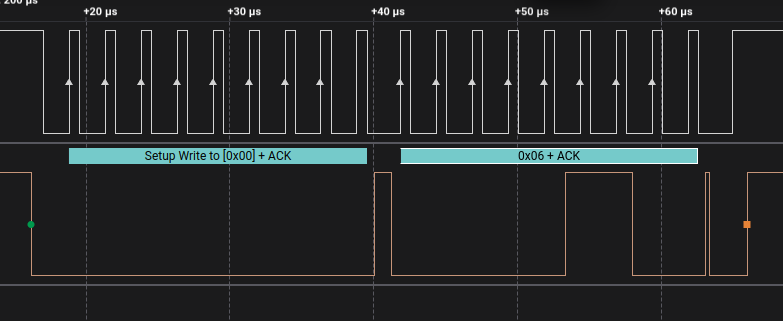
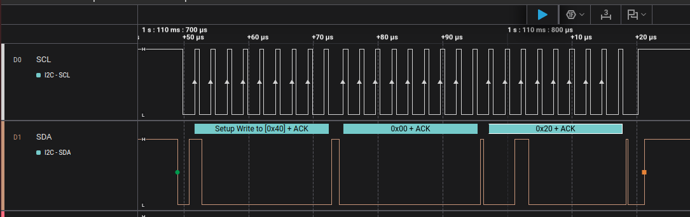
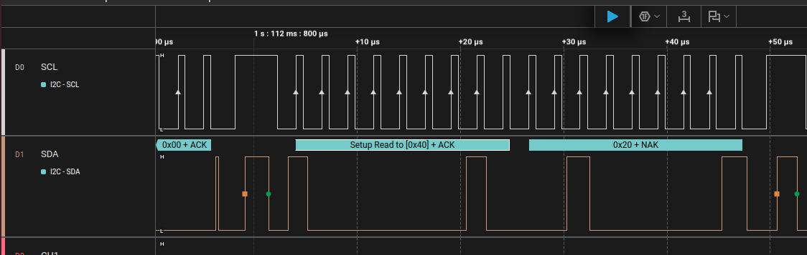
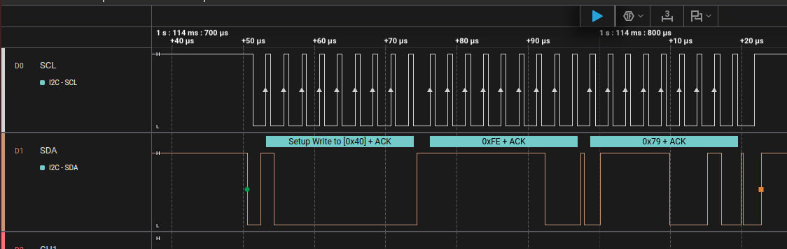
*Fig: Read and Write Transactions as Described Above*

### 7.2 Verifying the Prescaler Write

Zoom into the PRE_SCALE write transaction. Confirm:

The register address byte is 0xFE. The data byte is 0x79 (121 in hexadecimal). The transaction occurs between the sleep write and the wake write -- the prescaler must only be written while SLEEP is set.

### 7.3 Verifying PWM Output Frequency

Switch to the PWM channel view on channels 2 and 3. After initialisation and the first SetServoAngle call you should see a continuous PWM waveform. Measure the period of the waveform using cursors on two consecutive rising edges.

Expected period at 50Hz:

```
period = 1 / 50 = 20ms
```

Place cursors on two rising edges and confirm the measured period is approximately 20ms. The small oscillator error calculated in Section 5.1 means the actual period will be approximately 19.989ms rather than exactly 20ms.

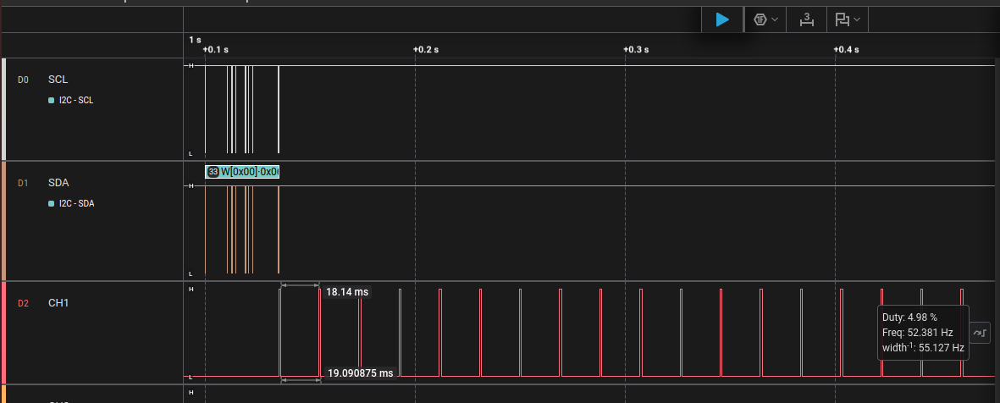
*Figure: PulseView screenshot showing PWM output on channel 1 with cursor measurement confirming 20ms period.*

### 7.4 Verifying Pulse Width at Each Angle

Measure the pulse high time at each of the five angles from Section A. Use cursors to measure from the rising edge to the falling edge of each pulse.

Expected pulse widths:

```
0 degrees:   1.0ms   (ticks = 205)
45 degrees:  1.25ms  (ticks = 256)
90 degrees:  1.5ms   (ticks = 307)
135 degrees: 1.75ms  (ticks = 358)
180 degrees: 2.0ms   (ticks = 410)
```

Confirm each measured pulse width matches the expected value within the oscillator tolerance of approximately 0.056 percent.

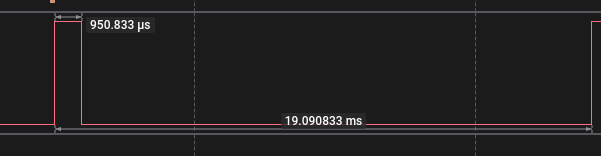
*Figure: PulseView screenshot showing pulse width measurement at 0 degrees confirming 1.0ms high time.*

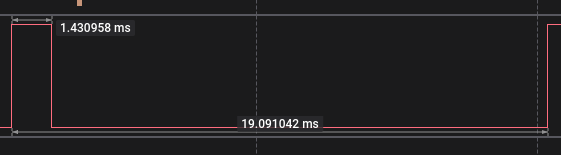
*Figure: PulseView screenshot showing pulse width measurement at 90 degrees confirming 1.5ms high time.*

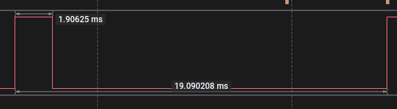
*Figure:  PulseView screenshot showing pulse width measurement at 180 degrees confirming 2.0ms high time.*

### 7.5 Verifying Multi-Channel Output

Capture the PWM outputs on channels 0 through 3 simultaneously during Section B. Confirm:

All four channels run at the same 20ms period -- the prescaler applies globally. Each channel has the correct pulse width for its programmed angle. The pulses on different channels start at the same point in the period since ON ticks are all set to 0.

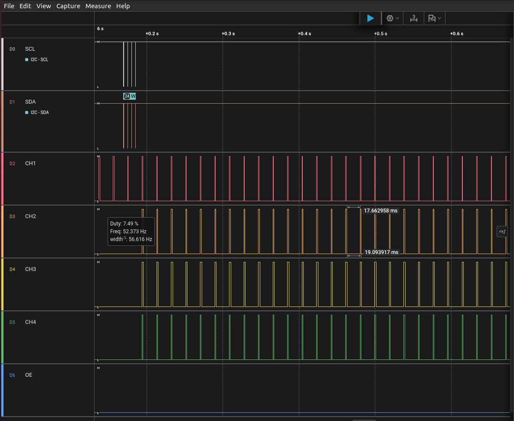
*Figure: PulseView screenshot showing four channels simultaneously with different pulse widths corresponding to 0, 90, 180 and 45 degrees.*

### 7.6 Verifying the SetAllOff Command

Capture the transition when PCA9685_SetAllOff is called followed by PCA9685_Disable. You should see:

The I2C write to ALL_LED_OFF_H with the full-off bit set. The PWM output on all channels immediately goes and stays low. The OE pin goes high as Disable is called.

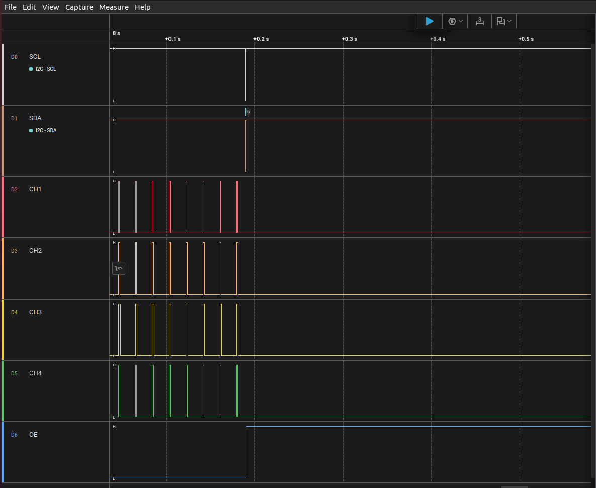
*Figure: PulseView screenshot showing PWM output going low after SetAllOff command and OE pin going high.*

## Section 8 -- Expected Serial Output

```
=== PCA9685 Driver ===

[PCA9685] prescale = 121 (target freq = 50.0 Hz)
PCA9685 initialised successfully.

--- Section A: Angle sweep on channel 0 ---
[PCA9685] ch0 angle=0.0 deg    pulse=1.000 ms   ticks=205
[PCA9685] ch0 angle=45.0 deg   pulse=1.250 ms   ticks=256
[PCA9685] ch0 angle=90.0 deg   pulse=1.500 ms   ticks=307
[PCA9685] ch0 angle=135.0 deg  pulse=1.750 ms   ticks=358
[PCA9685] ch0 angle=180.0 deg  pulse=2.000 ms   ticks=410

--- Section B: Multi-channel output ---
[PCA9685] ch0 angle=0.0 deg    pulse=1.000 ms   ticks=205
[PCA9685] ch1 angle=90.0 deg   pulse=1.500 ms   ticks=307
[PCA9685] ch2 angle=180.0 deg  pulse=2.000 ms   ticks=410
[PCA9685] ch3 angle=45.0 deg   pulse=1.250 ms   ticks=256

--- Section C: All channels off ---
All channels off. Outputs disabled.
```

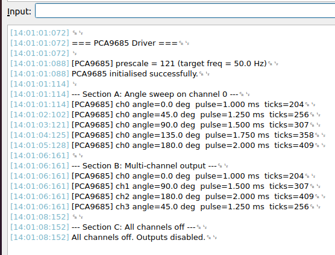

## What You Should Take Away

The PRE_SCALE register can only be written while the device is in sleep mode -- attempting to write it while the device is awake has no effect and is a common source of incorrect PWM frequency that produces no error message. The ON/OFF tick model gives each channel independent phase control within the PWM period, which is a more flexible design than a simple duty cycle register and is worth understanding thoroughly before assuming pulse position is fixed. The auto-increment bit in MODE1 must be set before attempting to write all four channel registers in a single I2C transaction -- without it only the first register is written and the channel output is incorrect. The prescaler calculation introduces integer rounding error that produces a small frequency offset from the target -- for servo control this is negligible but for precision timing applications an external clock source should be used. All 16 channels share the same PWM frequency set by the single prescaler register, so applications requiring different frequencies on different channels must use multiple PCA9685 devices.

---