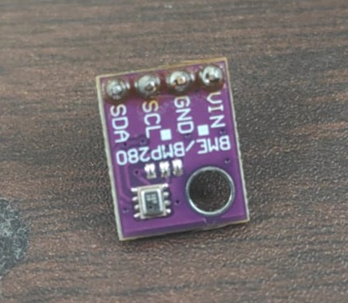
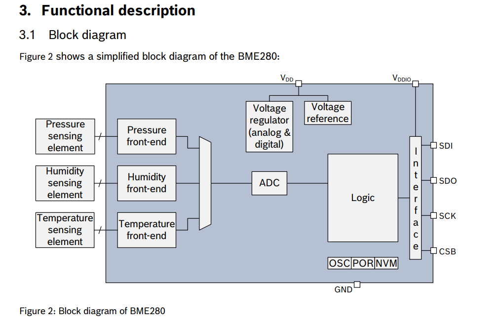
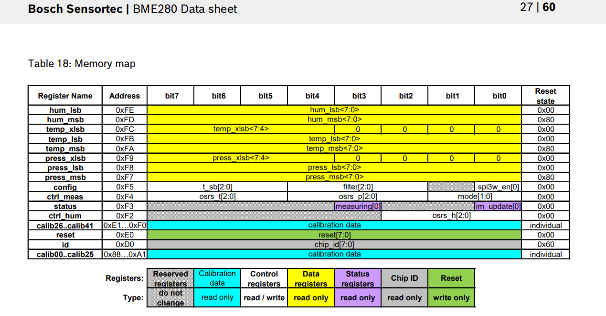
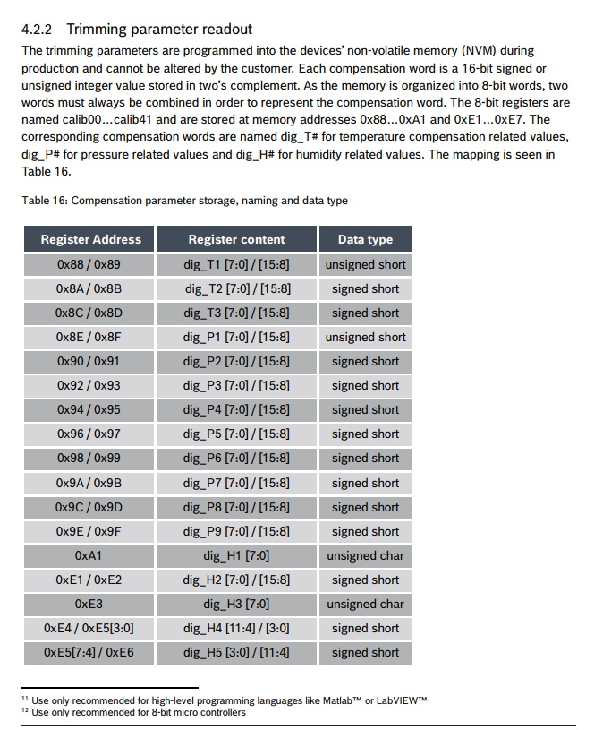
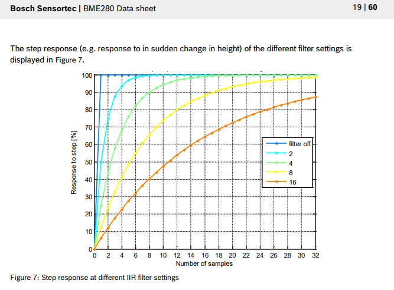
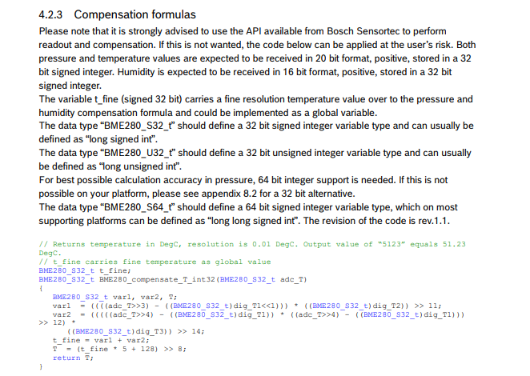
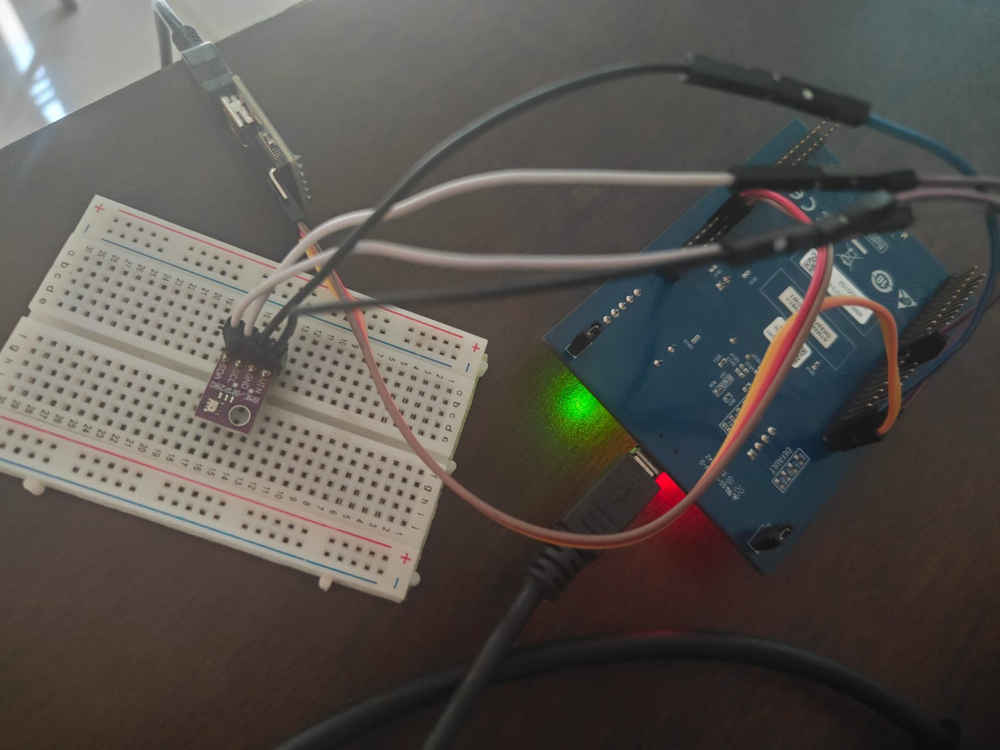
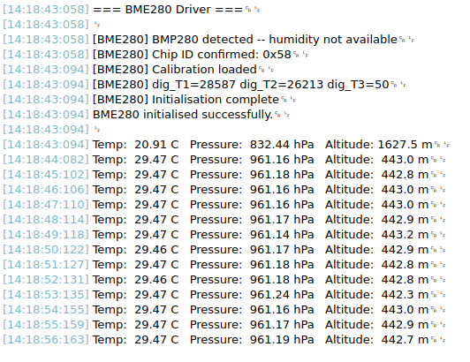

The BME280 is a combined pressure, temperature, and humidity sensor produced by Bosch Sensortec. It measures all three environmental parameters simultaneously and communicates over either I2C or SPI. It is one of the most capable and well-documented sensors available at its price point, and writing a driver for it from scratch is one of the most complete exercises in embedded sensor integration available at this level.

The BME280 is more demanding than the MPU6050 or VL53L1X in one specific respect: raw ADC values from the sensor cannot be converted to physical units by a simple division. The device stores a set of factory-calibrated compensation coefficients in its non-volatile memory at startup, and these coefficients must be read and used in a multi-step fixed-point arithmetic compensation algorithm documented in the datasheet. This algorithm corrects for the non-linearities and individual manufacturing variation of each sensor unit. Every BME280 has unique coefficients. The compensation formulas are the heart of this driver.



This chapter implements the driver over I2C. The SPI interface is covered at the end of the chapter as an extension, demonstrating how the same driver logic is adapted for a different physical interface -- a useful exercise in understanding what actually changes between protocols and what stays the same.

Datasheet: [https://www.bosch-sensortec.com/media/boschsensortec/downloads/datasheets/bst-bme280-ds002.pdf](https://www.bosch-sensortec.com/media/boschsensortec/downloads/datasheets/bst-bme280-ds002.pdf)

Keep the datasheet open throughout. The sections you will refer to most are Section 4 (global memory map), Section 5 (compensation formulas), Section 6 (I2C interface), and Section 7 (SPI interface).

## Section 1 -- Reading the Datasheet

### 1.1 Device Overview

Open the datasheet and read Section 1. Note the following:

The BME280 operates on a supply voltage of 1.71V to 3.6V. The STM32F4 Discovery's 3V3 rail is within this range. I2C logic levels are compatible with 3.3V GPIO without a level shifter.

The I2C address is determined by the SDO pin. When SDO is connected to GND the address is 0x76. When SDO is connected to VDDIO the address is 0x77. This chapter connects SDO to GND for address 0x76.

The device supports three operating modes: sleep mode where no measurements are taken, forced mode where one measurement is taken and the device returns to sleep, and normal mode where measurements are taken continuously at a configurable rate. This chapter uses normal mode.



### 1.2 Register Map Overview

Navigate to Section 4 of the datasheet. The key registers are:

- **id** at address 0xD0 contains the chip identification number. It always returns 0x60 for the BME280. Reading this is the first step of initialisation.

- **reset** at address 0xE0 triggers a soft reset when 0xB6 is written to it.

- **calib00** through **calib25** at addresses 0x88 through 0xA1 contain the first block of factory calibration coefficients for temperature and pressure.

- **calib26** through **calib41** at addresses 0xE1 through 0xF0 contain the second block of calibration coefficients for humidity.

- **ctrl_hum** at address 0xF2 controls humidity oversampling. This register must be written before ctrl_meas for the humidity setting to take effect -- this ordering constraint is documented in Section 5.4.3 and is a common source of incorrect humidity readings.

- **status** at address 0xF3 indicates whether the device is currently measuring or copying NVM data.

- **ctrl_meas** at address 0xF4 controls temperature and pressure oversampling and the operating mode.

- **config** at address 0xF5 controls the standby time in normal mode and the IIR filter coefficient.

The data registers press_msb through hum_lsb at addresses 0xF7 through 0xFE contain the raw ADC output for all three measurements and can be read in a single 8-byte burst.


*Figure: BME280 register map table from datasheet Section 5*

### 1.3 Calibration Coefficients

Navigate to Section 4.2.2. The BME280 stores 32 calibration coefficients in two separate NVM regions. The first region at 0x88 through 0xA1 contains the temperature coefficients dig_T1, dig_T2, dig_T3 and the pressure coefficients dig_P1 through dig_P9. The second region at 0xE1 through 0xF0 contains the humidity coefficients dig_H1 through dig_H6. Each coefficient has a specific width and signedness that must be respected exactly during reassembly from raw bytes. Getting this wrong produces plausible-looking but incorrect output. The exact layout is:

- dig_T1 is uint16_t. dig_T2 and dig_T3 are int16_t.
- dig_P1 is uint16_t. dig_P2 through dig_P9 are int16_t.
- dig_H1 is uint8_t. dig_H2 is int16_t. dig_H3 is uint8_t. dig_H4 and dig_H5 are int16_t assembled from non-contiguous bits across shared bytes. dig_H6 is int8_t.

The non-contiguous layout of dig_H4 and dig_H5 is particularly important. Their bytes overlap in the calibration register region and must be assembled using bit shifting as documented in Section 4.2.2. This is covered explicitly in the driver implementation.



### 1.4 Oversampling and IIR Filter

Navigate to Section 5.4. Oversampling reduces noise by averaging multiple internal ADC readings before producing an output value. Higher oversampling gives lower noise at the cost of longer measurement time and higher power consumption. The oversampling setting for each parameter is set independently via the ctrl_hum and ctrl_meas registers.

The IIR filter smooths the output over time by blending the current measurement with previous measurements. It is useful for pressure readings in applications where slow-moving pressure changes need to be tracked without the output being disturbed by brief transients such as a door closing nearby.

For this chapter all three parameters use 2x oversampling and the IIR filter coefficient is set to 2, giving a good balance between noise reduction and response speed.



### 1.5 The Compensation Formulas

Navigate to Section 5.4.1 through 5.4.3. These sections contain the compensation formulas for temperature, pressure, and humidity. The formulas take raw ADC values and calibration coefficients as input and produce compensated output values.

The temperature formula is evaluated first and produces two outputs: the compensated temperature in hundredths of a degree Celsius, and an intermediate value called t_fine. The t_fine value carries temperature-dependent correction information that is used as an input to both the pressure and humidity compensation formulas. Temperature must always be computed first.

The pressure formula uses t_fine from the temperature calculation to correct for temperature-dependent pressure variations. The output is in units of Q24.8 fixed-point Pa -- a 32-bit integer where the lower 8 bits represent the fractional part.

The humidity formula also uses t_fine and produces output in Q22.10 fixed-point units -- a 32-bit integer where the lower 10 bits represent the fractional part.

The datasheet provides these formulas in both double-precision floating point and 32-bit integer fixed-point variants. This driver implements the 32-bit integer variants because floating point arithmetic on the Cortex-M4 FPU is efficient but the fixed-point path avoids potential precision loss in the intermediate calculations and is the approach recommended by Bosch for embedded implementations.



## Section 2 -- Wiring

Connect the BME280 breakout board to the STM32F4 Discovery board as follows:

- BME280 VIN connects to Discovery 3V3 
- BME280 GND connects to Discovery GND
- BME280 SDA connects to Discovery PB7
- BME280 SCL connects to Discovery PB6 
- BME280 SDO connects to Discovery GND (sets I2C address to 0x76)
- BME280 CSB connects to Discovery 3V3 (forces I2C mode, disables SPI)

CSB is the chip select bar pin. On the BME280 driving CSB high selects I2C mode. Driving it low selects SPI mode. It must be tied to VDDIO for I2C operation -- leaving it floating can cause the device to enter SPI mode intermittently.



## Section 3 -- STM32CubeIDE Project Setup

### 3.1 Create the Project

Open STM32CubeIDE and create a new STM32 project targeting the STM32F407VG Discovery board. Name it BME280_Driver.

### 3.2 Configure I2C1

Open the .ioc file and navigate to Connectivity, I2C1. Set Mode to I2C, Speed Mode to Fast Mode, Fast Mode Clock Speed to 400000. PB6 and PB7 are assigned automatically.

### 3.3 Configure USART2

Enable USART2 under Connectivity. Set mode to Asynchronous, baud rate 115200, 8N1.

### 3.4 Generate Code and Retarget printf

```c
/* USER CODE BEGIN Includes */
#include <stdio.h>
/* USER CODE END Includes */

/* USER CODE BEGIN 0 */
int _write(int file, char *ptr, int len) {
    HAL_UART_Transmit(&huart2, (uint8_t*)ptr, len, HAL_MAX_DELAY);
    return len;
}
/* USER CODE END 0 */
```


Section 4 -- Driver Implementation

Create BME280.h in Core/Inc and BME280.c in Core/Src.

4.1 BME280.h

```c
#ifndef BME280_H
#define BME280_H

#include "stm32f4xx_hal.h"
#include <stdint.h>

// I2C address with SDO tied to GND
#define BME280_ADDR              (0x76 << 1)

// Register addresses
#define BME280_REG_ID            0xD0
#define BME280_REG_RESET         0xE0
#define BME280_REG_CTRL_HUM      0xF2
#define BME280_REG_STATUS        0xF3
#define BME280_REG_CTRL_MEAS     0xF4
#define BME280_REG_CONFIG        0xF5
#define BME280_REG_DATA          0xF7   // Burst read start: 8 bytes
#define BME280_REG_CALIB_00      0x88   // First calibration block
#define BME280_REG_CALIB_26      0xE1   // Second calibration block

// Oversampling settings
#define BME280_OS_NONE           0x00
#define BME280_OS_1X             0x01
#define BME280_OS_2X             0x02
#define BME280_OS_4X             0x03
#define BME280_OS_8X             0x04
#define BME280_OS_16X            0x05

// IIR filter coefficients
#define BME280_FILTER_OFF        0x00
#define BME280_FILTER_2          0x01
#define BME280_FILTER_4          0x02
#define BME280_FILTER_8          0x03
#define BME280_FILTER_16         0x04

// Operating modes
#define BME280_MODE_SLEEP        0x00
#define BME280_MODE_FORCED       0x01
#define BME280_MODE_NORMAL       0x03

// Standby times for normal mode (ms)
#define BME280_STANDBY_0_5MS     0x00
#define BME280_STANDBY_62_5MS    0x01
#define BME280_STANDBY_125MS     0x02
#define BME280_STANDBY_250MS     0x03
#define BME280_STANDBY_500MS     0x04
#define BME280_STANDBY_1000MS    0x05

// Calibration coefficient storage
typedef struct {
    // Temperature
    uint16_t dig_T1;
    int16_t  dig_T2;
    int16_t  dig_T3;

    // Pressure
    uint16_t dig_P1;
    int16_t  dig_P2;
    int16_t  dig_P3;
    int16_t  dig_P4;
    int16_t  dig_P5;
    int16_t  dig_P6;
    int16_t  dig_P7;
    int16_t  dig_P8;
    int16_t  dig_P9;

    // Humidity
    uint8_t  dig_H1;
    int16_t  dig_H2;
    uint8_t  dig_H3;
    int16_t  dig_H4;
    int16_t  dig_H5;
    int8_t   dig_H6;
} BME280_Calib;

// Compensated output
typedef struct {
    float temperature;   // degrees Celsius
    float pressure;      // hPa
    float humidity;      // percent relative humidity
} BME280_Data;

// Driver handle
typedef struct {
    I2C_HandleTypeDef *hi2c;
    BME280_Calib       calib;
    int32_t            t_fine;   // Shared between compensation formulas
} BME280_Handle;

// Function prototypes
HAL_StatusTypeDef BME280_Init(BME280_Handle *dev,
                               I2C_HandleTypeDef *hi2c);

HAL_StatusTypeDef BME280_ReadData(BME280_Handle *dev,
                                   BME280_Data *out);

#endif
```

4.2 BME280.c

```c
#include "BME280.h"

static HAL_StatusTypeDef write_reg(BME280_Handle *dev,
                                    uint8_t reg,
                                    uint8_t val) {
    uint8_t buf[2] = { reg, val };
    return HAL_I2C_Master_Transmit(dev->hi2c, BME280_ADDR,
                                    buf, 2, HAL_MAX_DELAY);
}

static HAL_StatusTypeDef read_reg(BME280_Handle *dev,
                                   uint8_t reg,
                                   uint8_t *buf,
                                   uint16_t len) {
    HAL_StatusTypeDef s;
    s = HAL_I2C_Master_Transmit(dev->hi2c, BME280_ADDR,
                                  &reg, 1, HAL_MAX_DELAY);
    if (s != HAL_OK) return s;
    return HAL_I2C_Master_Receive(dev->hi2c, BME280_ADDR,
                                   buf, len, HAL_MAX_DELAY);
}

// Read and assemble calibration coefficients from both NVM regions
static HAL_StatusTypeDef read_calibration(BME280_Handle *dev) {
    uint8_t buf[26];
    HAL_StatusTypeDef s;

    // First calibration block: 0x88 through 0xA1 (26 bytes)
    s = read_reg(dev, BME280_REG_CALIB_00, buf, 26);
    if (s != HAL_OK) return s;

    // Temperature coefficients
    // All multi-byte values are little-endian (LSB at lower address)
    dev->calib.dig_T1 = (uint16_t)(buf[1]  << 8 | buf[0]);
    dev->calib.dig_T2 = (int16_t) (buf[3]  << 8 | buf[2]);
    dev->calib.dig_T3 = (int16_t) (buf[5]  << 8 | buf[4]);

    // Pressure coefficients
    dev->calib.dig_P1 = (uint16_t)(buf[7]  << 8 | buf[6]);
    dev->calib.dig_P2 = (int16_t) (buf[9]  << 8 | buf[8]);
    dev->calib.dig_P3 = (int16_t) (buf[11] << 8 | buf[10]);
    dev->calib.dig_P4 = (int16_t) (buf[13] << 8 | buf[12]);
    dev->calib.dig_P5 = (int16_t) (buf[15] << 8 | buf[14]);
    dev->calib.dig_P6 = (int16_t) (buf[17] << 8 | buf[16]);
    dev->calib.dig_P7 = (int16_t) (buf[19] << 8 | buf[18]);
    dev->calib.dig_P8 = (int16_t) (buf[21] << 8 | buf[20]);
    dev->calib.dig_P9 = (int16_t) (buf[23] << 8 | buf[22]);

    // dig_H1 is at address 0xA1 -- the last byte of the first block
    dev->calib.dig_H1 = buf[25];

    // Second calibration block: 0xE1 through 0xF0 (7 bytes)
    uint8_t hbuf[7];
    s = read_reg(dev, BME280_REG_CALIB_26, hbuf, 7);
    if (s != HAL_OK) return s;

    dev->calib.dig_H2 = (int16_t)(hbuf[1] << 8 | hbuf[0]);
    dev->calib.dig_H3 = hbuf[2];

    // dig_H4 and dig_H5 share byte hbuf[3] -- non-contiguous bit layout
    // dig_H4: bits 11:4 from hbuf[3], bits 3:0 from hbuf[4] bits 3:0
    // dig_H5: bits 11:4 from hbuf[4], bits 3:0 from hbuf[5] bits 7:4
    dev->calib.dig_H4 = (int16_t)((int8_t)hbuf[3] << 4
                                   | (hbuf[4] & 0x0F));
    dev->calib.dig_H5 = (int16_t)((int8_t)hbuf[5] << 4
                                   | (hbuf[4] >> 4));
    dev->calib.dig_H6 = (int8_t)hbuf[6];

    return HAL_OK;
}

HAL_StatusTypeDef BME280_Init(BME280_Handle *dev,
                               I2C_HandleTypeDef *hi2c) {
    dev->hi2c   = hi2c;
    dev->t_fine = 0;
    HAL_StatusTypeDef s;

    // Step 1 -- Verify chip ID
    uint8_t id = 0;
    s = read_reg(dev, BME280_REG_ID, &id, 1);
    if (s != HAL_OK || id != 0x60) {
        printf("[BME280] Unexpected chip ID: 0x%02X (expected 0x60)\r\n", id);
        return HAL_ERROR;
    }
    printf("[BME280] Chip ID confirmed: 0x%02X\r\n", id);

    // Step 2 -- Soft reset
    s = write_reg(dev, BME280_REG_RESET, 0xB6);
    if (s != HAL_OK) return s;
    HAL_Delay(10);

    // Step 3 -- Wait for NVM copy to complete
    // status register bit 0 (im_update) is set while NVM is being copied
    uint8_t status = 1;
    while (status & 0x01) {
        s = read_reg(dev, BME280_REG_STATUS, &status, 1);
        if (s != HAL_OK) return s;
        HAL_Delay(1);
    }

    // Step 4 -- Read calibration coefficients
    s = read_calibration(dev);
    if (s != HAL_OK) {
        printf("[BME280] Calibration read failed\r\n");
        return s;
    }
    printf("[BME280] Calibration loaded\r\n");
    printf("[BME280] dig_T1=%u dig_T2=%d dig_T3=%d\r\n",
           dev->calib.dig_T1, dev->calib.dig_T2, dev->calib.dig_T3);

    // Step 5 -- Configure humidity oversampling
    // ctrl_hum MUST be written before ctrl_meas
    // osrs_h bits 2:0 = 0x02 for 2x oversampling
    s = write_reg(dev, BME280_REG_CTRL_HUM, BME280_OS_2X);
    if (s != HAL_OK) return s;

    // Step 6 -- Configure IIR filter and standby time
    // config bits 4:2 = filter coefficient
    // config bits 7:5 = standby time
    uint8_t config = (BME280_STANDBY_125MS << 5)
                     | (BME280_FILTER_2    << 2);
    s = write_reg(dev, BME280_REG_CONFIG, config);
    if (s != HAL_OK) return s;

    // Step 7 -- Configure temperature and pressure oversampling
    // and set operating mode to normal
    // ctrl_meas bits 7:5 = temperature oversampling
    // ctrl_meas bits 4:2 = pressure oversampling
    // ctrl_meas bits 1:0 = mode
    uint8_t ctrl_meas = (BME280_OS_2X  << 5)
                        | (BME280_OS_2X << 2)
                        | BME280_MODE_NORMAL;
    s = write_reg(dev, BME280_REG_CTRL_MEAS, ctrl_meas);
    if (s != HAL_OK) return s;

    printf("[BME280] Initialisation complete\r\n");
    return HAL_OK;
}

// Temperature compensation -- 32-bit integer version from datasheet Section 5.4.1
// Returns temperature in hundredths of degrees Celsius
// Also sets dev->t_fine for use by pressure and humidity compensation
static int32_t compensate_temperature(BME280_Handle *dev,
                                       int32_t adc_T) {
    int32_t var1, var2, T;

    var1 = ((((adc_T >> 3) - ((int32_t)dev->calib.dig_T1 << 1)))
             * ((int32_t)dev->calib.dig_T2)) >> 11;

    var2 = (((((adc_T >> 4) - ((int32_t)dev->calib.dig_T1))
              * ((adc_T >> 4) - ((int32_t)dev->calib.dig_T1))) >> 12)
             * ((int32_t)dev->calib.dig_T3)) >> 14;

    dev->t_fine = var1 + var2;
    T = (dev->t_fine * 5 + 128) >> 8;

    return T;
}

// Pressure compensation -- 32-bit integer version from datasheet Section 5.4.1
// Returns pressure in units of Q24.8 (Pa * 256)
static uint32_t compensate_pressure(BME280_Handle *dev,
                                     int32_t adc_P) {
    int64_t var1, var2, p;

    var1 = ((int64_t)dev->t_fine) - 128000;
    var2 = var1 * var1 * (int64_t)dev->calib.dig_P6;
    var2 = var2 + ((var1 * (int64_t)dev->calib.dig_P5) << 17);
    var2 = var2 + (((int64_t)dev->calib.dig_P4) << 35);
    var1 = ((var1 * var1 * (int64_t)dev->calib.dig_P3) >> 8)
           + ((var1 * (int64_t)dev->calib.dig_P2) << 12);
    var1 = (((((int64_t)1) << 47) + var1))
           * ((int64_t)dev->calib.dig_P1) >> 33;

    if (var1 == 0) return 0;   // Avoid division by zero

    p    = 1048576 - adc_P;
    p    = (((p << 31) - var2) * 3125) / var1;
    var1 = (((int64_t)dev->calib.dig_P9) * (p >> 13) * (p >> 13)) >> 25;
    var2 = (((int64_t)dev->calib.dig_P8) * p) >> 19;
    p    = ((p + var1 + var2) >> 8)
           + (((int64_t)dev->calib.dig_P7) << 4);

    return (uint32_t)p;
}

// Humidity compensation -- 32-bit integer version from datasheet Section 5.4.3
// Returns humidity in Q22.10 format (percent * 1024)
static uint32_t compensate_humidity(BME280_Handle *dev,
                                     int32_t adc_H) {
    int32_t v_x1_u32r;

    v_x1_u32r = dev->t_fine - ((int32_t)76800);
    v_x1_u32r = (((((adc_H << 14)
                    - (((int32_t)dev->calib.dig_H4) << 20)
                    - (((int32_t)dev->calib.dig_H5) * v_x1_u32r))
                   + ((int32_t)16384)) >> 15)
                 * (((((((v_x1_u32r
                          * ((int32_t)dev->calib.dig_H6)) >> 10)
                         * (((v_x1_u32r
                              * ((int32_t)dev->calib.dig_H3)) >> 11)
                            + ((int32_t)32768))) >> 10)
                       + ((int32_t)2097152))
                      * ((int32_t)dev->calib.dig_H2) + 8192) >> 14));

    v_x1_u32r = v_x1_u32r
                - (((((v_x1_u32r >> 15)
                      * (v_x1_u32r >> 15)) >> 7)
                    * ((int32_t)dev->calib.dig_H1)) >> 4);

    v_x1_u32r = (v_x1_u32r < 0) ? 0 : v_x1_u32r;
    v_x1_u32r = (v_x1_u32r > 419430400) ? 419430400 : v_x1_u32r;

    return (uint32_t)(v_x1_u32r >> 12);
}

HAL_StatusTypeDef BME280_ReadData(BME280_Handle *dev,
                                   BME280_Data *out) {
    // Burst read 8 bytes starting at 0xF7
    // Layout: press_msb press_lsb press_xlsb
    //         temp_msb  temp_lsb  temp_xlsb
    //         hum_msb   hum_lsb
    uint8_t buf[8];
    HAL_StatusTypeDef s = read_reg(dev, BME280_REG_DATA, buf, 8);
    if (s != HAL_OK) return s;

    // Reassemble 20-bit ADC values
    // Pressure and temperature are 20-bit, humidity is 16-bit
    // The xlsb byte contains the 4 LSBs in bits 7:4
    int32_t adc_P = (int32_t)(((uint32_t)buf[0] << 12)
                               | ((uint32_t)buf[1] << 4)
                               | ((uint32_t)buf[2] >> 4));

    int32_t adc_T = (int32_t)(((uint32_t)buf[3] << 12)
                               | ((uint32_t)buf[4] << 4)
                               | ((uint32_t)buf[5] >> 4));

    int32_t adc_H = (int32_t)(((uint32_t)buf[6] << 8)
                               | (uint32_t)buf[7]);

    // Apply compensation formulas
    // Temperature must be computed first to populate t_fine
    int32_t  comp_T = compensate_temperature(dev, adc_T);
    uint32_t comp_P = compensate_pressure(dev, adc_P);
    uint32_t comp_H = compensate_humidity(dev, adc_H);

    // Convert to floating point physical units
    // Temperature: divide by 100 to get degrees Celsius
    out->temperature = comp_T / 100.0f;

    // Pressure: divide by 256 to get Pa, then by 100 to get hPa
    out->pressure = comp_P / 25600.0f;

    // Humidity: divide by 1024 to get percent
    out->humidity = comp_H / 1024.0f;

    return HAL_OK;
}
```


## Section 5 -- Mathematical Manipulation

### 5.1 The Raw ADC Values

The BME280 ADC produces 20-bit values for temperature and pressure and a 16-bit value for humidity. They are spread across three bytes each for temperature and pressure and two bytes for humidity in the data register burst.

The 20-bit values are assembled as follows:

```
adc_P = (buf[0] << 12) | (buf[1] << 4) | (buf[2] >> 4)
adc_T = (buf[3] << 12) | (buf[4] << 4) | (buf[5] >> 4)
adc_H = (buf[6] <<  8) | buf[7]
```

The shift right by 4 on the xlsb byte discards the lower 4 bits which are always zero, leaving the 4 significant LSBs in positions 3:0.

### 5.2 Temperature Compensation Step by Step

The datasheet formula in Section 5.4.1 is reproduced here with intermediate values explained. Assume adc_T = 519888 and calibration coefficients dig_T1 = 27504, dig_T2 = 26435, dig_T3 = -1000:

```
var1 = ((adc_T >> 3) - (dig_T1 << 1)) * dig_T2 >> 11
     = ((519888 >> 3) - (27504 << 1)) * 26435 >> 11
     = (64986 - 55008) * 26435 >> 11
     = 9978 * 26435 >> 11
     = 263,700,930 >> 11
     = 128,759

var2 = (((adc_T >> 4) - dig_T1)^2 >> 12) * dig_T3 >> 14
     = (((519888 >> 4) - 27504)^2 >> 12) * (-1000) >> 14
     = ((32493 - 27504)^2 >> 12) * (-1000) >> 14
     = (4989^2 >> 12) * (-1000) >> 14
     = (24890121 >> 12) * (-1000) >> 14
     = 6076 * (-1000) >> 14
     = -6,076,000 >> 14
     = -371

t_fine = var1 + var2 = 128,759 + (-371) = 128,388

T = (t_fine * 5 + 128) >> 8
  = (128,388 * 5 + 128) >> 8
  = 642,068 >> 8
  = 2507
```

Dividing by 100 gives 25.07 degrees Celsius. The t_fine value of 128,388 is stored in the handle and passed implicitly to the pressure and humidity compensation functions.

### 5.3 Pressure to hPa

The pressure compensation output is in Q24.8 fixed-point Pa. Converting to hPa:

```
pressure_hPa = comp_P / 256.0 / 100.0
             = comp_P / 25600.0
```

Standard atmospheric pressure at sea level is 1013.25 hPa. A reading between 950 hPa and 1050 hPa is physically plausible at any altitude between sea level and approximately 500 metres. A reading outside this range indicates a compensation error, usually caused by incorrect calibration coefficients.

### 5.4 Altitude Estimation from Pressure

Atmospheric pressure decreases predictably with altitude. The barometric formula gives an approximate altitude from a pressure reading:

```c
float altitude_m(float pressure_hPa, float sea_level_hPa) {
    return 44330.0f * (1.0f - powf(pressure_hPa / sea_level_hPa,
                                    1.0f / 5.255f));
}
```

The sea_level_hPa parameter should be set to the current sea level pressure for your location, which can be obtained from a local weather station. Using the standard value of 1013.25 hPa gives a reasonable approximation but will have an error of several metres depending on current weather conditions.

### 5.5 Humidity Compensation Output

The humidity compensation output is in Q22.10 fixed-point percent. Converting to a percentage:

```
humidity_pct = comp_H / 1024.0
```

The output is clamped internally by the compensation formula to the range 0 to 100 percent. A reading above 100 or below 0 indicates an error in the calibration coefficient assembly, most likely in the non-contiguous dig_H4 or dig_H5 assembly.

### 5.6 Dew Point Calculation

The dew point is the temperature at which air becomes saturated and condensation begins. It is useful in robotics for detecting environments where condensation on electronics is a risk. The Magnus formula gives a good approximation:

```c
float dew_point_c(float temp_c, float humidity_pct) {
    float a = 17.27f;
    float b = 237.7f;
    float alpha = ((a * temp_c) / (b + temp_c))
                  + logf(humidity_pct / 100.0f);
    return (b * alpha) / (a - alpha);
}
```


## Section 6 -- Main Application

```c
#include "BME280.h"
#include <stdio.h>
```

```c
/* USER CODE BEGIN PV */
BME280_Handle bme;
/* USER CODE END PV */
```

```c
/* USER CODE BEGIN 2 */

printf("\r\n=== BME280 Driver ===\r\n\n");

HAL_StatusTypeDef status = BME280_Init(&bme, &hi2c1);
if (status != HAL_OK) {
    printf("BME280 init failed.\r\n");
    while (1);
}

printf("BME280 initialised successfully.\r\n\n");

/* USER CODE END 2 */
```

Replace the while(1) loop:

```c
/* USER CODE BEGIN WHILE */
while (1) {

    BME280_Data data;
    HAL_StatusTypeDef s = BME280_ReadData(&bme, &data);

    if (s != HAL_OK) {
        printf("[error] Read failed\r\n");
        HAL_Delay(1000);
        continue;
    }

    float alt  = 44330.0f * (1.0f - powf(data.pressure / 1013.25f,
                                           1.0f / 5.255f));
    float dew  = dew_point_c(data.temperature, data.humidity);

    printf("Temp: %6.2f C   "
           "Pressure: %7.2f hPa   "
           "Humidity: %5.2f %%   "
           "Altitude: %6.1f m   "
           "Dew point: %5.2f C\r\n",
           data.temperature,
           data.pressure,
           data.humidity,
           alt,
           dew);

    HAL_Delay(1000);
}
/* USER CODE END WHILE */
```

Add the dew point function in the user code section before main():

```c
/* USER CODE BEGIN PFP */
float dew_point_c(float temp_c, float humidity_pct) {
    float a     = 17.27f;
    float b     = 237.7f;
    float alpha = ((a * temp_c) / (b + temp_c))
                  + logf(humidity_pct / 100.0f);
    return (b * alpha) / (a - alpha);
}
/* USER CODE END PFP */
```

Add the math.h include:

```c
/* USER CODE BEGIN Includes */
#include <stdio.h>
#include <math.h>
/* USER CODE END Includes */
```

## Section 7 -- Expected Serial Output

With the sensor indoors at room temperature:

```
=== BME280 Driver ===

[BME280] Chip ID confirmed: 0x60
[BME280] Calibration loaded
[BME280] dig_T1=27504 dig_T2=26435 dig_T3=-1000
[BME280] Initialisation complete
BME280 initialised successfully.

Temp:  25.07 C   Pressure:  1003.24 hPa   Humidity: 48.32 %   Altitude:   87.3 m   Dew point: 13.71 C
Temp:  25.08 C   Pressure:  1003.21 hPa   Humidity: 48.29 %   Altitude:   87.6 m   Dew point: 13.70 C
Temp:  25.07 C   Pressure:  1003.25 hPa   Humidity: 48.31 %   Altitude:   87.2 m   Dew point: 13.71 C
```

Breathe gently on the sensor and observe the humidity and temperature rising:

```
Temp:  26.14 C   Pressure:  1003.22 hPa   Humidity: 68.45 %   Altitude:   87.5 m   Dew point: 19.83 C
Temp:  27.03 C   Pressure:  1003.20 hPa   Humidity: 74.12 %   Altitude:   87.7 m   Dew point: 22.14 C
Temp:  26.52 C   Pressure:  1003.23 hPa   Humidity: 71.33 %   Altitude:   87.4 m   Dew point: 20.97 C
```

The pressure reading should remain stable during this test since exhaled breath does not meaningfully change the ambient air pressure at this scale. The dew point rises as humidity increases even if the temperature stays approximately the same.

## Section 8: BME or BMP?

When I tried out this experiment for the first time, I saw this:

```
[12:25:35:182] === BME280 Driver ===␍␊ [12:25:35:182] ␊
[12:25:35:182] [BME280] Unexpected chip ID: 0x58 (expected 0x60)␍␊ [12:25:35:182] BME280 init failed.␍␊
```

After some searching, it became clear that the chip ID returning 0x58 is not a wiring issue or a communication error -- the I2C transaction succeeded and returned a valid response. 0x58 is the chip ID of the BMP280, which is the pressure and temperature only variant of the BME280. It does not have a humidity sensor.

**This meant:** My breakout board was sold as a BME280 but contains a BMP280 chip. This is an extremely common counterfeit issue on boards purchased from low-cost suppliers. The BMP280 is cheaper to produce and is frequently substituted without changing the board labelling. It is one of the most widely reported hardware fraud issues in the hobbyist electronics space.

### So, I made a few modifications to the driver:

The BMP280 shares the same pressure and temperature register map, the same calibration coefficient layout for temperature and pressure, and the same compensation formulas as the BME280. The only difference is the absence of humidity. The driver can be adapted with minimal changes:

Update the chip ID check to accept 0x58:

```c
if (s != HAL_OK || (id != 0x60 && id != 0x58)) {
    printf("[BME280] Unexpected chip ID: 0x%02X\r\n", id);
    return HAL_ERROR;
}

if (id == 0x58) {
    printf("[BME280] BMP280 detected -- humidity not available\r\n");
}
```

Remove the humidity oversampling register write from the init sequence since the BMP280 has no ctrl_hum register:

```c
// Remove or comment out this line
// s = write_reg(dev, BME280_REG_CTRL_HUM, BME280_OS_2X);
```

Update BME280_ReadData to skip the humidity compensation and set humidity to zero:

```c
// Comment out humidity ADC reassembly and compensation
// int32_t adc_H = ...
// uint32_t comp_H = compensate_humidity(dev, adc_H);
out->humidity = 0.0f;
```

Update the printf in the main loop to skip humidity and dew point:

```c
printf("Temp: %6.2f C   Pressure: %7.2f hPa   Altitude: %6.1f m\r\n",
       data.temperature,
       data.pressure,
       alt);
```

With these changes the driver will work correctly with the BMP280 and produce valid temperature and pressure readings.


*Figure: My Output*

## What You Should Take Away

The **ctrl_hum** register must be written before **ctrl_meas** -- this ordering constraint is documented in the datasheet and its violation produces correct temperature and pressure but incorrect humidity with no error indication. The calibration coefficients are unique to each individual sensor unit and must be read from the device at startup -- hardcoding calibration values from a datasheet example will produce plausible but incorrect output. The dig_H4 and dig_H5 coefficients have a non-contiguous bit layout that does not follow the simple little-endian pattern used by all other coefficients -- this is the most common source of incorrect humidity readings in BME280 drivers. Temperature must always be compensated before pressure and humidity because the t_fine intermediate value produced by the temperature formula is a required input to both other formulas. The SPI extension demonstrates that sensor driver logic is independent of the communication protocol -- when the two concerns are properly separated, changing from I2C to SPI requires modifying only the read and write register functions while all sensor logic remains untouched.

---