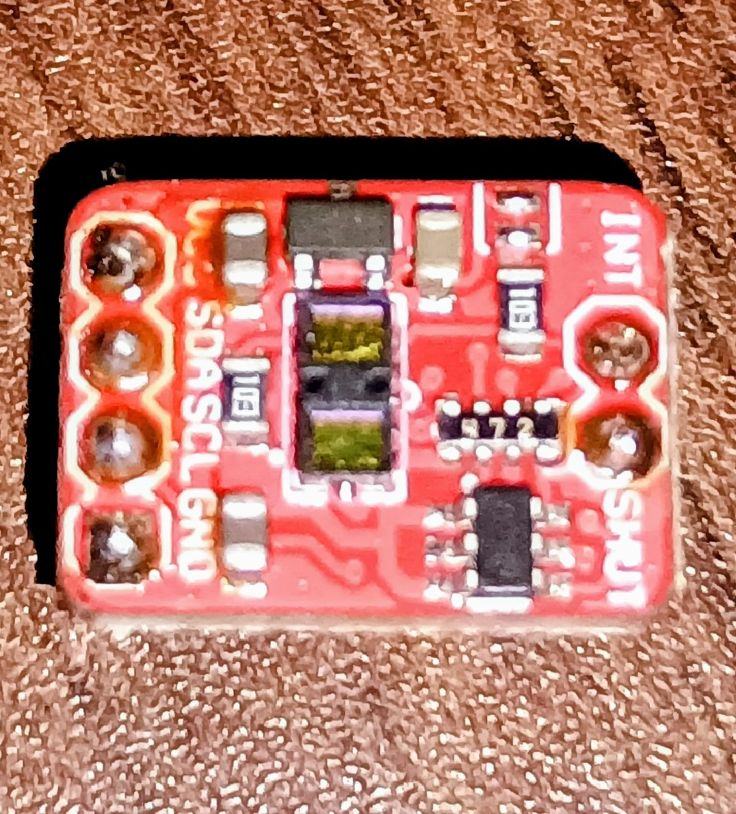
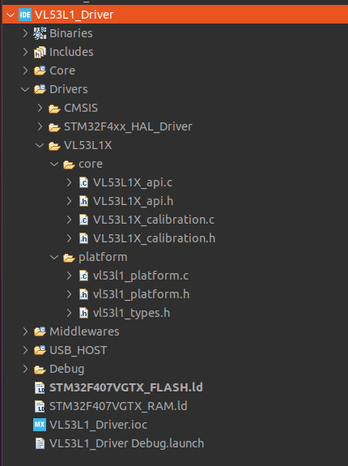
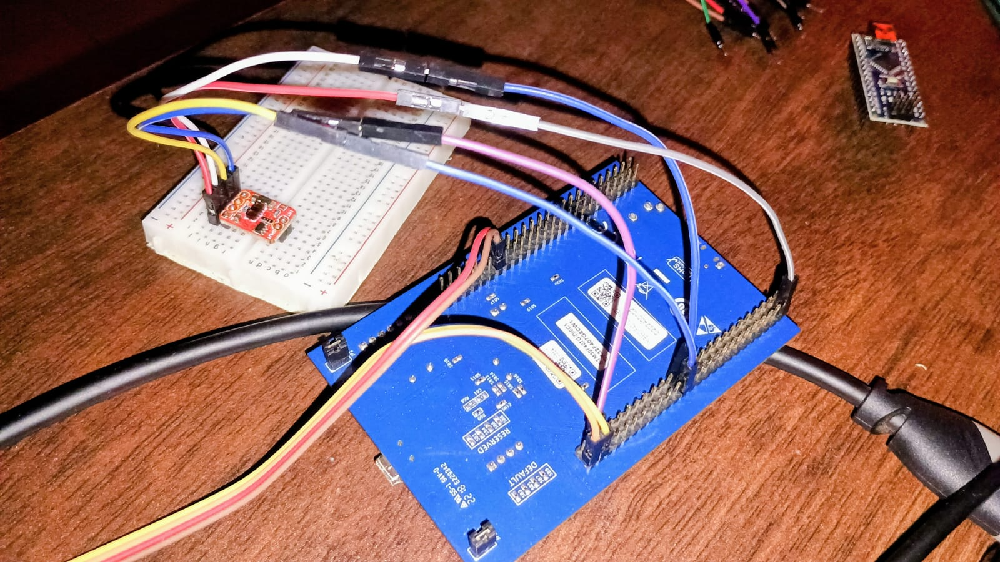
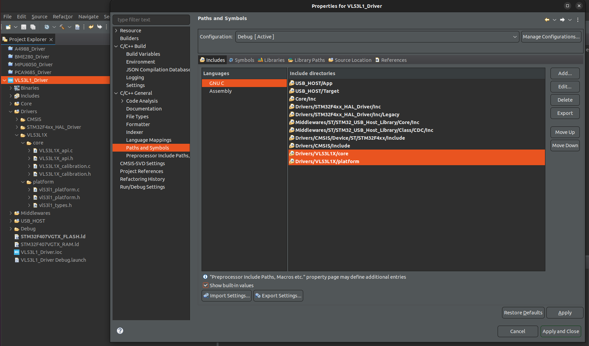
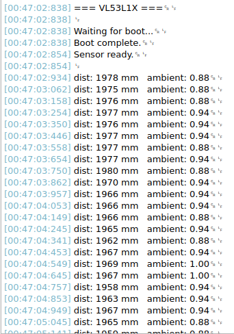

The VL53L1X is a time of flight ranging sensor produced by ST Microelectronics. It measures distance by emitting a brief infrared laser pulse and measuring the time taken for the reflection to return, producing distance readings in millimetres at ranges up to 4 metres over I2C.



Unlike every other device in this content, the VL53L1X is not a candidate for a from-scratch driver. The device contains a complex internal signal processing pipeline whose configuration registers are not publicly documented. ST provides an Ultra Lite Driver -- referred to throughout this chapter as the ULD -- which is a compact, portable C library that handles device initialisation, ranging configuration, and result retrieval correctly. Attempting to replicate this from the public datasheet alone produces a device that appears to initialise but returns unreliable or invalid measurements.

This is a common and important pattern in professional embedded development. Some devices are too complex to drive from first principles using only public documentation, and the correct engineering decision is to use the manufacturer's reference driver rather than reinvent it incorrectly. The skill in this situation shifts from register-level driver writing to platform integration -- providing the hardware abstraction layer that the reference driver needs to communicate with your specific microcontroller.

The ULD is designed to be platform-independent. It contains no hardware-specific code. Instead it defines a set of platform functions that you must implement for your target. These functions are the bridge between the ULD's portable logic and the STM32 HAL. Writing these platform wrapper files is the primary task of this chapter.

ULD download and documentation: https://www.st.com/en/embedded-software/stsw-img009.html

Datasheet: [https://www.st.com/resource/en/datasheet/vl53l1x.pdf](https://www.st.com/resource/en/datasheet/vl53l1x.pdf)

## Section 1 -- Understanding the ULD Architecture

Before writing any code, understand how the ULD is structured and what it expects from the platform layer.

### 1.1 ULD File Structure

Download the ULD package from the ST link above. Extract it and examine the contents. The relevant files are:

- VL53L1X_api.h and VL53L1X_api.c contain the main API functions for initialising the sensor, configuring ranging parameters, starting and stopping measurements, and retrieving results. These files are not modified.

- VL53L1X_calibration.h and VL53L1X_calibration.c contain optional calibration functions for offset and crosstalk correction. These files are not modified.

- platform/VL53L1X_platform.h declares the platform function signatures that the ULD expects you to implement. This file may need a small modification to include your STM32 HAL header.

- platform/VL53L1X_platform.c is the file you write. It contains the implementations of the platform functions using STM32 HAL calls. This is the primary deliverable of this chapter.



*Figure: Directory tree showing ULD package structure with platform folder highlighted.*

### 1.2 The Platform Functions

Open VL53L1X_platform.h and read the function declarations. The ULD requires the following platform functions:

```c
VL53L1X_ERROR VL53L1_WriteMulti(uint16_t dev,
                                  uint16_t index,
                                  uint8_t *pdata,
                                  uint32_t count);

VL53L1X_ERROR VL53L1_ReadMulti(uint16_t dev,
                                 uint16_t index,
                                 uint8_t *pdata,
                                 uint32_t count);

VL53L1X_ERROR VL53L1_WrByte(uint16_t dev,
                              uint16_t index,
                              uint8_t data);

VL53L1X_ERROR VL53L1_WrWord(uint16_t dev,
                              uint16_t index,
                              uint16_t data);

VL53L1X_ERROR VL53L1_WrDWord(uint16_t dev,
                               uint16_t index,
                               uint32_t data);

VL53L1X_ERROR VL53L1_RdByte(uint16_t dev,
                              uint16_t index,
                              uint8_t *data);

VL53L1X_ERROR VL53L1_RdWord(uint16_t dev,
                              uint16_t index,
                              uint16_t *data);

VL53L1X_ERROR VL53L1_RdDWord(uint16_t dev,
                               uint16_t index,
                               uint32_t *data);

VL53L1X_ERROR VL53L1_WaitMs(uint16_t dev,
                              int32_t wait_ms);
```

The dev parameter is the I2C device address. The index parameter is the 16-bit register address. All functions return VL53L1X_ERROR which is a typedef for int8_t -- zero means success, negative means failure.

Notice that all multi-byte functions use big-endian byte order -- the high byte is transmitted first. This matches the VL53L1X's native byte order and must be respected in your implementation.

### 1.3 The Dev Handle

The ULD uses uint16_t as its device handle, which carries the 8-bit I2C address shifted left by one bit -- exactly the format the STM32 HAL expects. You pass this value directly to the HAL I2C functions without any additional shifting.

However the ULD has no concept of which I2C peripheral to use. Since the STM32 may have multiple I2C peripherals, the platform implementation needs access to the correct I2C handle. The cleanest solution is a global variable in the platform file that holds the I2C handle pointer, set during initialisation before any ULD functions are called.

## Section 2 -- Wiring

Connect the VL53L1X breakout board to the STM32F4 Discovery board as follows:

- VL53L1X VIN connects to Discovery 3V3
- VL53L1X GND connects to Discovery GND
- VL53L1X SDA connects to Discovery PB7 
- VL53L1X SCL connects to Discovery PB6 
- VL53L1X XSHUT connects to Discovery PC0 (Optional)



*Figure: Photograph of physical wiring on breadboard.*

## Section 3 -- STM32CubeIDE Project Setup

### 3.1 Create the Project

Open STM32CubeIDE and create a new STM32 project targeting the STM32F407VG Discovery board. Name it VL53L1X_ULD.

### 3.2 Configure I2C1

Open the .ioc file and navigate to Connectivity, I2C1. Set Mode to I2C, Speed Mode to Fast Mode, Fast Mode Clock Speed to 400000. PB6 and PB7 are assigned automatically.

### 3.3 Configure GPIO for XSHUT

Navigate to System Core, GPIO. Configure PC0 as GPIO Output, Push-Pull, Pull-up, Low Speed. Set the User Label to XSHUT.

### 3.4 Configure USART2

Enable USART2. Set mode to Asynchronous, baud rate 115200, 8N1.

### 3.5 Generate Code and Retarget printf

```c
/* USER CODE BEGIN Includes */
#include <stdio.h>
/* USER CODE END Includes */

/* USER CODE BEGIN 0 */
int _write(int file, char *ptr, int len) {
    HAL_UART_Transmit(&huart2, (uint8_t*)ptr, len, HAL_MAX_DELAY);
    return len;
}
/* USER CODE END 0 */
```

### 3.6 Add the ULD Source Files to the Project

In STM32CubeIDE, right-click Drivers/ and select New, Folder. Name it VL53L1X. Copy the following files from the ULD package into this folder as shown:

Right-click the project, open Properties, navigate to C/C++ Build, Settings, MCU GCC Compiler, Include Paths. Add the path to Core/Inc/VL53L1X so the compiler can find the ULD headers.



*Figure: STM32CubeIDE include path settings showing VL53L1X header path added.*

### 3.7 Modify VL53L1X_platform.h

Open vl53l1_platform.h from the ULD package. Find the includes section at the top of the file. It will contain references to a generic platform type header. Replace the existing includes with the STM32 HAL header:

```c
/**
  *
  * Copyright (c) 2023 STMicroelectronics.
  * All rights reserved.
  *
  * This software is licensed under terms that can be found in the LICENSE file
  * in the root directory of this software component.
  * If no LICENSE file comes with this software, it is provided AS-IS.
  *
  ******************************************************************************
  */
  
/**
 * @file  vl53l1_platform.h
 * @brief Those platform functions are platform dependent and have to be implemented by the user
 */
 
#ifndef VL53L1X_PLATFORM_H_
#define VL53L1X_PLATFORM_H_

#include "stm32f4xx_hal.h"
#include <stdint.h>
#include <string.h>

typedef uint16_t Dev_t;
typedef uint8_t   VL53L1X_ERROR;

void VL53L1X_Platform_Init(I2C_HandleTypeDef *hi2c);

VL53L1X_ERROR VL53L1_WriteMulti(Dev_t dev, uint16_t index,
                                  uint8_t *pdata, uint32_t count);
VL53L1X_ERROR VL53L1_ReadMulti (Dev_t dev, uint16_t index,
                                  uint8_t *pdata, uint32_t count);
VL53L1X_ERROR VL53L1_WrByte   (Dev_t dev, uint16_t index,
                                  uint8_t data);
VL53L1X_ERROR VL53L1_WrWord   (Dev_t dev, uint16_t index,
                                  uint16_t data);
VL53L1X_ERROR VL53L1_WrDWord  (Dev_t dev, uint16_t index,
                                  uint32_t data);
VL53L1X_ERROR VL53L1_RdByte   (Dev_t dev, uint16_t index,
                                  uint8_t *data);
VL53L1X_ERROR VL53L1_RdWord   (Dev_t dev, uint16_t index,
                                  uint16_t *data);
VL53L1X_ERROR VL53L1_RdDWord  (Dev_t dev, uint16_t index,
                                  uint32_t *data);
VL53L1X_ERROR VL53L1_WaitMs   (Dev_t dev, int32_t wait_ms);

#endif

#ifdef __cplusplus
}
#endif
```

## Section 4 -- Writing the Platform Wrapper

Modify vl53l1_platform.c in Drivers/VL53L1X/. This is the file that connects the ULD to the STM32 HAL. Every function here maps a ULD platform call to the equivalent HAL I2C call.

```c
/**
  *
  * Copyright (c) 2023 STMicroelectronics.
  * All rights reserved.
  *
  * This software is licensed under terms that can be found in the LICENSE file
  * in the root directory of this software component.
  * If no LICENSE file comes with this software, it is provided AS-IS.
  *
  ******************************************************************************
  */

#include "vl53l1_platform.h"
#include <string.h>
#include <time.h>
#include <math.h>

static I2C_HandleTypeDef *_hi2c = NULL;

void VL53L1X_Platform_Init(I2C_HandleTypeDef *hi2c) {
    _hi2c = hi2c;
}

VL53L1X_ERROR VL53L1_WriteMulti(Dev_t dev, uint16_t index,
                                  uint8_t *pdata, uint32_t count) {
    uint8_t buf[count + 2];
    buf[0] = (index >> 8) & 0xFF;
    buf[1] =  index       & 0xFF;
    memcpy(&buf[2], pdata, count);
    return HAL_I2C_Master_Transmit(_hi2c, dev, buf,
                                    count + 2,
                                    HAL_MAX_DELAY) == HAL_OK ? 0 : -1;
}

VL53L1X_ERROR VL53L1_ReadMulti(Dev_t dev, uint16_t index,
                                 uint8_t *pdata, uint32_t count) {
    uint8_t addr[2] = { (index >> 8) & 0xFF, index & 0xFF };
    if (HAL_I2C_Master_Transmit(_hi2c, dev, addr, 2,
                                  HAL_MAX_DELAY) != HAL_OK) return -1;
    return HAL_I2C_Master_Receive(_hi2c, dev, pdata,
                                   count,
                                   HAL_MAX_DELAY) == HAL_OK ? 0 : -1;
}

VL53L1X_ERROR VL53L1_WrByte(Dev_t dev, uint16_t index, uint8_t data) {
    return VL53L1_WriteMulti(dev, index, &data, 1);
}

VL53L1X_ERROR VL53L1_WrWord(Dev_t dev, uint16_t index, uint16_t data) {
    uint8_t buf[2] = { (data >> 8) & 0xFF, data & 0xFF };
    return VL53L1_WriteMulti(dev, index, buf, 2);
}

VL53L1X_ERROR VL53L1_WrDWord(Dev_t dev, uint16_t index, uint32_t data) {
    uint8_t buf[4] = {
        (data >> 24) & 0xFF,
        (data >> 16) & 0xFF,
        (data >>  8) & 0xFF,
         data        & 0xFF
    };
    return VL53L1_WriteMulti(dev, index, buf, 4);
}

VL53L1X_ERROR VL53L1_RdByte(Dev_t dev, uint16_t index, uint8_t *data) {
    return VL53L1_ReadMulti(dev, index, data, 1);
}

VL53L1X_ERROR VL53L1_RdWord(Dev_t dev, uint16_t index, uint16_t *data) {
    uint8_t buf[2];
    if (VL53L1_ReadMulti(dev, index, buf, 2) != 0) return -1;
    *data = (uint16_t)(buf[0] << 8 | buf[1]);
    return 0;
}

VL53L1X_ERROR VL53L1_RdDWord(Dev_t dev, uint16_t index, uint32_t *data) {
    uint8_t buf[4];
    if (VL53L1_ReadMulti(dev, index, buf, 4) != 0) return -1;
    *data = (uint32_t)(buf[0] << 24 | buf[1] << 16
                     | buf[2] <<  8 | buf[3]);
    return 0;
}

VL53L1X_ERROR VL53L1_WaitMs(Dev_t dev, int32_t wait_ms) {
    (void)dev;
    HAL_Delay((uint32_t)wait_ms);
    return 0;
}
```


## Section 5 -- Understanding the ULD API

Before writing the main application, read through VL53L1X_api.h to understand what the ULD provides. The functions you will use in this chapter are:

- VL53L1X_BootState checks whether the device has completed its internal boot sequence. Returns 1 in the state parameter when boot is complete.

- VL53L1X_SensorInit sends the initialisation configuration to the device. This is the function that transmits the internal configuration blob. It must be called after boot is confirmed.

- VL53L1X_SetDistanceMode sets the ranging mode. Pass 1 for short mode (up to 1.3m) or 2 for long mode (up to 4m).

- VL53L1X_SetTimingBudgetInMs sets the measurement timing budget. Valid values are 15, 20, 33, 50, 100, 200, and 500 milliseconds.

- VL53L1X_SetInterMeasurementInMs sets the interval between measurements in continuous ranging mode. Must be greater than or equal to the timing budget.

- VL53L1X_StartRanging begins continuous ranging.

- VL53L1X_StopRanging stops continuous ranging.

- VL53L1X_CheckForDataReady polls whether a new measurement is ready. Returns 1 in the isDataReady parameter when a result is available.

- VL53L1X_GetRangingData retrieves the latest measurement result into a VL53L1X_Result_t struct containing status, distance in millimetres, signal rate, and ambient rate.

- VL53L1X_ClearInterrupt must be called after reading each result to allow the next measurement to proceed.

The ULD function signatures all follow the same convention: the first parameter is always the device address (uint16_t dev), and the return value is VL53L1X_ERROR where zero is success and negative is failure.

## Section 7 -- Main Application

```c
/* USER CODE BEGIN Includes */
#include <stdio.h>
#include "VL53L1X_api.h"
/* USER CODE END Includes */
```

Declare the device address and XSHUT control in the private defines section:
```c
/* Private define ------------------------------------------------------------*/
/* USER CODE BEGIN PD */
#define VL53L1X_DEV    ((uint16_t)(0x29 << 1))
#define TIMING_BUDGET  100
#define INTER_MEAS     100
/* USER CODE END PD */
```

```c
/* USER CODE BEGIN PFP */
void VL53L1X_Platform_Init(I2C_HandleTypeDef *hi2c);
/* USER CODE END PFP */
```

```c
  /* USER CODE BEGIN 2 */

  // Connect platform layer to I2C peripheral
  VL53L1X_Platform_Init(&hi2c1);

  printf("\r\n=== VL53L1X ===\r\n\n");

  // Wait for sensor boot
  uint8_t boot = 0;
  printf("Waiting for boot...\r\n");
  while (boot == 0) {
      VL53L1X_BootState(VL53L1X_DEV, &boot);
      HAL_Delay(2);
  }
  printf("Boot complete.\r\n");

  // Initialise sensor
  VL53L1X_ERROR err = VL53L1X_SensorInit(VL53L1X_DEV);
  if (err != 0) {
      printf("SensorInit failed: %d\r\n", err);
      while (1);
  }
  printf("Sensor ready.\r\n\n");

  // Configure and start ranging
  VL53L1X_SetDistanceMode(VL53L1X_DEV, 2);
  VL53L1X_SetTimingBudgetInMs(VL53L1X_DEV, TIMING_BUDGET);
  VL53L1X_SetInterMeasurementInMs(VL53L1X_DEV, INTER_MEAS);
  VL53L1X_StartRanging(VL53L1X_DEV);

  /* USER CODE END 2 */
```

```c
  /* USER CODE BEGIN WHILE */
  while (1)
  {

	uint8_t ready = 0;
	VL53L1X_CheckForDataReady(VL53L1X_DEV, &ready);

	if (!ready) {
		HAL_Delay(5);
		continue;
	}

	VL53L1X_Result_t result;
	err = VL53L1X_GetResult(VL53L1X_DEV, &result);
	VL53L1X_ClearInterrupt(VL53L1X_DEV);

	if (err != 0) {
		printf("[error] %d\r\n", err);
		continue;
	}

	if (result.Status == 0) {
		printf("dist: %4u mm   ambient: %.2f\r\n",
			   result.Distance,
			   result.Ambient/128.0f);
	}

    /* USER CODE END WHILE */
    MX_USB_HOST_Process();

    /* USER CODE BEGIN 3 */
  }
  /* USER CODE END 3 */
}

```

## Section 8 --  Serial Output



Figure: Serial Output

## What You Should Take Away

The platform wrapper is the only code you write from scratch in this chapter -- everything else is provided by ST and should not be modified. The quality of the platform wrapper determines the quality of the entire integration. Every ULD function call ultimately resolves to one of the eight platform functions, so a bug in the platform layer affects every aspect of device behaviour. The 16-bit register address must be transmitted high byte first in both read and write transactions -- this is the most common platform implementation mistake and produces a device that appears to respond but returns incorrect data. VL53L1X_ClearInterrupt must be called after every GetRangingData call without exception -- omitting it causes CheckForDataReady to return ready immediately on every subsequent call, flooding the main loop with repeated reads of the same stale result. The decision to use a manufacturer reference driver rather than write from scratch is an engineering judgement, not a shortcut. When a device's internal configuration is not publicly documented, a from-scratch driver is not just difficult -- it is impossible to implement correctly without the reference material ST uses internally. Recognising this situation and integrating the reference driver properly is the correct professional response.

---