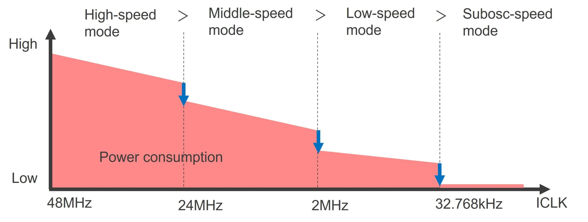

## The Power-Aware Sensor Node

Most embedded systems in the field run on batteries. And most embedded systems tutorials ignore this entirely.

In this project, you will conceptualise a sensor node that reads some measurable quantity from its environment -- temperature, humidity, light level, motion, or anything you find interesting, and transmits or logs that data at regular intervals. That part is straightforward. The constraint is what makes this hard:

**Core constraint:** _Your node must actively manage its own power consumption. It should not simply run continuously. It must decide when to be awake, when to sleep, and how deeply._

This forces you to confront questions that don't appear in most embedded tutorials but are fundamental to real deployed systems.

Image Source: https://www.redeweb.com/en/Articles/The-power-saving-features-of-the-MCU-ensure-that-your-system-does-not-consume-a-lot-of-power/
## Your Task

Build a working implementation of this system. As you go, keep a log (not a formal document), just notes. What decisions did you make and why? What broke? What surprised you? What would you do differently? By the end, you should be able to answer the challenge questions in your own words.

## **The Challenge**

As you work through this project, you will encounter decisions that have no obvious right answer. Here are some of the questions you should expect to wrestle with:

### **On sleep and wake**

- What sleep modes does your microcontroller support? What is the power draw at each level?
- What peripherals stay active during sleep, and which ones need to be re-initialized on wake?
- How do you wake the system on a timer? On an external interrupt? What is the tradeoff between the two?
- How long does it take your system to wake up and reach a ready state? Does this affect your timing accuracy?

### **On the sensor**

- Does your sensor need time to stabilize after being powered on? How does this affect your duty cycle?
- Can you power the sensor off between readings, or does it draw current continuously?
- What is the tradeoff between sampling frequency and power consumption?

### **On data transmission**

- When does your radio or communication peripheral consume the most power — during transmit, receive, or idle?
- Is it better to transmit every reading immediately, or buffer several readings and transmit in one burst?
- What happens if a transmission fails while the node is in a low-power state?

### **On the system as a whole**

- How do you estimate the battery life of your node given your current architecture?
- What is the dominant power consumer in your system? Is it what you expected?
- What would you change if the target battery life were 1 year instead of 1 week?

## **Suggested Reading**

To ground your work in how real systems solve these problems, explore the following:

### **Technical references**

- Your microcontroller's datasheet — specifically the power management and sleep mode sections. Read it carefully. The answers to many of the questions above are in there.    
- Your microcontroller's reference manual on low-power timer peripherals (RTC, LPTIM, or equivalent). Understand how wakeup is triggered at the hardware level.
- Application notes from your MCU vendor on low-power design. STMicroelectronics, Nordic Semiconductor, and Texas Instruments all publish detailed guides.

### **Real systems to investigate**

- The ESA's Rosetta spacecraft and its 957-day hibernation mode — one of the most extreme examples of embedded power management ever deployed.
- Nordic Semiconductor's nRF52 series — widely used in IoT and wearables precisely because of its power architecture. Study how its power profiles are structured.
- The LoRaWAN specification — not for the networking details, but for its Class A device sleep/wake cycle, which is a clean model of duty-cycled embedded operation.
- Texas Instruments' MSP430 family — designed from the ground up around ultra-low-power operation. Even if you don't use it, studying its architecture is instructive.

## **A Note on Scope**

Do not try to optimize everything at once. Start with a working system that ignores power entirely. Measure its current draw. Then introduce sleep modes one step at a time, measuring the effect of each change. The measurements are as important as the code.

A logic analyzer or a simple current-sense resistor and oscilloscope will reveal things about your system that you cannot see any other way.

## **The Bigger Picture**

**Before you read on:** _Have you built your node? Have you measured its power draw in each state? Have you felt the frustration of a system that wakes up too slowly, or a sensor that refuses to stabilize in time?_

Good. Now consider this.

Image Source: https://science.nasa.gov/mission/voyager/voyager-1/

Voyager 1 was launched in 1977. As of today, it is over 24 billion kilometers from Earth — the most distant human-made object in existence. It is still transmitting data back to us. Its radio signal, by the time it reaches Earth, has a power of roughly 10^-17 watts. And yet we receive it.

Voyager runs on a radioisotope thermoelectric generator — not a battery in any conventional sense — but the engineers who designed its power system faced the same fundamental questions you just worked through. Every watt is finite. Every subsystem competes for power. The system must decide what to keep alive and what to shut down, and it must do so autonomously, because a round-trip communication delay of over 44 hours makes human intervention impossible.

Closer to home: a modern IoT sensor node deployed in an agricultural field, a pipeline monitoring system in a remote location, or a wildlife tracking collar on a migrating animal faces the same class of problem. The physics is the same. The tradeoffs are the same. The engineering discipline is the same.

_What you built in this project is a small instance of one of the most enduring problems in embedded systems engineering: how do you make a system that runs for a long time, in the field, without human intervention, on finite energy?_

That question does not go away as systems get more complex. It gets harder.

---