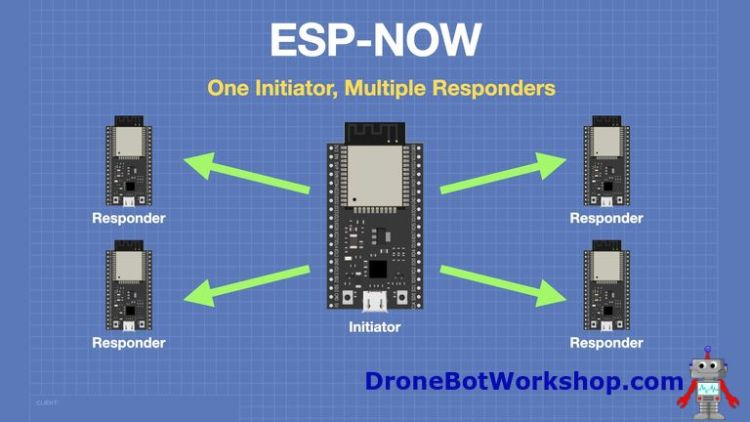

## The Wireless Node Network

You have a single microcontroller that can send a message to another. You can probably envision how that would work right? Now imagine you have five of them scattered across a room, or a field, or a warehouse floor. None of them have a fixed address. There's no router, no access point, no central coordinator. And yet, somehow, they need to talk to each other.

This is the problem of peer-to-peer embedded networking, and it is deceptively hard.

Your task is to build a small network of wireless nodes  (at least three) where each node can originate a message, and that message can reach any other node in the network, even if the sender and receiver are not within direct radio range of each other. A node that receives a message it didn't originate should be able to relay it onward.

If you are working with ESP32 hardware, ESP-NOW is a natural starting point: It is a connectionless, peer-to-peer protocol that bypasses the overhead of a full WiFi stack and is well-suited to exactly this kind of problem. But the underlying concepts apply equally to nRF24L01 modules, LoRa transceivers, or any radio hardware that supports direct node-to-node communication without infrastructure. The protocol's simply a detail, the architecture is the real lesson here.

Image Source: https://dronebotworkshop.com/esp-now/

## **The Challenge**

Start by getting two nodes talking. Send a message from one to the other. Confirm it arrived. Now ask yourself: what does "arrived" actually mean? Did the receiving node acknowledge it? Does your protocol distinguish between a message that was received and one that was acted on?

Once two nodes are communicating reliably, introduce a third — one that sits between the other two but is out of range of at least one of them. Your network just became a relay problem. The middle node needs to receive a message from one side and forward it to the other. This sounds simple, but now you are designing a routing system. How does a node know where to send a message it didn't originate? How does it avoid forwarding the same message in an infinite loop? What happens when two nodes try to relay the same packet at the same time?

As you add more nodes, new questions surface that you didn't anticipate. What happens when a node drops out — loses power, moves out of range, crashes? Does the rest of the network notice? Does it adapt? How long does it take to recover? A network that works perfectly under ideal conditions is not a robust network. The interesting engineering happens at the edges of failure.

You will also need to think carefully about your message format. What information does a packet need to carry so that any node in the network can make a sensible routing decision? At minimum, it probably needs an origin, a destination, some kind of sequence number to detect duplicates, and a hop count to prevent infinite forwarding. Designing this packet structure is not a formality — it is the core of the problem.

Finally, think about what happens at scale. Your network of three nodes works. Would it work with ten? With fifty? Where do the bottlenecks appear? What assumptions in your current design break down?

## **Suggested Reading**

Before and during this project, the following resources will give you both the technical foundations and a sense of how this problem is solved in real systems:

### **Protocol documentation**

- **Espressif's official ESP-NOW API reference** — read this carefully before writing a single line of code. Understanding the peer registration model, the 250-byte payload limit, and the send callback behavior will save you hours of debugging: https://docs.espressif.com/projects/esp-idf/en/stable/esp32/api-reference/network/esp_now.html
- **The painlessMesh library for ESP32/ESP8266** — a true ad-hoc mesh implementation that handles self-organization automatically. Study its source code and documentation to understand how a production-quality mesh handles topology changes: https://github.com/gmag11/painlessMesh
- **The ESP-NOW User Guide from Espressif** — a shorter, higher-level document that explains the protocol design philosophy, including its security model and power-saving features: https://www.espressif.com/sites/default/files/documentation/esp-now_user_guide_en.pdf

### **Concepts to investigate**

- **Flooding vs. routing** — understand the difference between a network that forwards every message everywhere and one that makes intelligent path decisions. Neither is universally better. Knowing when to use each is the skill.
- **The AODV** (Ad hoc On-demand Distance Vector) routing protocol — a widely used algorithm for mobile ad hoc networks (MANETs) that gives a concrete answer to the question of how nodes discover routes without a central coordinator. https://www.rfc-editor.org/rfc/rfc3561
- **Duplicate packet detection using sequence numbers** — a foundational technique in distributed systems. Understand how a simple counter per sender, combined with a small receive buffer, eliminates the infinite relay problem.

### **Real systems to look at**

- **The Meshtastic project** — an open-source, long-range mesh networking system built on LoRa hardware. Its protocol documentation is publicly available and shows how a real deployed system handles routing, deduplication, and node discovery at scale. https://meshtastic.org/docs/overview/mesh-algo/
- **Thread** — the mesh networking protocol used in modern smart home devices, including many Google Nest and Apple HomeKit products. Unlike ESP-NOW, it is IP-based and designed for interoperability. Comparing its architecture to ESP-NOW reveals the tradeoffs between simplicity and capability. https://openthread.io/

## **A Note on Scope**

Do not try to build a general-purpose mesh router. Build the simplest thing that works, understand why it works, and then deliberately break it to find out where it doesn't. A network of three nodes that you understand completely is worth far more than a network of ten nodes that mostly works for reasons you can't fully explain.

If you find yourself reaching for a library that handles all the mesh logic for you, that is fine — but take the time to read its source. The library is not magic. It is someone else's solution to the same problem you are working through.

## **The Bigger Picture**

**Before you read on:** _Did your network hold together when a node dropped out? Did messages loop? Did the relay logic break in ways you didn't expect? Did you find yourself reinventing solutions that felt oddly familiar?_

Image Source: https://science.nasa.gov/mission/insight/ 

On November 26, 2018, NASA's InSight lander was descending through the Martian atmosphere — seven minutes of autonomous flight that engineers call the "seven minutes of terror." During those minutes, InSight was out of direct line-of-sight from Earth. The signal delay alone was over eight minutes each way, which meant that by the time any command from Earth could possibly arrive, the landing would already be over, one way or another.

Flying alongside InSight were two small spacecraft the size of a briefcase: MarCO-A and MarCO-B, nicknamed WALL-E and EVE by their engineers at NASA's Jet Propulsion Laboratory. These were the first CubeSats ever to fly beyond Earth orbit. Their job was simple in concept and extraordinarily difficult in practice: relay InSight's landing telemetry back to Earth in real time, so that mission controllers wouldn't have to wait hours to learn whether the lander had survived.

Each MarCO spacecraft was an independent node. There was no central coordinator. If one went silent — and both eventually did, going dark in January 2019 after their mission was complete — the other had to be capable of fulfilling the relay function alone. The network had to be robust to node loss by design, not by luck.

The engineers who built MarCO asked the same questions you just worked through. How do you design a communication architecture where no single node is essential? How do you ensure a message reaches its destination when the path is uncertain? How do you handle the case where a node disappears without warning?

  _The difference between your project and MarCO is not the problem. It is the stakes, the distance, and the fact that there was no opportunity to debug in the field._

Every wireless embedded network — from a three-node ESP-NOW testbed on a workbench to a pair of CubeSats flying past Mars — is built on the same foundational questions. The physics of radio, the logic of routing, and the discipline of designing for failure are not skills reserved for spacecraft engineers. They are the craft of embedded systems networking, and you have just begun to learn them.

---