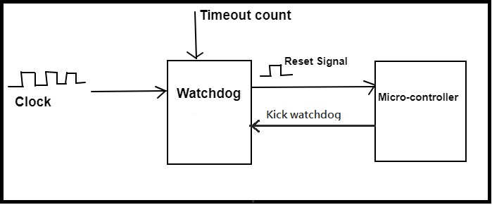
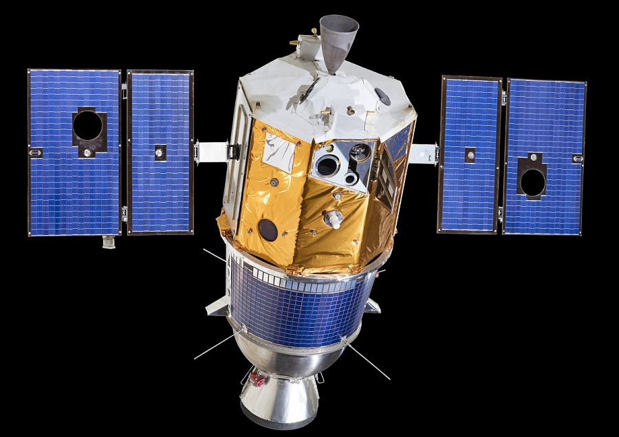

## The Self Supervising System

Every embedded system you have ever built had an implicit assumption baked into it: that someone is watching. If the firmware hung, you hit reset. If the output looked wrong, you reflashed. If something crashed at 2am, it stayed crashed until morning.

That assumption is a luxury. In the real world, embedded systems are deployed in places where no one is watching — inside walls, on rooftops, underground, in moving vehicles, and in orbit. They are expected to run for months or years without intervention. And they will, at some point, fail in ways that no amount of testing predicted.

Your task in this project is to build a system that supervises itself. It should be able to detect that something has gone wrong, attempt to recover from it autonomously, and keep a record of what happened so that when someone does eventually look at it, there is something useful to read.

The failure you are designing for is not a hardware failure — a broken sensor or a dead battery. It is a firmware failure: a condition where your own code, running on your own hardware, reaches a state it was never designed to handle. It may be a hanging  task, or a stack overflow. A peripheral may even stop responding. An interrupt that fires at a rate your loop can no longer keep up with. These are the failures that a watchdog is built to catch, and they are far more common in production systems than most developers expect.

Image Source: https://www.embeddedtutor.com/2019/02/watchdog-timer-in-embedded-system.html

## **The Challenge**

Begin with the simplest form of the problem: a hardware watchdog timer. Every modern microcontroller has one. Read your datasheet carefully and find it. Configure it, start it, and then deliberately let it expire by not feeding it. Confirm that your system resets. This is the foundation — a last-resort mechanism that kicks in when all else has failed.

Now make it smarter. A bare watchdog timer is blunt: it resets the system if the main loop stops ticking, but it cannot distinguish between a system that is genuinely stuck and one that is busy doing legitimate work. Your goal is to build a layered supervision architecture — one that can detect not just that the system has stopped, but why, and respond proportionally. A task that misses a single deadline might warrant a warning and a retry. A task that has missed ten consecutive deadlines warrants a subsystem restart. A system that has restarted three times in five minutes without recovering warrants entering a safe, minimal state and waiting for human intervention.

To do any of this, you need persistent state — information that survives a reset. When your system reboots, it needs to know whether it rebooted because someone pressed a button, because power was cycled, or because the watchdog fired. It needs to know how many times it has rebooted in the last hour. It needs to be able to read a fault log that was written before the crash. This means storing data in non-volatile memory — flash, EEPROM, or a battery-backed register — and reading it back reliably after a reset. Think carefully about what happens if a crash occurs in the middle of a write. Corrupted fault logs are worse than no fault logs.

Once your fault detection and logging are working, introduce deliberate failures into your firmware and verify that your system responds correctly to each one. What happens if you infinite-loop in an interrupt handler? What happens if you corrupt the stack? What happens if a peripheral stops acknowledging on I2C? The test suite for a self-supervising system is a catalogue of ways to break it, and your system's response to each failure tells you exactly how robust your supervision layer really is.

Finally, think about the boundary between recoverable and unrecoverable. What conditions should cause your system to give up on autonomous recovery and enter a permanent safe mode? What does safe mode look like — what is the minimal set of functionality that should remain active? And how would an engineer, arriving at the system days or weeks later, know what happened?

## **Suggested Reading**

The following resources span the full range from practical implementation to real-world consequences — read them in whatever order suits where you are in the project:

### **Technical foundations**

- Your microcontroller's datasheet — specifically the watchdog timer, reset source registers, and non-volatile storage sections. The reset source register is particularly important: it tells your firmware, on every boot, whether the reset was caused by a power cycle, a software reset, a watchdog timeout, or an external pin. Without reading this register, your system is flying blind after every reboot.
- Jack Ganssle's "Designing Great Watchdog Timers" — a thorough and opinionated guide to watchdog design from one of the most experienced embedded systems engineers writing today. It covers common mistakes, multi-stage watchdog architectures, and how to make a watchdog robust against the very firmware failures it is trying to catch. https://www.ganssle.com/watchdogs.htm
- Jacob Beningo's review of watchdog architectures — a more structured treatment of the design space, covering linear, circular, and hierarchical watchdog topologies and how to choose between them depending on system complexity. https://www.beningo.com/insights/white-papers/a-review-of-watchdog-architectures/

### **Concepts to investigate**

- **Safe mode design** — what does a minimal, known-good operating state look like for your system? How does your firmware transition into it, and what does it take to exit? Studying how spacecraft enter and exit safe mode is particularly instructive, since these are systems where the cost of getting it wrong is total mission loss.
- **Non-volatile fault logging** — research how to write a circular log to flash or EEPROM that is resilient to mid-write corruption. Techniques include dual-buffer schemes, sequence numbers with CRC validation, and write-once append-only structures. Any of these will teach you something important about the relationship between firmware and persistent storage.
- **Priority inversion** — before you build a supervision layer that runs alongside your main application, understand why task scheduling can silently starve your watchdog-feeding code even when no obvious bug is present. The Mars Pathfinder incident (described below) is the canonical example.

### **Real systems to study**

- **The NASA Mars Pathfinder mission** — its famous priority inversion bug, the on-orbit software fix, and the role the watchdog played in both causing and ultimately surviving the incident. The full technical post-mortem is publicly available and is essential reading for anyone building real-time embedded systems. https://www.cs.unc.edu/~anderson/teach/comp790/papers/mars_pathfinder_long_version.html
- **The Clementine spacecraft incident (1994)** — a cautionary tale about what happens when a watchdog timer is omitted. Clementine's firmware hung, its thrusters fired uncontrolled, and the mission was lost. A few lines of watchdog code would have prevented it. https://www.ganssle.com/watchdogs.htm

## **A Note on Scope**

Do not try to build a complete fault-tolerant operating system. Build one supervision layer that works reliably, understand it completely, and test it destructively. The most valuable thing you can produce from this project is not elegant recovery logic — it is a fault log that accurately captures what your system was doing at the moment it failed. In production systems, that log is often the only window into failures that happen in the field and can never be reproduced on a bench.

## **The Bigger Picture**

**Before you read on:** _Did your watchdog fire when you expected it to? Did your fault log survive the reset intact? Did your system ever end up in a state it couldn't recover from — and if so, what was missing from your supervision layer that would have caught it?_

**NASA Clementine Replica (Image Source: https://airandspace.si.edu/collection-objects/clementine-engineering-model/nasm_A20020260000)**

In 1994, NASA launched the Clementine spacecraft on a mission to map the moon and then fly past the near-Earth asteroid Geographos. By any measure, the lunar phase was a success. Then, on May 7th, as Clementine was preparing for the asteroid flyby, a floating-point exception occurred in the onboard 1750 processor. This was not unusual — roughly 3,000 such exceptions had been detected and handled normally over the course of the mission. But this one was different. The system hung. The processor locked up, and while it was hung, it began firing thrusters it had no business touching. By the time ground controllers could intervene — spending twenty minutes sending reset commands that were never acknowledged — the fuel tanks were nearly empty and the spacecraft was spinning at 80 RPM. The mission to Geographos was abandoned.

The Clementine team had considered the risk of exactly this kind of failure. They had implemented a software-based thruster timeout as a safeguard. But a software timeout cannot protect you from a firmware hang — if the code has stopped running, the timeout never fires. The hardware watchdog timer built into the processor was not used, over the explicit objection of the lead software engineer who had argued for it. For the lack of a watchdog, a mission was lost.

Now contrast this with Mars Pathfinder, which landed on Mars in 1997. Shortly after landing, the system began resetting unexpectedly — the watchdog was firing, rebooting the spacecraft, and causing mission operations to stall. Engineers on Earth diagnosed the problem: a classic priority inversion bug in the VxWorks RTOS was starving the bus management task, which caused the watchdog to conclude the system had hung and trigger a reset. The bug was real, the resets were disruptive, and the situation was serious. But the mission survived, because the watchdog was doing exactly what it was designed to do — resetting the system to a known state rather than letting it run indefinitely in a degraded condition. Engineers uploaded a software patch to a spacecraft 40 million miles away, fixed the scheduling configuration, and the mission continued. Pathfinder went on to operate far beyond its designed lifetime.

**NASA Mars Pathfinder (Image Source: https://science.nasa.gov/mission/mars-pathfinder/)**

Two missions. Two firmware failures. One had a watchdog and survived. One did not, and was lost.

_The watchdog timer is not a feature you add to a system when you have time. It is the last line of defense between a firmware failure and a total loss of the system — and it is only useful if it is designed, configured, and tested before deployment, not after._

The principle scales in every direction. A robot operating autonomously in a warehouse, a medical device running without continuous monitoring, an agricultural sensor node in a field — every embedded system that operates without a human nearby needs some version of what you just built. The sophistication of the supervision layer is proportional to the cost of failure. But the discipline is the same whether you are building a shelf sensor or a spacecraft: design for failure, test for failure, and give your system the means to tell you what went wrong.

---