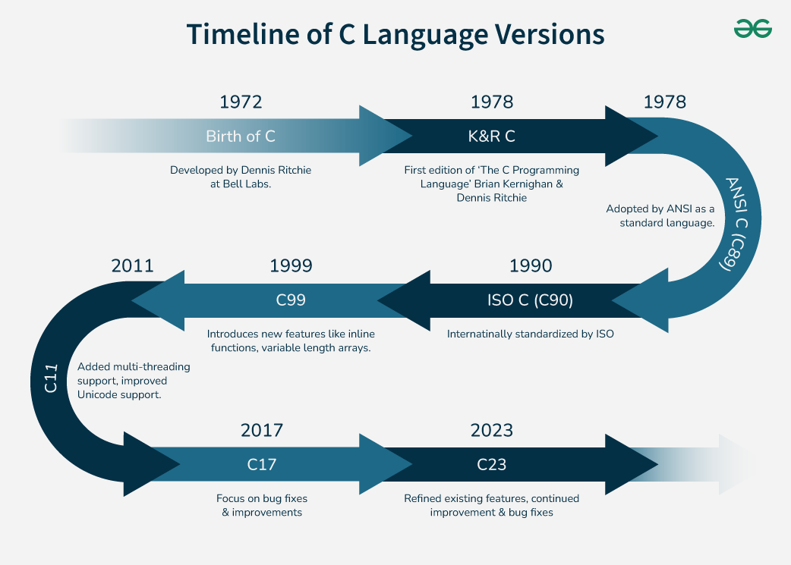
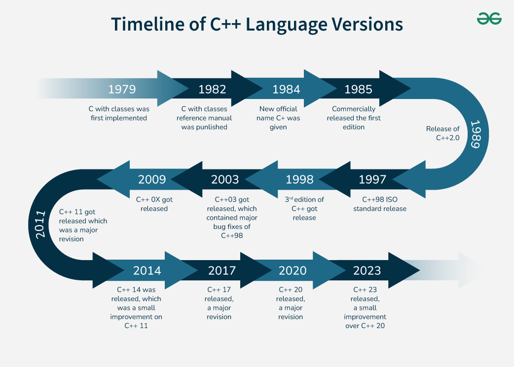
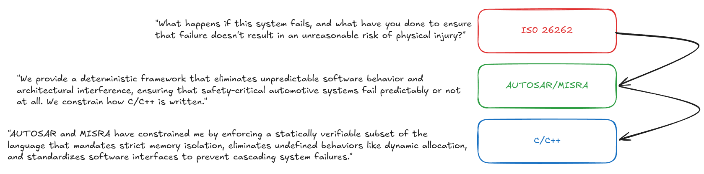

There is a version of this chapter that reads like a legal document -- a categorized list of rules, each with a compliance status and a terse rationale. That version exists already. It is called the MISRA C:2012 Guidelines, and it costs money to purchase and several days to read carefully. A link to the official MISRA publication page is here: [MISRA Guidelines](https://www.misra.org.uk/publications/). If you work at a company that develops safety-certified software, your team will almost certainly own a copy, and you will eventually need to read the sections relevant to your domain.

This chapter is not that document. Its goal is to give you the mental model that makes those rules feel inevitable rather than arbitrary, and to cover the rules that matter most in a working robotics codebase, concretely enough that you can apply them on Monday morning.

### Why the Industry Needed a Language Subset

C was designed in the early 1970s for systems programming on hardware with severe resource constraints. The language was deliberately lean, and many decisions that would strike a modern programmer as dangerous were intentional tradeoffs. Behavior that varied across platforms was left "implementation-defined" so that compiler authors could optimize for their target hardware. Behavior that was simply too expensive to define consistently was left "undefined," meaning the compiler was free to do anything at all -- including produce code that appeared to work correctly until it didn't.

C++ inherited all of this and added its own complexities. The language grew substantially with each standard revision, accumulating powerful abstractions alongside subtle traps. A modern C++ compiler is one of the most sophisticated pieces of software ever written, and it uses undefined behavior as a license to perform optimizations that can transform subtly wrong code into catastrophically wrong code in ways that are genuinely difficult to predict.



Source: https://www.geeksforgeeks.org/c/history-and-application-of-c/



Source: https://www.geeksforgeeks.org/cpp/history-of-c/

The aviation industry encountered this problem first. As software took over flight control systems in the 1980s and 1990s, engineers discovered that the full C language was simply too unpredictable for certified software. Different compilers, and even different versions of the same compiler, could produce different behavior from identical source code. Testing alone could not catch this. You might test on one compiler and deploy on another.

The Motor Industry Software Reliability Association (MISRA) was formed in the UK in 1994, initially to address exactly this problem in automotive embedded systems. Their first C guidelines, published in 1998, defined a subset of C that excluded or constrained the parts of the language where behavior was unpredictable, implementation-defined, or simply too easy to misuse. The guidelines were not arbitrary conservatism. Each rule was traceable to a specific class of defects, and the rationale was documented.

The robotics industry arrived at the same conclusions somewhat later, partly because robotics software remained research-oriented for longer than automotive software. But as robots moved from laboratory demonstrations into factories, hospitals, and public spaces, the same pressures applied. A robot operating near people needs software that can be systematically verified. Ad hoc coding practices, however clever, are not sufficient.

### The Relationship Between MISRA, AUTOSAR, and ISO 26262

These three names appear together so frequently in safety-critical software discussions that they can blur into a single undifferentiated concept. They are actually three distinct things that operate at different levels of abstraction, and understanding how they relate to each other saves a lot of confusion.

ISO 26262 is a functional safety standard for road vehicles, first published in 2011 and revised in 2018. It defines a process (not a set of coding rules) for developing systems where a failure could cause physical harm. It introduces the concept of Automotive Safety Integrity Levels, or ASILs, which range from A (lowest risk) to D (highest risk). A braking system is ASIL D. A dashboard display might be ASIL A. The standard specifies what development practices, verification activities, and documentation are required at each level.

Crucially, ISO 26262 does not tell you which lines of C++ to avoid. What it does is require that you use a defined coding guideline for safety-relevant software -- and it explicitly recommends MISRA as the appropriate choice for C and C++. This is why the two names appear together so often. MISRA is not part of ISO 26262, but it is the industry's answer to what ISO 26262 requires.



AUTOSAR:  the AUTomotive Open System ARchitecture -- is a consortium of automotive manufacturers and suppliers that developed its own C++14 coding guidelines, published in 2017 and updated since. The AUTOSAR C++14 Guidelines overlap substantially with MISRA C++:2008, but they were designed with modern C++ in mind and cover features introduced in C++11 and C++14 that MISRA C++:2008 predates entirely. They are organized differently too. AUTOSAR rules are numbered in a format like M0-1-1 (for rules adapted from MISRA) or A0-1-1 (for AUTOSAR-original rules), whereas MISRA C:2012 uses a Dir/Rule numbering scheme.

In practice, many robotics companies use AUTOSAR C++14 guidelines as their primary coding standard for modern C++ codebases, treating MISRA C as the standard for any C code or legacy systems. The two coexist without significant conflict because they are solving the same underlying problem with compatible philosophies. Where they diverge, AUTOSAR tends to be more permissive of modern C++ idioms. For example, it allows `auto` type deduction in specific contexts where MISRA C++ would be more restrictive, on the grounds that modern C++ code is often more readable with it than without.

For the remainder of this chapter, rules will be drawn from both bodies of guidelines. Where a rule exists in both, that will be noted. Where they diverge in an interesting way, that divergence will be explained.

### How Rules Are Classified

MISRA classifies every rule as either Mandatory, Required, or Advisory. This classification matters enormously in practice.

- **A Mandatory rule has no exceptions.** The behavior it prohibits is so dangerous that there is no legitimate reason to permit it in safety-critical code. Violations of mandatory rules cannot be formally deviated from. If your code violates a mandatory rule, it is non-compliant, full stop.

- **A Required rule must be followed unless a formal deviation is documented and approved.** Deviations are not loopholes. They require a written justification explaining why the rule does not apply in a specific context, a risk assessment, and sign-off from whoever owns the safety case for the project. In a well-run team, deviations are rare and treated seriously.

- **An Advisory rule is a recommendation.** Violating it does not make your code non-compliant, but the violation should be deliberate and considered rather than accidental.

AUTOSAR uses a similar scheme. Understanding this classification helps you triage violations from a static analysis tool. A mandatory violation that blocks a CI build needs to be fixed. An advisory violation in a low-risk module might be deferred with a comment explaining the reasoning.

### The Rules That Matter Most

Rather than working through the full guidelines sequentially, the most useful approach is to group the most consequential rules by the class of problem they prevent. The categories below represent the areas where violations are most common in real robotics codebases and where the consequences of getting it wrong are most severe.

#### 1. Type Safety and Implicit Conversions

C's implicit conversion rules are a genuine minefield. The language will convert between integer types, between signed and unsigned types, and between integer and floating point types in ways that can produce surprising results. MISRA C:2012 Rule 10.1 through 10.8 address this entire family of problems.

The most important concept here is the "essential type" model that MISRA C:2012 introduced. Rather than working with the C standard's complex promotion rules directly, MISRA defines a **simplified type category system** and then rules about which conversions between categories are permitted. This is a significant improvement over the 2004 version of the guidelines, which tried to work within **C's own type system** and produced rules that were difficult to apply consistently.

The practical consequence of these rules is that you need to be explicit about conversions. Consider this:

```c
uint32_t sensor_value = 1024U;
int16_t scaled = sensor_value / 4;   /* MISRA C:2012 Rule 10.3 violation */
```

The division produces a `uint32_t` result of 256, which is then implicitly converted to `int16_t`. The value fits, so no harm is done here. But MISRA flags this because the implicit conversion is not visible at the call site. Someone reading the code cannot tell whether the author intended this conversion or overlooked it. The correct form is explicit:

```c
int16_t scaled = (int16_t)(sensor_value / 4U);
```

Now the conversion is intentional and visible. A code reviewer can see immediately that the author considered the type at this point. A static analysis tool will not flag it.

Signed and unsigned mixing deserves particular attention. This comparison does the wrong thing on most platforms:

```c
int32_t error_code = get_error();
uint32_t error_count = get_error_count();

if (error_code < error_count) {   /* MISRA C:2012 Rule 10.4 violation */
    handle_error();
}
```

When `error_code` is negative --  which is precisely when it most likely represents a real error, the comparison converts it to a large positive `uint32_t` value. The condition evaluates to false when it should evaluate to true. The error is not handled. It is a bug pattern that appears in real code regularly, and MISRA's type rules exist specifically to make it visible.

#### 2. Pointer Usage

Pointers are where C and C++ give you the most power and the most opportunity to cause memory safety violations. MISRA C:2012 Rule 17 and 18 address pointer behavior, and several AUTOSAR rules tighten this further for C++.

MISRA C:2012 Rule 18.1 requires that pointer arithmetic only produce values that point within the same array object (or one element past the end). This sounds obvious, but it rules out a common pattern in embedded code where pointer arithmetic is used as a convenient way to address memory-mapped hardware registers. If you need to address hardware registers, use a struct with explicit member definitions, not pointer arithmetic across register boundaries.

```c
// NON-COMPLIANT: Using arithmetic to jump between distinct registers
uint32_t *base_reg = (uint32_t *)0x40001000;
uint32_t status = *(base_reg + 5); // Risk: Pointer arithmetic outside bounds

// COMPLIANT: Use a struct to define the memory-mapped layout
typedef struct {
    uint32_t CONTROL;
    uint32_t DATA;
    uint32_t _reserved[3];
    uint32_t STATUS;
} Peripheral_Type;

#define MY_PERIPHERAL ((volatile Peripheral_Type *)0x40001000)
uint32_t status = MY_PERIPHERAL->STATUS;
```

MISRA C:2012 Rule 11.3 prohibits casting between a pointer to object and a pointer to a different object type. This rule directly addresses strict aliasing violations, which are among the most insidious sources of undefined behavior in C. We will return to strict aliasing in detail in Chapter 3.

```c
// NON-COMPLIANT: Casting pointers to different object types
uint32_t value = 0x12345678;
uint16_t *half_word = (uint16_t *)&value; // Violation: Strict aliasing risk

// COMPLIANT: Use a union or memcpy for type conversion
union {
    uint32_t word;
    uint16_t halves[2];
} converter;

converter.word = value;
uint16_t safe_half = converter.halves[0];
```

Function pointers in safety-critical code are restricted by MISRA C:2012 Rule 11.1. The concern is that calling through a function pointer makes control flow harder to trace statically. This matters for code coverage analysis and for the kind of worst-case execution time analysis that is required at higher ASIL levels.

In C++, the AUTOSAR guidelines add additional pressure toward using references instead of pointers where possible (AUTOSAR Rule A8-5-2), and toward smart pointers instead of raw owning pointers. Smart pointers are not universally appropriate in embedded contexts; `std::shared_ptr` involves a heap allocation and atomic reference counting that may be unacceptable in a hard real-time path, but `std::unique_ptr` is a reasonable choice in many robotics applications and has zero runtime overhead.

```c
// NON-COMPLIANT: Raw owning pointer
void process_sensor() {
    Sensor* s = new Sensor(); 
    s->read();
    delete s; // Risk: If read() throws, 's' is leaked
}

// COMPLIANT: Zero-overhead smart pointer (A8-5-2)
void process_sensor_safe() {
    auto s = std::make_unique<Sensor>();
    s->read(); 
    // Automatically cleaned up even if an exception occurs
}
```

#### 3. Dynamic Memory

This rule category tends to surprise developers coming from application software backgrounds. MISRA C:2012 Rule 21.3 prohibits the use of `malloc`, `calloc`, `realloc`, and `free` in safety-critical code. AUTOSAR Rule A18-5-1 extends this prohibition to `new` and `delete` in their raw forms.

The rationale is not that heap allocation is intrinsically bad. The rationale is that heap allocation has nondeterministic timing and can fail at runtime in ways that are difficult to handle safely. In a hard real-time control loop, a call to `malloc` that takes longer than expected because of heap fragmentation can miss a timing deadline. A failed allocation that is not handled correctly can leave the system in an undefined state.

The practical response to this rule in embedded robotics is to do all necessary dynamic allocation at startup, before the real-time loop begins, and to use only stack-allocated or statically-allocated objects within the control loop itself. For C++ codebases, this often means using fixed-capacity container types -- either from a library like ETL (Embedded Template Library, [https://www.etlcpp.com](https://www.etlcpp.com)) or hand-written wrappers around stack-allocated arrays, rather than `std::vector` and `std::map`, which allocate on the heap freely.

```c
/* Heap-allocating container: not appropriate in a real-time control loop */
std::vector<float> joint_angles;
joint_angles.push_back(1.57f);

/* Fixed-capacity alternative: all memory allocated at construction */
#include "etl/vector.h"
etl::vector<float, 6> joint_angles;   /* Maximum 6 elements, no heap */
joint_angles.push_back(1.57f);
```

This is one of the areas where following the standard forces genuinely better design. Code that avoids runtime allocation is inherently more predictable, easier to reason about, and less vulnerable to a class of failures that are notoriously hard to reproduce in testing.

#### 4. Control Flow

Control flow rules in MISRA address the places where C and C++ programs most commonly become difficult to reason about statically. The best-known rule in this category is probably MISRA C:2012 Rule 15.5, which requires that every function have a single point of exit. Many developers find this rule stylistically disagreeable at first -- early returns are idiomatic in modern C++, but the rationale is that single-exit functions are much easier to reason about in terms of postconditions and resource cleanup.

`goto` is prohibited by MISRA C:2012 Rule 15.1 with no exceptions, which will not surprise most readers. More interesting is the treatment of `switch` statements. Rule 16.3 requires that every non-empty case clause in a `switch` statement ends with an unconditional `break` or `return`. Implicit fall-through -- where execution continues from one case into the next without a break -- is a source of bugs that is easy to introduce and hard to notice in code review.

```c
/* This is a MISRA violation: missing break causes fall-through to case 2 */
switch (motor_state) {
    case MOTOR_IDLE:
        reset_integrator();
    case MOTOR_RUNNING:      /* Executes even when state is MOTOR_IDLE */
        update_pid();
        break;
    case MOTOR_FAULT:
        trigger_estop();
        break;
}
```

```c
/* Correct: every case has an explicit break */
switch (motor_state) {
    case MOTOR_IDLE:
        reset_integrator();
        break;
    case MOTOR_RUNNING:
        update_pid();
        break;
    case MOTOR_FAULT:
        trigger_estop();
        break;
}
```

In C++17 and later, intentional fall-through can be annotated with `[[fallthrough]]`, which satisfies both MISRA's requirement for explicitness and modern C++ style. AUTOSAR explicitly permits this.

#### 5. Initialization and Scope

MISRA C:2012 Rule 9.1 requires that objects be initialized before being read. This sounds like something the compiler should catch, but C's rules about automatic storage duration mean that uninitialized variables contain whatever happened to be in that memory location. This is not undefined behavior in some narrow technical sense -- it is undefined behavior that manifests as a different value every time the program runs, making it extraordinarily difficult to reproduce in testing.

```c
void compute_trajectory(float* output) {
    float intermediate;           /* Uninitialized */
    float scale_factor = 2.5f;

    if (some_condition()) {
        intermediate = calculate_base();
    }

    *output = intermediate * scale_factor;   /* MISRA Rule 9.1 violation */
                                             /* intermediate may be unread */
}
```

MISRA C:2012 Rule 5.3 and related rules address variable scope. Variables should be declared at the smallest scope in which they are used. This is good C++ practice anyway -- it reduces the surface area of state that needs to be tracked when reading a function -- but MISRA makes it a requirement rather than a preference.

#### 6. The Preprocessor

The C preprocessor is a text substitution engine that operates before the compiler sees your code. Macros defined with `#define` have no type information, no scope, and no constraints on what they can expand to. MISRA C:2012 Rule 20 contains a set of rules constraining macro usage, requiring that function-like macros be replaced with `inline` functions where possible and that object-like macros for constants be replaced with `const` or `enum` values.

In C++, this argument is even stronger. `constexpr` variables and `inline` functions provide everything macros provided in C, with full type safety and proper scoping. AUTOSAR Rule A16-0-1 states this directly: the preprocessor shall only be used for include guards, include directives, and header guards.

```cpp
/* Dangerous macro: no type safety, expands inline, easy to misuse */
#define MAX_VELOCITY 5.0 * UNIT_CONVERSION

/* Correct C++ equivalent: typed, scoped, debuggable */
constexpr double MAX_VELOCITY_MPS = 5.0 * UNIT_CONVERSION;
```

### A Note on Deviations in Practice

No real codebase achieves 100% MISRA compliance without any deviations. The question is whether those deviations are _managed_  (documented, reviewed, and understood) or _accidental_, the result of nobody noticing or nobody caring.

A well-maintained deviation register looks something like this:

|Rule|Location|Justification|Approved By|Review Date|
|---|---|---|---|---|
|MISRA C:2012 Rule 11.5|hal/uart_driver.c:47|Cast from void* required by hardware abstraction layer interface|Safety Lead|2024-03-15|
|AUTOSAR A18-5-1|startup/memory_init.cpp:12|Dynamic allocation permitted during initialization phase only, before RTOS scheduler starts|Safety Lead|2024-03-15|

The existence of a deviation register is not a sign of a sloppy team. It is a sign of a mature one. The team that has no deviations either has a very simple codebase or has not actually checked. The team with fifty undocumented deviations has a problem. The team with five documented and approved deviations is doing it correctly.

### ISO 26262 in Practice: What You Actually Need to Know

Most robotics engineers are not safety engineers. You will not be responsible for writing a safety case, performing a hazard analysis, or managing the full ISO 26262 lifecycle. But you will work alongside people who are, and you will write code that has an ASIL classification attached to it. Understanding what that means at the code level matters.

The practical implication of an ASIL classification for a software component is that it determines which development and verification activities are required. ASIL A requires relatively light verification -- design reviews, unit testing to reasonable coverage. ASIL D requires a much heavier burden -- formal reviews, structural coverage analysis at the MC/DC level, independence between the developer and the verifier.

For coding standards specifically, ISO 26262 Part 6 Table 1 maps coding guideline requirements to ASIL levels. At ASIL B and above, the use of a coding guideline such as MISRA is "highly recommended" -- which in the context of a certification audit effectively means required. At ASIL D it is a firm requirement.

What this means for you as a developer is that if your team's CI pipeline enforces MISRA compliance, it is almost certainly because your software has an ASIL B or higher classification on at least some of its components. Understanding this context helps you treat compliance as engineering rather than bureaucracy. The rules are not there to make your life difficult. They are part of the evidence package that your organization will present to demonstrate that the software was developed to the appropriate standard of care.

The official standard can be purchased from ISO here: [ISO 26262:2018](https://www.iso.org/standard/68383.html). For most engineers, the more approachable entry point is a published textbook -- Nicholas Weedon's _Functional Safety for Road Vehicles_ or the AUTOSAR consortium's own published guidance documents, which are available free at [https://www.autosar.org](https://www.autosar.org).

| **ASIL Level** | **Contemporary Robotics System**                                                                    | **Verification Requirements**                                                        | **Coding Standards (MISRA/AUTOSAR)**                                                         |
| -------------- | --------------------------------------------------------------------------------------------------- | ------------------------------------------------------------------------------------ | -------------------------------------------------------------------------------------------- |
| **ASIL A**     | **Warehouse AMR Telemetry** (Fleet monitoring, status LEDs, non-critical data logging)              | Functional testing; review of high-level logic and basic communication protocols.    | **Recommended**: Use of language subsets to prevent crashes; basic linting.                  |
| **ASIL B**     | **Cobot Vision (Object Detection)** (Standard person-presence detection for slowdowns)              | Boundary value analysis; formal code inspections; interface consistency checks.      | **Required**: Strict static analysis; automated enforcement of MISRA C:2012 / C++14.         |
| **ASIL C**     | **Autonomous Navigation/Path Planning** (Obstacle avoidance at high speed, trajectory calculation)  | Fault injection; structural coverage (Statement/Branch); semi-formal verification.   | **Required**: Zero-deviation for safety-critical paths; manual "Four-Eyes" code reviews.     |
| **ASIL D**     | **Surgical Robot Control / AMR Emergency Braking** (Haptic feedback, "Stop" command, drive-by-wire) | MC/DC coverage; formal mathematical verification; rigorous timing & memory analysis. | **Required**: Full compliance; hardware-level isolation; runtime error detection (BIST/ESM). |

### Putting It Together

The mental model to carry forward from this chapter is this: MISRA and AUTOSAR are a curated set of lessons learned from decades of field failures, codified into a form that can be checked automatically. ISO 26262 is the framework that gives those lessons legal and contractual weight in safety-critical industries.

You do not need to memorize the rule numbers. What you need is enough familiarity with the categories -- type safety, pointer usage, dynamic memory, control flow, initialization, and the preprocessor -- to recognize a violation when you write one, understand why a static analysis tool is flagging it, and make an informed decision about whether to fix it or formally deviate from it.

---