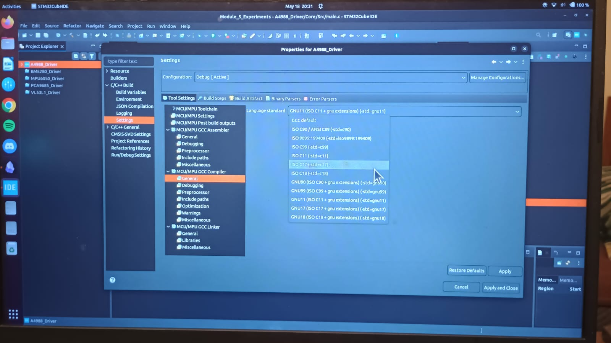

If you have learned C++ through coursework or personal projects, there is a reasonable chance you learned a version of the language that the industry would consider outdated. This is not a criticism -- universities teach fundamentals, and the fundamentals of C++ have not changed. But the language itself has evolved substantially over the past fifteen years, and the way professional robotics teams write C++ today looks quite different from the way it was written in 2003.

This chapter introduces the C++ standards process, explains why version numbers matter in a production codebase, and then works through the modern features that are most relevant to robotics software; what they are, why they exist, and how to use them well.

### The C++ Standards Process

C++ is not owned by any single company. It is governed by ISO, the International Organization for Standardization, through a technical committee called WG21. This committee meets several times per year and is composed of representatives from compiler vendors, major technology companies, academics, and independent contributors. Proposals for new language features and library additions are submitted, discussed, revised, and either accepted or rejected through a formal process that typically takes years.

The result of this process is a standard document -- a precise, legally unambiguous specification of what every C++ construct means. Compiler vendors implement this specification in their tools. When GCC or Clang or MSVC claims to support C++17, it means their compiler produces code that behaves according to the C++17 standard document.

For a production robotics codebase, the standard version matters for two reasons. First, it determines which language features and library components are available. Second, it affects your toolchain choices -- not every compiler version supports every standard, and embedded toolchains in particular can lag behind the latest standard by several years.

C++17 is the current baseline for most professional robotics software. ROS 2, the dominant framework for robot software development, requires C++17 as its minimum standard. GCC 7 and Clang 5, which are widely available on the embedded Linux platforms used in robotics, provide solid C++17 support. If you are writing software for a resource-constrained microcontroller like the STM32F4, the ARM GCC toolchain that ships with STM32CubeIDE supports C++17 fully as of recent versions.

C++20 support is increasingly available but adoption is more cautious in safety-critical and production robotics code. Throughout this chapter, features that require C++20 are marked clearly. For everything else, assume C++17.

In STM32CubeIDE, you can set the C++ standard version for your project by right-clicking the project, selecting Properties, navigating to C/C++ Build → Settings → Tool Settings → MCU G++/GCC Compiler → General, and setting the Language Standard field to ISO C++17 (-std=c++17).



*Figure: Screenshot of STM32CubeIDE project properties showing the Language Standard field set to ISO C++17*

### 1. RAII and Ownership of Hardware Resources

RAII (Resource Acquisition Is Initialization) is not a C++17 feature. It has been part of C++ since the early 1990s. It is covered here because it is the single most important C++ idiom for embedded and robotics code, and because many developers who learned C-style embedded programming have not fully internalized it.

The core idea is simple: tie the lifetime of a resource to the lifetime of an object. When the object is constructed, the resource is acquired. When the object is destroyed, the resource is released. Because C++ guarantees that destructors run when objects go out of scope, even when exceptions are thrown or when a function returns early; this pattern makes resource management automatic and leak-proof.

In robotics code, the resources managed this way are not only memory, but hardware peripherals, mutexes, file handles, communication channels, and motor enable signals. Consider a motor driver that must be explicitly enabled before commanding motion and disabled when the command sequence is complete:

```cpp
class MotorGuard {
public:
    explicit MotorGuard(uint8_t motor_id)
        : motor_id_(motor_id)
    {
        motor_enable(motor_id_);
    }

    ~MotorGuard() {
        motor_disable(motor_id_);
    }

    /* Prevent copying: only one object should own the motor */
    MotorGuard(const MotorGuard&)            = delete;
    MotorGuard& operator=(const MotorGuard&) = delete;

private:
    uint8_t motor_id_;
};

void execute_motion_sequence(uint8_t motor_id) {
    MotorGuard guard(motor_id);   /* Motor enabled here */

    move_to_position(0.0f);
    move_to_position(1.57f);
    move_to_position(0.0f);

}   /* Motor disabled here, automatically, even if an exception occurs */
```

The motor is guaranteed to be disabled when `execute_motion_sequence` returns, regardless of how it returns. Without RAII, every early return path and every exception handler would need an explicit `motor_disable()` call -- and in practice, some of them would be missed. The `= delete` syntax on the copy constructor and copy assignment operator is important. If `MotorGuard` could be copied, two objects would believe they own the same motor, and the destructor would call `motor_disable()` twice, once when each copy is destroyed. Deleting the copy operations makes this a compile-time error rather than a runtime bug. `std::unique_ptr` is the standard library's application of RAII to heap-allocated memory and is the correct replacement for raw owning pointers in modern C++. In embedded robotics, direct heap allocation is often restricted as discussed in Chapter 2, but `std::unique_ptr` with a custom deleter is a clean way to manage hardware resources that require explicit cleanup:

```cpp
#include <memory>

struct UARTDeleter {
    void operator()(UART_HandleTypeDef* handle) const {
        HAL_UART_DeInit(handle);
    }
};

using UARTHandle = std::unique_ptr<UART_HandleTypeDef, UARTDeleter>;

UARTHandle open_uart(USART_TypeDef* instance) {
    auto handle = std::make_unique<UART_HandleTypeDef>();
    handle->Instance = instance;
    /* ... configure handle ... */
    HAL_UART_Init(handle.get());
    return handle;
}   /* HAL_UART_DeInit called automatically when handle goes out of scope */
```

### 2. auto and Type Deduction

The `auto` keyword, introduced in C++11, instructs the compiler to deduce the type of a variable from its initializer. This sounds like a convenience feature, and in simple cases it is. In more complex cases it is genuinely important for correctness.

```cpp
/* Without auto: type must be restated, and must match exactly */
std::vector<SensorReading>::const_iterator it = readings.cbegin();

/* With auto: type is deduced correctly, immune to mismatch */
auto it = readings.cbegin();
```

The AUTOSAR C++14 guidelines permit `auto` in specific contexts, and C++17 practice in robotics generally treats it as appropriate when the deduced type is obvious from the initializer or when the explicit type would be verbose and redundant. It is not a license to avoid thinking about types. if the type of a variable is not immediately clear from context, spelling it out explicitly is better style.

One important subtlety is that `auto` strips reference and const qualifiers from the deduced type. When you want to capture a value by const reference, which is usually what you want when iterating over a container of non-trivial objects, you need to say so explicitly:

```cpp
std::vector<JointState> joints = get_joint_states();

/* auto deduces JointState: copies each element */
for (auto joint : joints) { }

/* const auto& deduces const JointState&: no copy */
for (const auto& joint : joints) { }
```

In a control loop iterating over six joint states sixty times per second, the difference between copying and referencing is not enormous. In a loop processing a point cloud with tens of thousands of elements, it matters significantly.

### 3. std::optional for Representing Absent Values

`std::optional<T>`, introduced in C++17, represents a value that may or may not be present. It is the type-safe replacement for the common C pattern of using a sentinel value, returning `-1` from a function that normally returns a positive index, or returning `nullptr` from a function that normally returns a valid pointer, to signal absence or failure.

The problem with sentinel values is that they require out-of-band knowledge. A caller has to know that `-1` means failure, which is convention rather than language. If the convention is not followed (if a caller uses the return value without checking), the sentinel passes into subsequent computations.

```cpp
#include <optional>
#include <string_view>

struct JointConfig {
    float max_velocity;
    float max_torque;
    float home_position;
};

std::optional<JointConfig> load_joint_config(std::string_view joint_name) {
    if (!config_file_contains(joint_name)) {
        return std::nullopt;
    }
    return JointConfig {
        .max_velocity  = config_get_float(joint_name, "max_velocity"),
        .max_torque    = config_get_float(joint_name, "max_torque"),
        .home_position = config_get_float(joint_name, "home_position")
    };
}
```

At the call site, the caller cannot accidentally use the absent value. The type system enforces the check:

```cpp
auto config = load_joint_config("shoulder_pan");

if (!config.has_value()) {
    log_error("Missing configuration for shoulder_pan");
    return false;
}

float vel_limit = config->max_velocity;   /* Safe: has_value() was true */
```

The `->` operator on an `optional` accesses the contained value directly without unwrapping. If you call it on an empty `optional`, the behavior is undefined -- which is why the `has_value()` check matters. For safety-critical code where you want a hard failure rather than undefined behavior on misuse, `config.value()` throws `std::bad_optional_access` if the optional is empty, which is catchable in application-layer code.

`std::optional` has zero heap allocation overhead. The optional object stores the value inline if present and a flag indicating whether it is present. On most platforms, `sizeof(std::optional<float>)` is eight bytes -- four for the float, one for the flag, and three for alignment padding.

### 4. std::variant for State Machines

Robotics systems are full of state machines. A mobile robot has navigation states. A robotic arm has motion states. A sensor driver has connection states. The traditional C implementation uses an enum plus a union, which is unsafe. Nothing prevents you from accessing the wrong union member for the current state.

`std::variant<T1, T2, T3>`, introduced in C++17, is a type-safe union. It holds exactly one value of exactly one of its template types at any given time, and accessing the wrong type is either a compile-time error or a well-defined runtime exception.

```cpp
#include <variant>
#include <string>

struct StateIdle {};

struct StateMoving {
    float target_position;
    float velocity_limit;
};

struct StateFault {
    uint32_t fault_code;
    std::string description;
};

using RobotState = std::variant<StateIdle, StateMoving, StateFault>;
```

Processing a state uses `std::visit` with a visitor, which the compiler enforces is exhaustive --if you add a new state type to the variant and forget to handle it in a visitor, the code will not compile:

```cpp
#include <variant>

void handle_state(const RobotState& state) {
    std::visit([](const auto& s) {
        using T = std::decay_t<decltype(s)>;

        if constexpr (std::is_same_v<T, StateIdle>) {
            set_motor_power(false);
        }
        else if constexpr (std::is_same_v<T, StateMoving>) {
            execute_motion(s.target_position, s.velocity_limit);
        }
        else if constexpr (std::is_same_v<T, StateFault>) {
            trigger_estop(s.fault_code);
            log_error("Fault: %s", s.description.c_str());
        }
    }, state);
}
```

The `if constexpr` construct (another C++17 addition) evaluates the branch condition at compile time. Only the branch whose condition is true for a given type is compiled, which means you can write type-specific code inside the lambda without the compiler complaining about operations that do not apply to other types.

### 5. constexpr: Moving Computation to Compile Time

`constexpr`, introduced in C++11 and significantly expanded in C++14 and C++17, marks a function or variable as eligible for evaluation at compile time. In embedded robotics, this matters for two reasons. First, computation at compile time has zero runtime cost. Second, `constexpr` values are safer than macros -- they are typed, scoped, and visible to the debugger.

The most straightforward use is replacing preprocessor constants with typed compile-time values:

```cpp
/* Preprocessor: no type, no scope, invisible to debugger */
#define CONTROL_LOOP_FREQ_HZ  1000
#define CONTROL_LOOP_PERIOD_S (1.0 / CONTROL_LOOP_FREQ_HZ)

/* constexpr: typed, scoped, debuggable */
constexpr uint32_t CONTROL_LOOP_FREQ_HZ  = 1000U;
constexpr float    CONTROL_LOOP_PERIOD_S = 1.0f / static_cast<float>(CONTROL_LOOP_FREQ_HZ);
```

`constexpr` functions can compute values from other compile-time inputs:

```cpp
constexpr float degrees_to_radians(float degrees) {
    return degrees * (3.14159265358979f / 180.0f);
}

/* Evaluated entirely at compile time: no runtime cost */
constexpr float JOINT_HOME_ANGLE_RAD = degrees_to_radians(45.0f);
```

In C++17, `if constexpr` enables compile-time branching inside templates, which eliminates a category of template metaprogramming complexity that previously required obscure specialization tricks. The `std::visit` example above demonstrates this pattern.

A `constexpr` lookup table is a particularly useful pattern for embedded robotics, where computing a sine or cosine value in a tight control loop may be too slow but storing a precomputed table at a known address is entirely acceptable:

```cpp
#include <array>
#include <cmath>

constexpr size_t SIN_TABLE_SIZE = 256;

constexpr std::array<float, SIN_TABLE_SIZE> make_sin_table() {
    std::array<float, SIN_TABLE_SIZE> table{};
    for (size_t i = 0; i < SIN_TABLE_SIZE; ++i) {
        table[i] = static_cast<float>(
            sin(2.0 * 3.14159265358979 * i / SIN_TABLE_SIZE)
        );
    }
    return table;
}

constexpr auto SIN_TABLE = make_sin_table();
```

This entire table is computed by the compiler and placed in flash memory. At runtime, looking up a sine value is a single array index operation.

### Range-Based Algorithms and Why They Are Safer Than Raw Loops

C++11 introduced range-based for loops as a cleaner syntax for iterating over containers. C++17 extended the standard algorithm library substantially. C++20 adds the ranges library, which composes algorithms in a pipeline style. This section focuses on the C++17 baseline, with a note on ranges at the end.

Raw loops are the default for many developers, and they work. But they carry an implicit contract that the programmer must manually uphold: the loop bounds must be correct, the index must be incremented correctly, and accessing elements through the index must stay in bounds. Each of these is an opportunity for an off-by-one error or a bounds violation.

Standard algorithms replace the loop mechanics with named operations, shifting the burden of correctness from the programmer to the standard library implementation:

```cpp
#include <algorithm>
#include <array>
#include <numeric>

constexpr size_t NUM_JOINTS = 6;
std::array<float, NUM_JOINTS> joint_torques = get_joint_torques();

/* Raw loop: programmer manages bounds and accumulation */
float total = 0.0f;
for (size_t i = 0; i < NUM_JOINTS; ++i) {
    total += joint_torques[i];
}

/* Standard algorithm: bounds management delegated to the library */
float total = std::accumulate(joint_torques.begin(),
                              joint_torques.end(),
                              0.0f);
```

The algorithm version is not just shorter. It is immune to the off-by-one errors that raw loops invite, and its intent is immediately clear to a reader who knows the standard library. `std::accumulate` sums a range. `std::transform` applies a function element-wise. `std::find_if` searches for the first element satisfying a predicate. `std::clamp` constrains a value to a range. Learning these algorithms and reaching for them before writing a raw loop is a habit worth building early.

Lambda expressions, introduced in C++11, allow inline function objects to be passed to algorithms without the overhead of defining a named function:

```cpp
/* Find the first joint exceeding its torque limit */
auto fault_it = std::find_if(
    joint_torques.begin(),
    joint_torques.end(),
    [](float torque) { return torque > TORQUE_LIMIT_NM; }
);

if (fault_it != joint_torques.end()) {
    size_t joint_idx = std::distance(joint_torques.begin(), fault_it);
    trigger_torque_fault(joint_idx);
}
```

**C++20 note:** The ranges library introduced in C++20 removes the need to pass iterator pairs explicitly. The same search becomes `std::ranges::find_if(joint_torques, [](float t){ return t > TORQUE_LIMIT_NM; })`, which is cleaner and composes naturally with other range adaptors. If your toolchain supports C++20, ranges are worth adopting for application-layer code, though their use in safety-certified code should follow your team's deviation process until toolchain support is fully validated.

### What Not to Use: Features to Avoid in Safety-Critical Paths

Modern C++ adds powerful features, but not all of them are appropriate in every part of a robotics codebase. The decision about which features to use in safety-critical code is not purely stylistic -- it has direct implications for timing predictability, static analyzability, and certification compliance.

1. `std::function` is the standard type-erasure wrapper for callable objects. It is convenient and flexible, but its implementation typically involves a heap allocation when wrapping a lambda that captures state, and its call overhead is nondeterministic. In a hard real-time control loop running at one kilohertz, neither of these properties is acceptable. Use function pointers or templated callable parameters instead, and restrict `std::function` to configuration and initialization code that runs outside the real-time path.

2. Exceptions, as discussed in Chapter 4, are not appropriate in hard real-time code paths. This does not mean avoiding them entirely -- they are the right error handling mechanism for configuration loading, device initialization, and other application-layer code where timing predictability is not a hard constraint. The key discipline is to keep exception-throwing code out of the control loop and to structure your codebase so that the boundary between exception-safe and no-exception code is explicit and enforced.

3. `dynamic_cast` performs a runtime type check and is inherently nondeterministic in cost when used with complex inheritance hierarchies. It also requires runtime type information (RTTI) to be enabled, which adds binary size overhead. AUTOSAR Rule A5-2-3 prohibits `dynamic_cast` in safety-related code. If you find yourself reaching for `dynamic_cast`, it is usually a signal that the design should use `std::variant` or a virtual interface instead.

4. Recursive functions are prohibited by MISRA C:2012 Rule 17.2 and AUTOSAR Rule A7-5-2. The concern is stack depth. In a recursive implementation, the maximum stack usage depends on the depth of recursion, which may depend on input data and is therefore difficult to bound statically. On an embedded system with limited stack space, an unexpectedly deep recursion causes a stack overflow, which overwrites adjacent memory without generating a useful diagnostic. All recursive algorithms have iterative equivalents, and for robotics applications the iterative form is always preferable.

### A Decision Framework

With this landscape in mind, a practical framework for evaluating any C++ feature for use in a robotics codebase comes down to three questions. Does it introduce nondeterministic timing? Does it require heap allocation? Does it make the code harder to analyze statically?

If the answer to any of these is yes, the feature belongs in application-layer code: planning, perception, configuration, logging -- and not in the real-time control path. If the answer to all three is no, the feature is a candidate for use anywhere in the codebase, subject to your team's coding standard.

The table below summarizes the features covered in this chapter against these criteria.

|Feature|Heap Allocation|Nondeterministic Timing|Safe in RT Path|
|---|---|---|---|
|RAII / unique_ptr|No (stack)|No|Yes|
|auto|No|No|Yes|
|std::optional|No|No|Yes|
|std::variant|No|No|Yes|
|constexpr|No|No|Yes|
|Range algorithms|No|No|Yes|
|std::function|Yes (often)|Yes|No|
|Exceptions|Yes|Yes|No|
|dynamic_cast|No|Yes|No|
|Recursion|No|Yes (unbounded)|No|

This is not an exhaustive list of C++ features, but it covers the ones you will encounter most frequently in robotics codebases and the ones whose misuse causes the most production problems. The pattern is clear: features that trade runtime predictability for convenience are fine in application code and dangerous in control code.

---