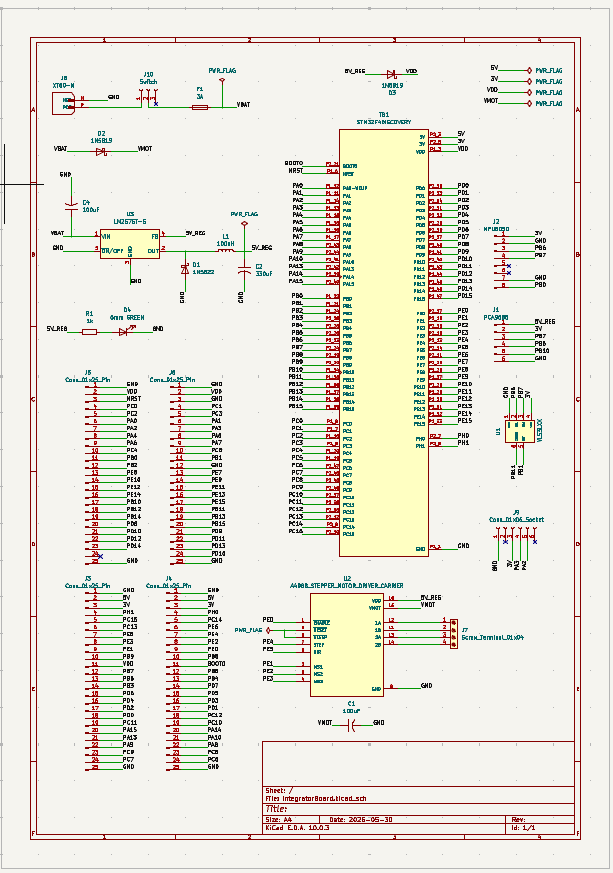
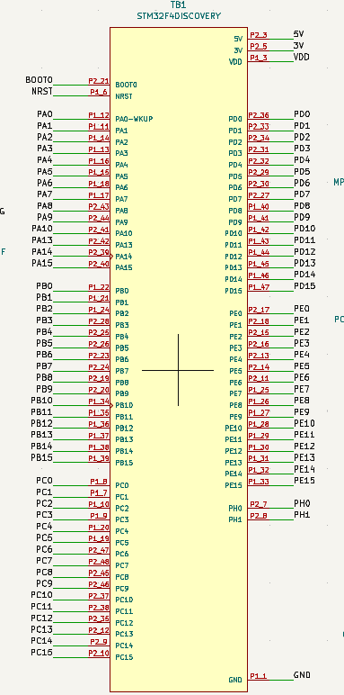
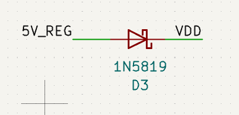
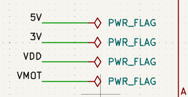

A schematic is where an idea becomes a circuit. Before a single component is placed on a board, the schematic forces you to answer every question about connectivity -- what talks to what, over which interface, at which voltage. Getting this right is the most important step in the entire process. A mistake in the schematic propagates into the layout, into the fabricated board, and ultimately into time spent reworking something that should have been caught on paper.

This chapter walks through the schematic for the STM32 Integration Board section by section. If you want to follow along in KiCAD, the project files are available at:  https://github.com/mukul160/STM32IntegratorBoard

*Figure: Full schematic screenshot.*

### Getting Your Symbols in Order

Before placing anything, the first thing to check is whether KiCAD's built-in library has symbols for every component you intend to use. For common passives, connectors, and generic ICs, it almost certainly does. For specific modules and breakout boards, it often doesn't.

In this case, the STM32F4 Discovery board's symbol was not in the standard library. I imported it from SnapEDA, which maintains a large, community-contributed library of KiCAD-compatible symbols and footprints for exactly this kind of situation.

Find the link to the footprint here: https://www.snapeda.com/parts/STM32F4DISCOVERY/STMicroelectronics/view-part/

The A4988 and VL53L1 were a similar story -- no convincing footprints existed in the library for either. For these, I created custom footprints manually in KiCAD's Footprint Editor. The key parameter to get right when doing this is **pin pitch** -- the centre-to-centre spacing between adjacent pins. For standard through-hole components and breakout boards with 0.1" headers, that pitch is **2.54mm**. Get this wrong and your component physically won't fit the board, regardless of how correct everything else is.

For the stepper motor output, I needed a 4-pin screw terminal. Screw terminals for PCBs typically come in a 3.5mm pitch, which I specified in the footprint.

The MPU6050, PCA9685, and FTDI breakout were simpler:  since all three slot into single-row female headers, there was no need to create custom symbols. KiCAD's generic connector symbols (`Conn_01xNN`) serve perfectly well here. The symbol just represents a row of pins; the net labels you assign to those pins carry all the meaningful information.

### Fanning Out the Discovery Headers

With symbols sorted, the first thing I placed was the STM32F4 Discovery itself.

The Discovery breaks its GPIO out across two dual-row male headers -- one on each side of the board. In the schematic, these are represented by the imported symbol, with all its pins exposed and ready to connect. Rather than drawing explicit wires across the schematic to every peripheral, I used **net labels** throughout. Any two pins sharing an identical net label are electrically connected in KiCAD's netlist, even if no wire visually joins them. For a schematic of this complexity, this is essential -- explicit wires would turn the whole thing into an unreadable tangle.

The Discovery's pins are fanned out to two separate **25-pin connectors**, one for each header row. The intent is straightforward: these connectors become clearly labelled male pin rows on the physical board, so that instead of squinting at the underside of the Discovery to read a pin label, you can read it directly off the silkscreen next to a pin row.

*Figure: Schematic section showing STM32 Discovery symbol with net labels fanning out to the two 25-pin connectors.*

This alone (before any peripheral is connected) already solves the most persistent frustration with the Discovery board on a workbench.

### Connecting the Peripherals

With the Discovery's pins exposed and labelled, connecting peripherals became a matter of routing the right net labels to the right places.

#### A4988 Stepper Driver

The A4988 was imported using its custom symbol. Connections to the STM32 followed the standard recommendations for this driver -- STEP, DIR, and ENABLE lines going to GPIO pins, logic power drawn from the voltage regulator's 5V output.

The A4988 datasheet recommends placing a **100µF bulk capacitor** between VMOT and GND, positioned as close to the chip as possible. This is a decoupling capacitor intended to absorb the voltage spikes that a stepper motor generates as its coils switch. Skipping it risks damaging the driver IC. I included it in the schematic, connected directly across the A4988's motor power pins.

The stepper motor output (four wires for two coils) connects to a **4-pin screw terminal** with a 3.5mm pitch. Screw terminals are the right choice here because motor wires are thick, carry meaningful current, and need a connection that won't shake loose.

*Figure: Schematic section showing A4988 connections -- STM32 control pins, VMOT capacitor, and screw terminal output.*

#### VL53L1 Time-of-Flight Sensor

The VL53L1 communicates over I2C, so it shares the SCL and SDA lines with whatever else is on the I2C bus. Its custom symbol was imported and connected accordingly, with the appropriate GPIO pins from the Discovery assigned via net labels.

*Figure: Schematic section showing VL53 connections* 

#### MPU6050, PCA9685, and FTDI

These three required no custom symbols. Each is represented by a generic connector symbol sized to match its breakout board's pin count. Net labels connect each pin to the appropriate STM32 GPIO, power rail, or ground.

The MPU6050 and PCA9685 are both I2C devices, so they share the same SCL and SDA net labels as the VL53L1. The FTDI bridge connects to the Discovery's USART TX and RX pins, along with power and ground.

*Figure: Schematic section showing generic connector symbols for MPU6050, PCA9685, and FTDI with net labels.*

### The Power Section

The power section is the most involved part of the schematic, and the part most worth understanding carefully before you replicate it.

The board accepts power from two sources: USB via the STM32F4 Discovery, and a 3S LiPo battery at nominally 12V. The LiPo provision exists primarily to drive motors -- the PCA9685 and A4988 both need more current than USB can reasonably provide. All other peripherals draw comfortably from the STM32's onboard regulators.

*Figure: Power section schematic -- full view.*

#### LM2576-5 Buck Regulator

Stepping 12V down to 5V is handled by an **LM2576-5**, a fixed 5V output buck switching regulator capable of supplying up to 3A continuously. I followed the typical application circuit from the LM2576 datasheet directly.

*Figure: Typical application circuit from the LM2576 datasheet -- Texas Instruments.*

The supporting passive components around the LM2576 are not optional. They are part of the regulator's operating circuit:

| Component        | Value              | Purpose                                                |
| ---------------- | ------------------ | ------------------------------------------------------ |
| Input capacitor  | 100µF electrolytic | Stabilises input voltage, absorbs LiPo lead inductance |
| Output inductor  | 100µH              | Energy storage element -- core of the buck topology    |
| Output capacitor | 330µF electrolytic | Smooths output ripple                                  |
| Catch diode      | 1N5822 Schottky    | Freewheeling diode -- conducts during off-cycle        |

The values above come directly from the datasheet's component selection tables for a 5V output. If you're designing a similar circuit at a different output voltage, consult the datasheet -- the inductor and capacitor values change with the output voltage and expected load current.

#### Protection and Isolation

With two potential power sources on the same board, there needs to be a mechanism preventing them from interfering with each other. If the LiPo and USB are both connected simultaneously, without any isolation, current from the regulator's 5V output could back-feed into the USB port, or vice versa. Neither outcome is desirable.

An **1N5819 Schottky diode** sits between the LM2576's 5V output and the STM32's VDD pin. A Schottky diode conducts in only one direction, so power from the LiPo-fed regulator can reach the STM32, but the STM32's USB-derived power cannot flow back into the regulator circuit. The 1N5819 was chosen specifically because Schottky diodes have a lower forward voltage drop than standard silicon diodes (typically 0.3V rather than 0.7V) which means less wasted voltage on a rail where every fraction counts.

That said, connecting both sources simultaneously is still inadvisable. The diode handles the conflict gracefully, but it's not a designed operating mode.

#### Fuse, Switch, and Indicator

Upstream of the regulator, a **3A fuse** sits in series with the LiPo positive rail. This is a simple but important protection measure -- if something on the board draws excessive current due to a fault or a short, the fuse opens before anything more expensive is damaged. 3A was chosen to comfortably cover the regulator's maximum output current with some headroom for the motor loads, while still being low enough to blow before a fault becomes destructive.

A **single-pole double-throw (SPDT) toggle switch** sits between the fuse and the regulator input, giving you a clean way to cut LiPo power to the board without disconnecting the battery physically.

Finally, a **5mm LED** with a **1kΩ current-limiting resistor** is connected across the regulated 5V rail and ground. It serves one purpose: confirming at a glance that the regulator is running and 5V is present. The 1kΩ resistor limits current through the LED to approximately 3.5mA -- well within the LED's ratings, and bright enough to be clearly visible.
### Running the ERC

With the schematic complete, the last step before moving to the PCB editor is running the **Electrical Rules Check**. In KiCAD 11, this is found under `Inspect → Electrical Rules Checker`.

The ERC will flag a number of warnings on a schematic like this -- most commonly, pins that KiCAD considers unconnected or passive pins without a defined driver. Work through each violation methodically. Some will be genuine errors worth fixing. Others will be false positives that you can acknowledge and suppress -- for example, KiCAD often flags connector pins as unconnected even when they are intentionally left unpopulated. Use your judgement, but don't ignore the list wholesale.

In my case, I encountered errors starting some of my "input" pins weren't being driven by any "output" pins. These errors were semantic in nature. I fixed them by assigning explicit power flags to the concerned lines. The power flag symbol is available in the symbol menu.

Once the ERC is clean, you're ready to assign footprints to any remaining symbols and push the design into the PCB editor with `Tools → Update PCB from Schematic`.

The schematic's job is done. Everything from this point is physical.

---