The schematic tells you what connects to what. The PCB layout tells you where everything actually lives, and how those connections are physically realised in copper. It's a different kind of problem -- less about circuit logic, more about spatial reasoning, manufacturing constraints, and a fair amount of patience.

This chapter walks through the layout process for the STM32 Integration Board, from the first component placement to the final Gerber export.

#### First Thoughts on the Layout

Before placing a single component, it's worth spending a few minutes thinking about the board at a high level. What does the finished object need to look like? What needs to be accessible? What's going to be plugged in and unplugged regularly?

For this board, the answer to that last question was clear: the USB port on the STM32 Discovery needed to be easily reachable. That single constraint anchored the entire layout -- the Discovery's footprint was placed and oriented first, with its USB-facing edge aligned toward the board's edge, and everything else arranged around it.

#### Board Stackup and Design Rules

When you first enter the PCB editor, one of the first things you'll typically do is configure your **board stackup** -- the number of copper layers, their thickness, and the dielectric material between them. For more complex boards, these settings matter a great deal.

For a simple two-layer board like this one, the KiCAD defaults work fine. I didn't need to touch them.

What I did set explicitly were the **trace widths**. Rather than routing everything at a default width and adjusting later, I established two widths upfront and stuck to them throughout:

| Trace type                               | Width         |
| ---------------------------------------- | ------------- |
| Signal traces (GPIO, I2C, UART, SPI)     | 0.3mm         |
| Power traces (5V, VMOT, GND connections) | 1.5mm – 2.0mm |

Signal lines carry very little current -- a 0.3mm trace is more than adequate. Power lines, particularly those feeding the A4988 and PCA9685, can carry several amps under load. A trace that's too narrow for its current will resistively heat up, which at best causes a voltage drop and at worst damages the board. The trace width table from the previous chapter is worth keeping handy when making these decisions.

#### Copper Pours

Rather than routing individual power and ground traces to every component, I used **copper pours** for both supply rails -- one per layer.

The front copper layer (`F.Cu`) carries the **regulated 5V pour**. The back copper layer (`B.Cu`) serves as the **ground pour**. Any pad connected to either of those nets automatically picks up a connection to the pour on its respective layer, dramatically reducing the amount of manual routing needed for power distribution.

One setting worth noting: I disabled **isolated islands** in both pours. An isolated island is a region of copper that's enclosed by other copper but has no connection to the net -- it's electrically floating, which serves no purpose and can actually cause problems during manufacture. KiCAD will remove these automatically if you disable them in the pour settings, which you should always do.

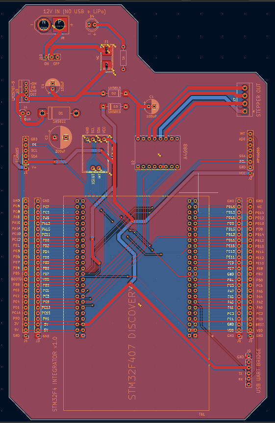

*Figure: PCB Editor showing F.Cu 5V pour and B.Cu GND pour -- filled state.*

#### Placing Components

With the Discovery footprint anchored, placement proceeded module by module -- grouping related components together and working outward logically.

A few principles guided every decision:

- **Decoupling capacitors belong next to the device they serve.** The 100µF capacitor across the A4988's VMOT pin, and the input and output capacitors around the LM2576, were all placed as physically close to their respective ICs as the layout allowed. A decoupling capacitor that's routed far from its device has inductance in the path between them, which partially defeats its purpose.

- **Connectors belong at the edges.** The screw terminal for the stepper motor output, the LiPo connector, the FTDI header, and the fanned-out Discovery pin rows all sit at or near the board's perimeter. Anything a user needs to physically access -- to plug in, connect a wire, or read a label -- should never be buried in the middle of the board.

- **Alignment keeps things readable.** I worked on a **2.54mm grid** throughout placement, which kept everything snapped to the same pitch as the through-hole headers. KiCAD's horizontal and vertical align tools were used liberally. A board where components are visually lined up is easier to inspect, easier to solder, and easier to debug.

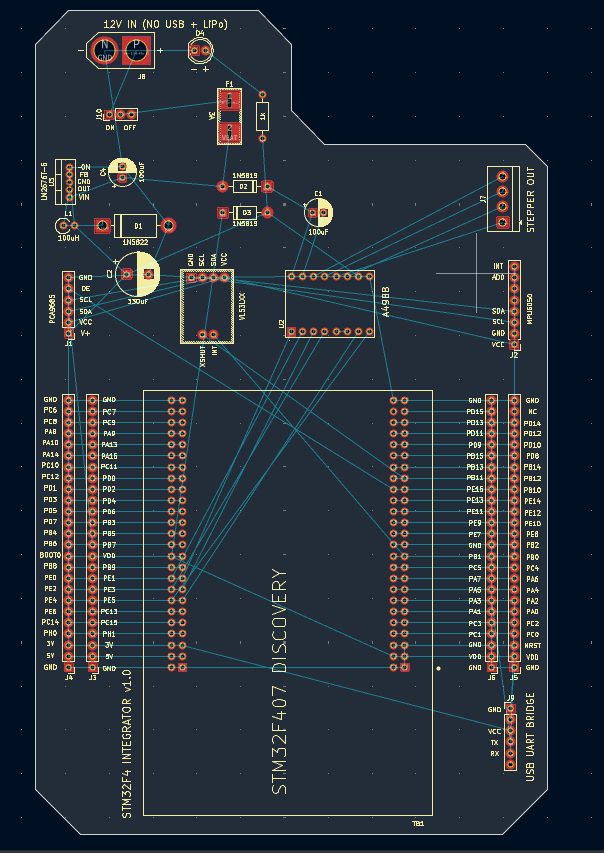

*Figure: Component placement screenshot -- arranged but unrouted, ratsnest visible.*

#### Routing

With components placed, routing was a matter of working through the ratsnest methodically -- front layer first, using the back layer and vias wherever the front became congested.

Signal traces ran at 0.3mm. Power traces were widened to 1.5mm or 2.0mm wherever they carried supply current. 

**Vias** were used extensively. A via is simply a drilled, plated hole that connects a trace on one copper layer to a trace on the other. They're invaluable for escaping congested areas -- when a trace on the front layer runs into an obstacle, dropping a via and continuing on the back layer is often the cleanest solution. Every via has a small cost in board area, but used judiciously they make complex routing significantly more tractable.

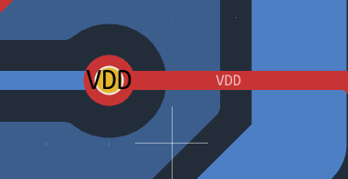

*Figure: Routing screenshot showing via usage -- trace transitioning between F.Cu and B.Cu

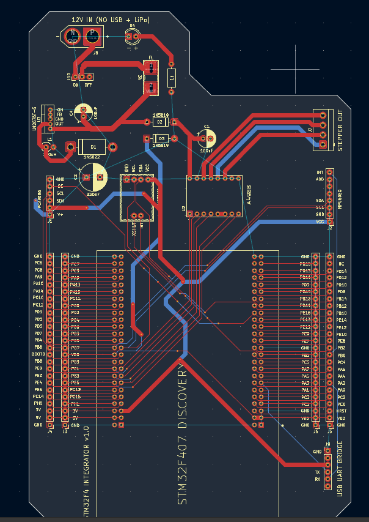

*Figure: Fully routed board before copper pour fill.*

#### A Note on the LM2576 Footprint

The LM2576 presented an unexpected problem mid-routing. Its footprint -- as it existed in the library -- had **annular rings** that were too narrow to pass KiCAD's DRC.

An annular ring is the copper pad that surrounds a drilled hole on a through-hole component. It needs to be wide enough to reliably survive the drilling process and still leave enough copper for a good solder joint. If the ring is too thin, the drill can break through the edge of the pad, leaving a compromised or missing connection.

Rather than going back to the Footprint Editor, I edited the footprint directly in the PCB editor -- KiCAD allows this via right-click on the footprint. I widened the annular rings to satisfy the DRC, saved the change, and carried on.

In hindsight, I should have gone further. The corrected rings still turned out to be uncomfortably thin for hand soldering with a standard iron tip. The LM2576 was one of the more difficult components to solder on the finished board, and the tight pad geometry was a significant part of why. If you're replicating this circuit, I'd recommend widening those annular rings more generously than the DRC minimum -- give yourself room to work.

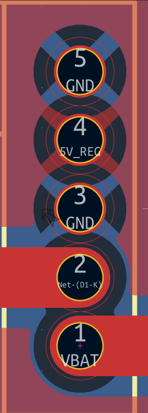

*Figure: Notice how thin the yellow annular rings are.*

#### Board Outline and Shape

The board outline is drawn on the **Edge.Cuts** layer using KiCAD's line tool. Whatever you draw on this layer becomes the physical boundary of the board -- the fabrication house uses it to determine where to cut.

The outline for the Integration Board isn't a simple rectangle. There's a protrusion along one of the longer edges to accommodate the LiPo connector and the indicator LED, both of which needed a little extra real estate. The overall board area comes to approximately **220 cm²**.

Non-rectangular boards are perfectly manufacturable -- don't feel constrained to a rectangle if your components call for a different shape. The only thing to be careful about is ensuring your Edge.Cuts boundary is a single, fully closed loop with no gaps. An open outline will confuse the fabrication house's tooling.

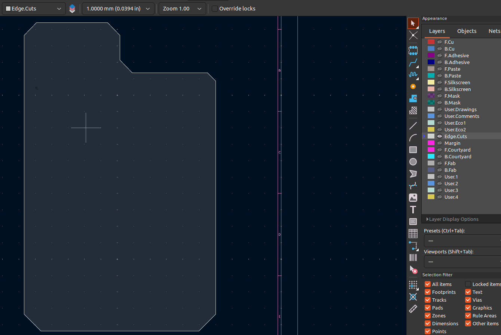

*Figure: Board outline on Edge.Cuts layer -- full board shape visible.*

#### Silkscreen Labels

Once routing and pours were complete, I added silkscreen labels across the board. The silkscreen is the layer of ink printed on the board's surface: it's where your reference designators, pin labels, and any other human-readable information lives.

For the Integration Board, I labelled essentially everything: every connector pin, every passive component, the fuse, and the power switch. The only exceptions were the A4988 and VL53L1 footprints, where the physical shape of the component makes its orientation self-evident.

Thorough silkscreen labelling is worth the time. When you're sitting at a bench with a multimeter, trying to figure out which pin is which, a well-labelled board saves you from constantly consulting the schematic. It also makes the board usable by someone other than you.

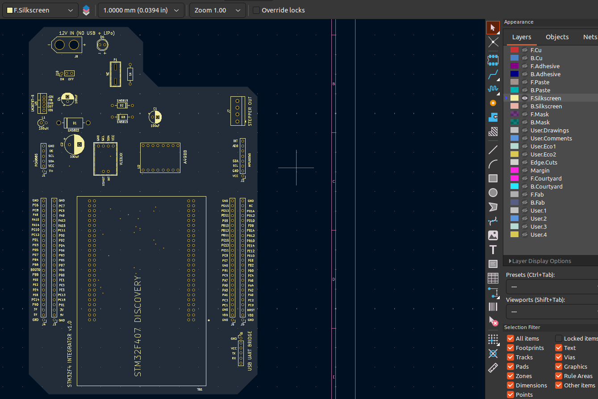

*Figure: Board silkscreen layer -- showing pin labels and component references.*

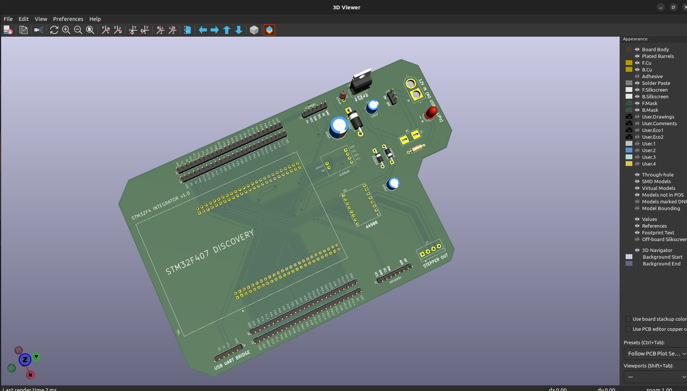

*Figure: 3D visualiser view of the finished board -- front face.*

#### Running the DRC

With routing complete, pours filled, and silkscreen added, the final step before export is the **Design Rule Check**.

Run it from `Inspect → Design Rules Checker`. On a board of this complexity, you should expect a list of violations -- don't be alarmed. Work through them carefully and categorise each one.

On this board, the bulk of the violations were **copper-to-silkscreen clearance warnings** -- KiCAD flagging that some silkscreen labels were sitting too close to copper features. These are cosmetic in nature. A silkscreen label that overlaps a copper trace doesn't affect the circuit's function; at worst, the fabrication house's DRC will trim or omit the offending label. They're worth cleaning up if you have the time, but they don't warrant holding up fabrication.

Violations that do warrant attention are unrouted nets (a ratsnest line you missed), copper clearance errors between different nets (a short waiting to happen), and annular ring violations. Resolve these before moving on.

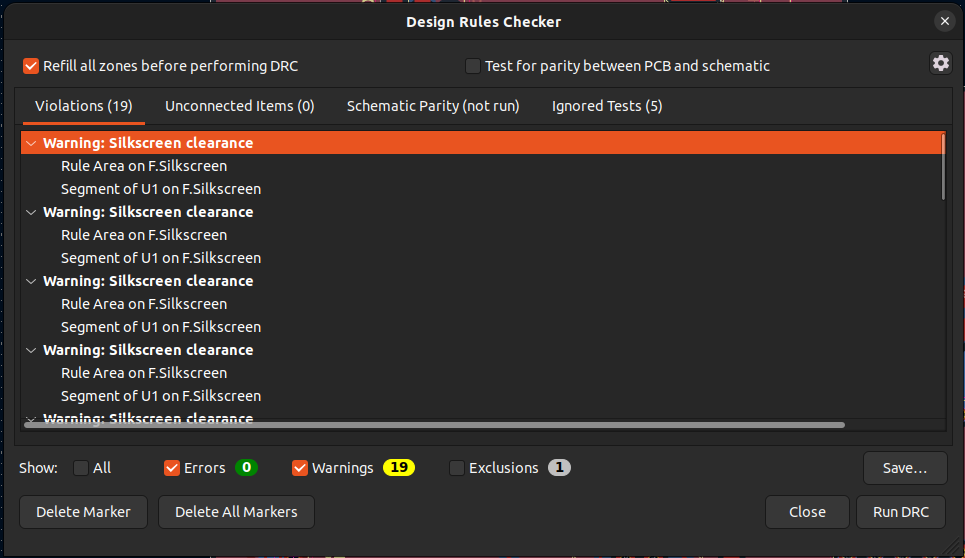

#### Generating Gerbers for Lion Circuits

With the DRC resolved to satisfaction, the board was ready for Gerber export.

I fabricated through **Lion Circuits**, a Bangalore-based PCB manufacturer. For export settings, I followed their KiCAD-specific Gerber guide directly -- fabrication houses often have particular preferences for layer naming and file format that differ slightly from KiCAD's defaults, and it's always worth following the manufacturer's guide rather than guessing.

Here's Lion Circuit's KiCAD Gerber Guide:  https://www.lioncircuits.com/faq/pcb-fab/how-to-generate-the-gerber-files-using-kicad

The exported zip file contains one file per layer -- front and back copper, front and back silkscreen, front and back soldermask, board outline, and drill file. Upload the zip directly to the manufacturer's portal, run their online DRC if one is available, and verify the preview carefully before confirming the order.

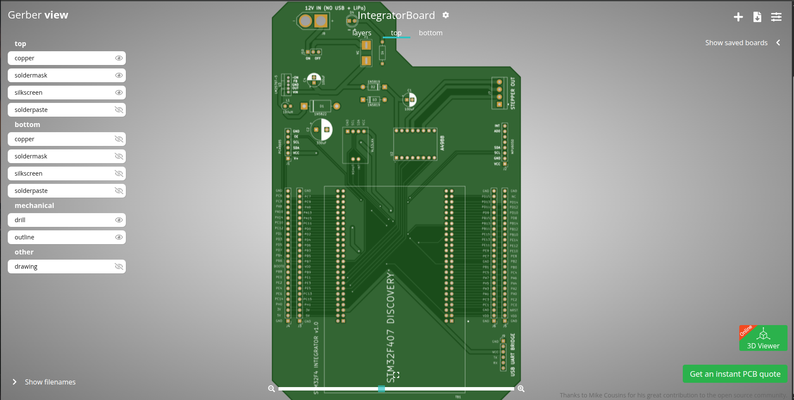

*Figure: Gerber viewer preview -- front copper layer.*

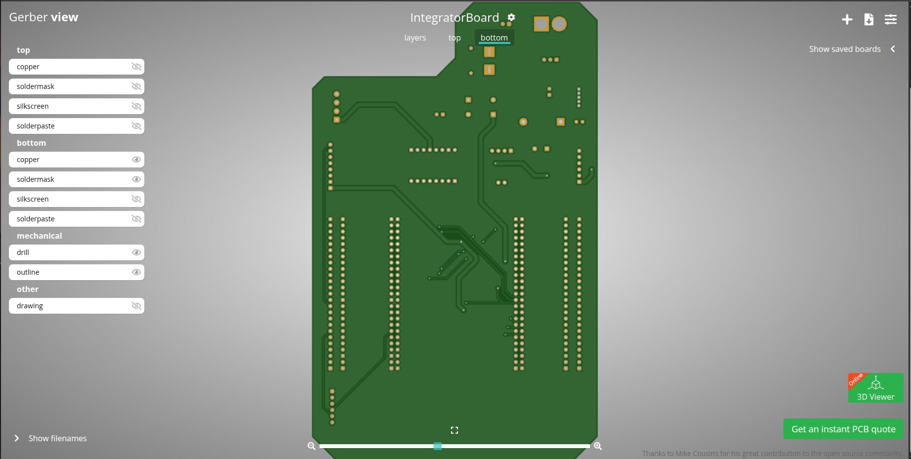

*Figure: Gerber viewer preview -- board overview, bottom copper layer.*

---
