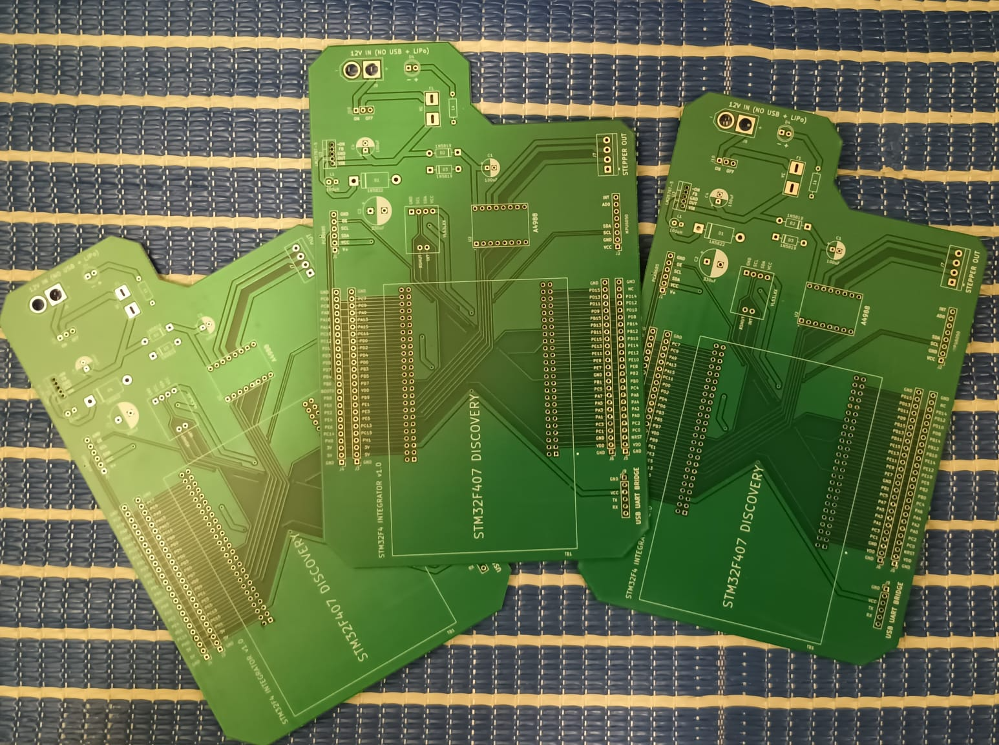
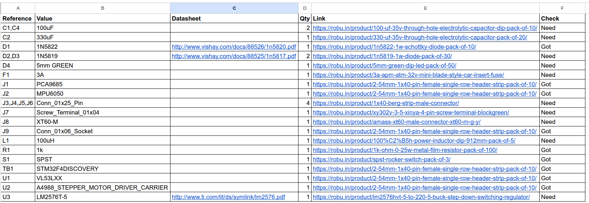
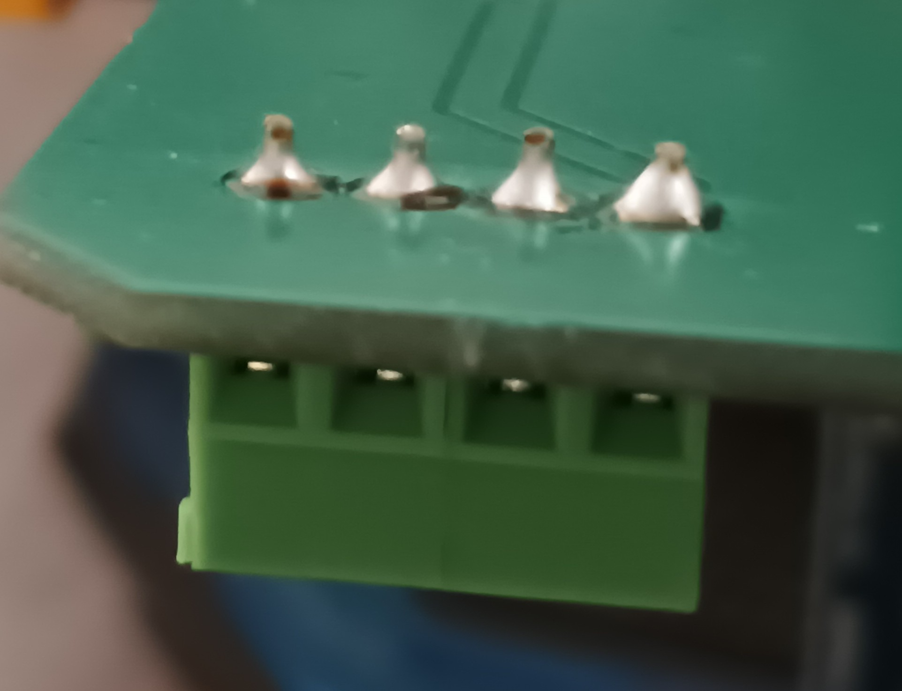
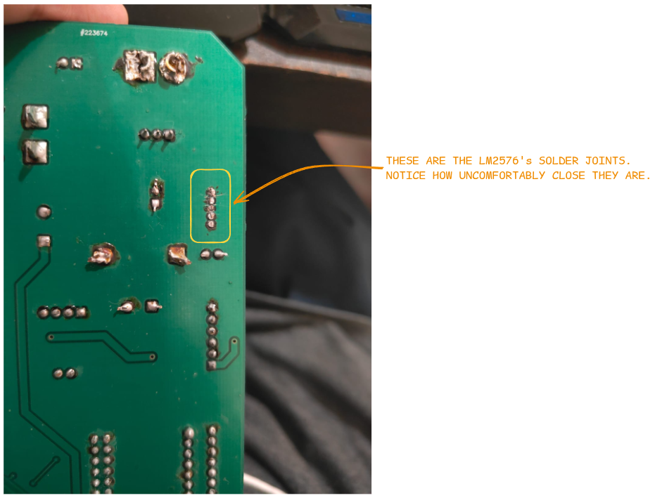
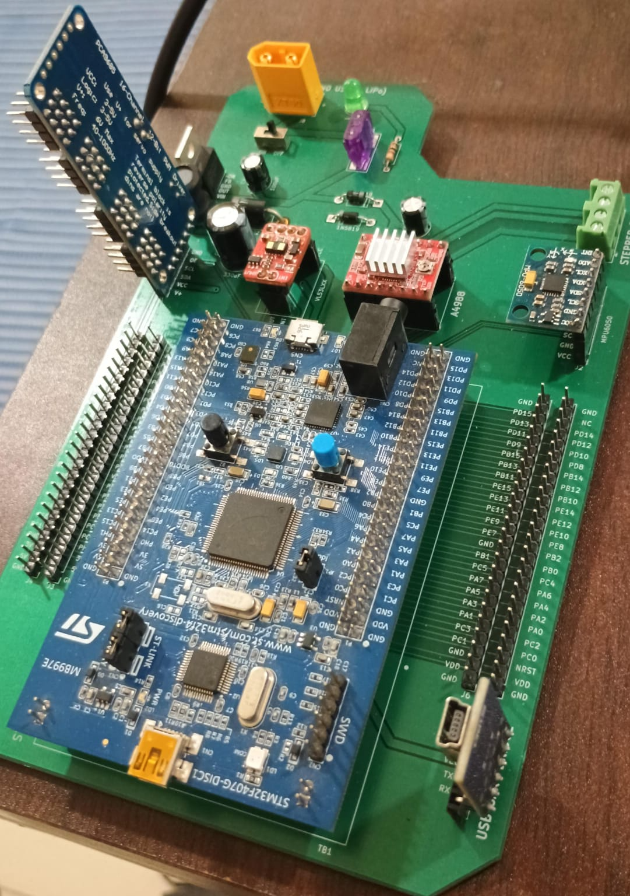
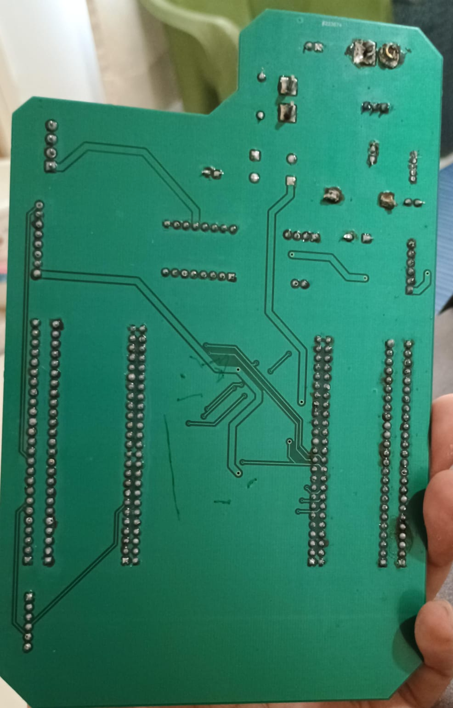
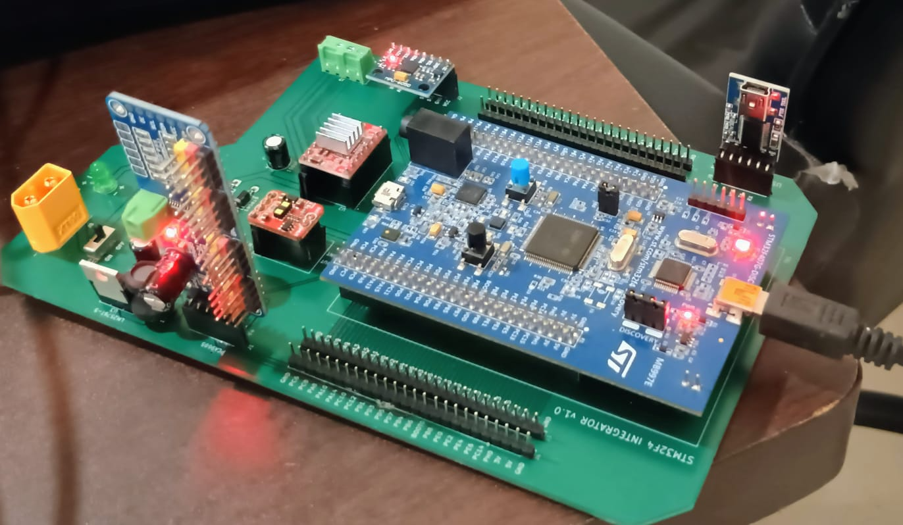
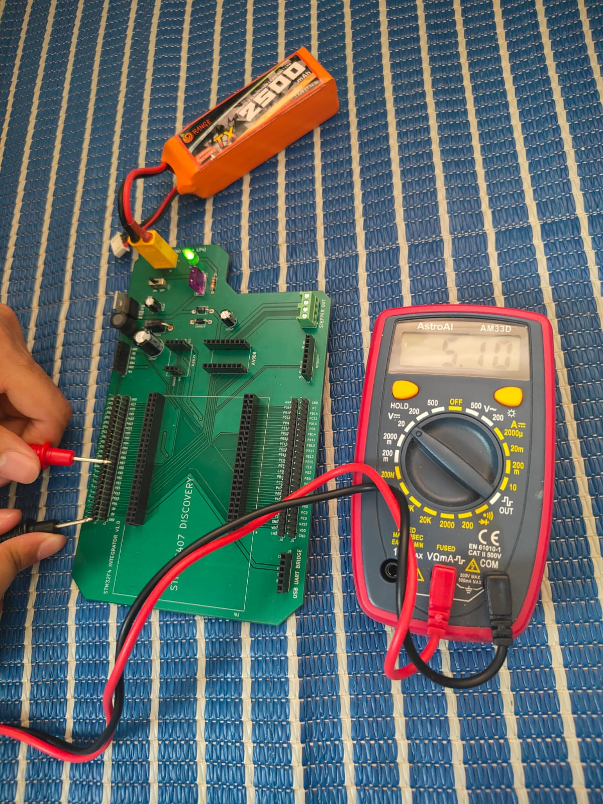
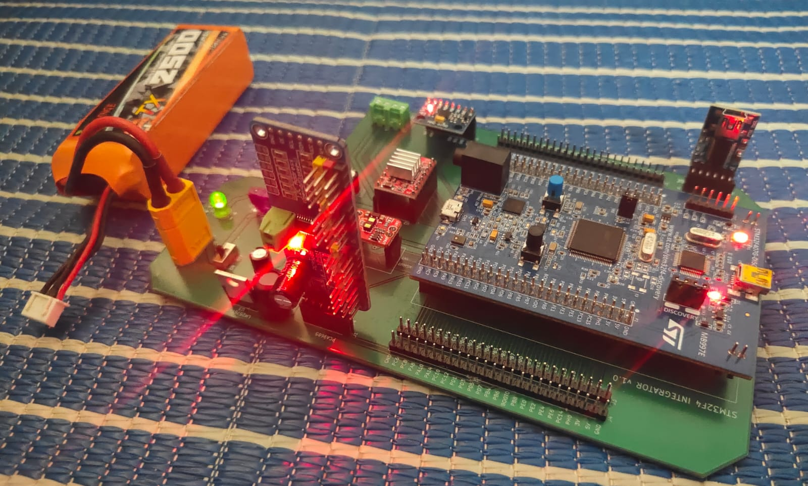

Receiving a fabricated PCB for the first time is a particular kind of satisfaction. Why wouldn't it be? It's the moment a KiCAD file becomes a physical object -- something you can hold, inspect under a light, and eventually power up. This chapter covers everything from that moment to first power, including a debugging detour that kept me occupied longer than I'd like to admit.

### The Order

I placed the order through **Lion Circuits**. The minimum order quantity was 5 boards, and the total came to around **₹3,500** -- reasonable for a board of this size and complexity. Delivery took **6–7 days**.

When the boards arrived, I was relieved. All five looked clean -- no visible defects, lifted pads, or obvious misalignments. The silkscreen was legible too, the board edges were clean. It's always worth doing this kind of visual inspection before touching a soldering iron. A fabrication defect caught now saves you the frustration of debugging a board that was never going to work regardless of how well you assembled it.

*Figure: Photograph of received bare PCBs. I'm showing 3 here, because I've already consumed 2.*

### Why Through-Hole Only

Every component on this board uses a **through-hole footprint**. This was a deliberate choice driven by tooling: I only had a standard soldering iron available. Through-hole soldering requires nothing more -- the component lead passes through a drilled hole, and you apply solder to the pad on the underside of the board.

**SMD (surface-mount) components** sit directly on pads on the board surface, with no through-hole. They're smaller, cheaper in volume, and the industry standard for professional production -- but soldering them by hand with a standard iron is difficult, and doing it reliably at scale essentially requires a reflow oven. If you have access to one, SMD opens up a much wider range of component choices and smaller board footprints. For a prototype assembled at a workbench with hand tools, through-hole is the pragmatic choice.

### Bill of Materials

KiCAD includes a **BOM export utility** under `File → Fabrication Outputs → Bill of Materials`. This generates a spreadsheet listing every component in your schematic -- reference designator, value, footprint, and quantity.

Fair warning: the raw export is not immediately useful. It tends to group components inconsistently, omit supplier information entirely, and require significant manual cleanup before it resembles something you'd actually use to place an order. The workflow I'd recommend is to export the raw BOM, then add columns for supplier, supplier part number, unit cost, and a direct link to the product listing. That turns it into an actual procurement document.

*Figure: STM32 Integration Board Bill of Materials. I have added columns E and F.*

All components for this build were sourced from **ROBU.in**, which stocks most common electronic components and modules and ships reasonably quickly within India.

Find ROBU's landing page here: https://robu.in/

### Soldering

#### Setup and Approach

With boards and components in hand, I set up for soldering. A few things to note about the approach:

Since all footprints are through-hole, **solder is applied from the underside of the board** -- components sit on the top face, leads pass through the holes, and you solder the exposed leads on the bottom. The challenge is keeping components in place while you flip the board over to solder them. To handle this, I applied a small amount of **liquid adhesive** to each component before flipping -- enough to hold it against the board without it shifting or falling out while I worked on the underside.

My soldering iron has a chunky tip -- not ideal for dense pin arrangements, but workable for most of this board. A finer tip would have made the LM2576 significantly less miserable, as you'll read shortly.

#### General Soldering Tips

Good solder joints share a few common characteristics: they're shiny, conical, and make contact with both the pad and the component lead. A dull or blobby joint -- sometimes called a cold joint -- indicates insufficient heat or movement during cooling, and may not make reliable electrical contact even if it looks attached.

Some practical habits that help:

- Heat the pad and the lead simultaneously before applying solder, rather than melting solder onto the iron and hoping it flows. Solder follows heat -- if the joint itself is hot enough, the solder will flow into it cleanly.

- Use flux liberally. Most solder wire has a rosin flux core, but additional flux paste helps significantly on stubborn joints. It promotes wetting, reduces oxidation, and generally makes the solder behave.

- Work in a logical order -- larger, flatter components first, then taller ones. This keeps the board stable on the bench as you work.

- Don't rush. A joint that takes an extra ten seconds to do properly is better than one you revisit three times during debugging.
  
I'm attaching YouTube channel **wermy**'s guide to soldering here:
https://youtu.be/6rmErwU5E-k?si=G2Jh-lpGuWVTDGmB 

*Figure: Close-up of good solder joints on through-hole pads -- underside of board. There are plenty of bad ones too.*

#### Order of Assembly

I began with a **pre-soldering continuity check** using a multimeter. Starting with the STM32 fanout connections, then working across the power lines, I probed between pins and nets to verify the bare board matched the intended netlist -- catching any fabrication-introduced shorts or open connections before committing components. Only once I was satisfied that the bare board was clean did I pick up the iron.

Assembly started with the **power section**. The reasoning is practical: if the power section doesn't work, nothing else will, so it makes sense to build and verify it first before populating the rest of the board.

Most of the power section went smoothly. Then came the LM2576.

### The LM2576 Problem

I mentioned in the layout chapter that the LM2576's annular rings were uncomfortably thin even after the DRC fix. Soldering confirmed exactly that.

The moment I applied the iron, the solder flowed across adjacent pins and bridged them. I attempted to clear the bridges, but on the first board, it was a lost cause. The joints were too compromised to recover cleanly. I set that board aside.

On the **second board**, I went back to the LM2576 immediately -- before anything else was soldered. Starting with the most difficult component first, while the board is clean and you have full access, is a lesson worth internalising. I worked slowly, applied flux, and used a thin nail to tease the solder away from adjacent pins before it cooled. Eventually I got the joints to a state where they were (just barely) isolated from one another.

To verify, I probed between each adjacent pin pair with the multimeter in **continuity mode**. No beeps -- encouraging. But the meter did show a small resistance reading between some pins rather than an open circuit. Not enough to trigger the continuity beeper, but not a clean open either. A partial connection -- possibly a whisker of solder somewhere just below the threshold of continuity, possibly just the meter picking up resistive coupling through the IC's internal structure.

I cleaned the joints as thoroughly as I could and moved on. The rest of the assembly -- headers, passives, connectors, fuse, switch, indicator LED -- went without incident. Through-hole components with standard pin spacing are forgiving to solder, and the rest of the board presented no real difficulty.

*Figure: Assembled board -- top view with all components populated.*

*Figure: Assembled board -- underside showing solder joints.*

### Bring-Up

With the board fully assembled, it was time to find out whether any of it actually worked.

#### USB Power

Before connecting the LiPo, I inserted the STM32 Discovery and all the breakout modules into their respective slots and powered up via USB from my laptop. This was a deliberate precaution. If something was wrong with the board, I didn't want to find out by damaging ₹3,500 worth of modules with an unexpected voltage. USB power is current-limited by the host, which provides some natural protection.

The result was encouraging. Every module powered on. No smoke, no unexpected heat. A good first sign.

*Figure: Board powered via USB -- indicator LED on, modules seated.*

#### LiPo Power

With USB bring-up confirmed, I removed all the breakout modules -- again, as a precaution -- and connected the LiPo via its XT60 connector. Then I flipped the power switch.

**Disappointingly, The LED didn't come on.**

I started probing. What I observed was a collection of behaviours that pointed clearly toward the LM2576 as the problem:

| Observation                                        | Implication                                                          |
| -------------------------------------------------- | -------------------------------------------------------------------- |
| LED blinks momentarily when switch is turned _off_ | Stored energy briefly appears on output as input collapses           |
| LED turns on momentarily when LM2576 is touched    | Physical pressure on IC changes contact state of suspect joints      |
| LM2576 becomes hot when switch is on               | IC is dissipating power without switching -- likely in a fault state |
| No voltage on output pin                           | Regulator not regulating                                             |
| Multimeter probing caused LM to activate           | Probe contact altered something in the circuit                       |

After additional probing, the LM2576 eventually activated and stayed on. The LED lit up, 5V appeared on the STM32's VDD pin, and the IC cooled down. With further testing, the regulator settled into apparently normal behaviour -- turning on reliably when the switch is flipped.

#### What's Likely Going On

My strongest suspicion is the solder joints. The near-miss continuity readings I measured after soldering the LM2576 suggest a partial bridge between two adjacent pins -- most likely between the **~ON pin** (active-low enable) and the **FB pin** (feedback). If ~ON is being partially pulled toward the FB voltage, the IC's enable logic may be seeing an ambiguous signal that prevents it from starting up cleanly.

The physical sensitivity of the fault: it responds to touch, to probe contact, to the mechanical act of connecting and disconnecting the multimeter -- is consistent with a marginal solder joint that changes state under mechanical perturbation. It isn't consistent with a design error, which would produce repeatable, stable failure.

It's also worth considering one other possibility: the LM2576 is a switching regulator, and switching regulators can sometimes exhibit startup instability if the feedback network sees unexpected impedance during power-on. If the output capacitor has any leakage, or if the catch diode is marginal, the regulator could fail to start cleanly on the first cycle. This seems less likely than the solder joint explanation, but it can't be entirely ruled out without resoldering the IC with proper tooling and retesting.

For now, the board works. Since this isn't going into a critical application, I'm comfortable calling it a **tentative success** and moving forward. If the LM2576 becomes unreliable again, the honest fix is to resolder it with a finer iron tip, or better yet, have it reflowed properly.

*Figure: Board powered via LiPo -- LED on, multimeter showing 5V on VDD*

*Figure: Board powered via LiPo -- all components seated.*

### Closing Thoughts

This board started as a solution to a specific frustration -- the awkwardness of working with the STM32 Discovery on a bench -- and ended up being a meaningful exercise in the full PCB design and assembly workflow. The process from schematic to fabricated, assembled hardware surfaces a category of problems that no amount of breadboarding or simulation will prepare you for.

That friction is the point. The Integration Board will serve its primary purpose in the next module, providing a rich hardware platform for exploring RTOS concepts. But the secondary purpose, which is what this module has been about, is giving you the confidence and the vocabulary to sit down with KiCAD, design something real, and see it through to a physical board.

---