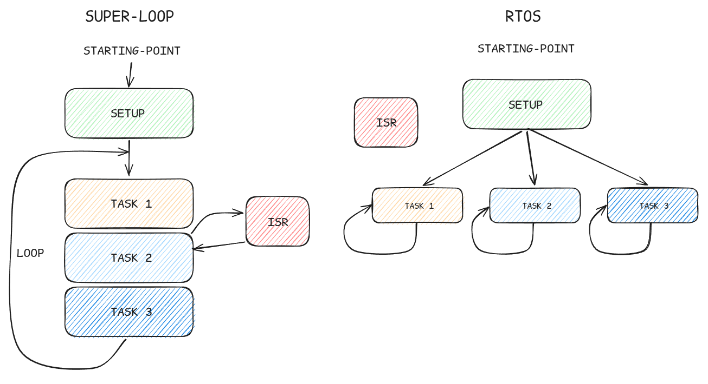

By this point in the course, you've written a fair amount of embedded firmware. And if you look back at the structure of every program you've written, you'll notice they all share the same skeleton:

```c
int main() {
    // Initialise peripherals
    HAL_Init();
    SystemClock_Config();
    MX_GPIO_Init();
    // ...

    while(1) {
        // Do things
    }
}
```

The `while(1)` loop is the heartbeat of bare-metal embedded firmware. Everything happens inside it, one thing after another, in a fixed sequence. Read the sensor. Process the result. Send it over UART. Check a flag. Update an output. Loop back to the top and do it all again.

For simple programs, this works perfectly well. But as your system grows, the super-loop starts to show its limitations in ways that are frustrating to debug and difficult to scale.

---
#### The Problem With Super-Loops

Consider the Integration Board from the previous module. Suppose you wanted to write firmware that did all of the following simultaneously:

- Poll the MPU6050 every 10ms for IMU data
- Poll the VL53L1 every 50ms for distance readings
- Drive the PCA9685 to update servo positions every 20ms
- Send diagnostic data over UART whenever something interesting happens
- Monitor the A4988 and stop the stepper motor if an obstacle is detected

In a super-loop, "simultaneously" is an illusion. The processor executes one instruction at a time, so everything actually happens sequentially. The loop runs as fast as it can, and you use timing checks -- typically comparisons against `HAL_GetTick()` -- to decide when each task is due to run.

This approach has a name: a **time-sliced super-loop**, sometimes called a **scheduler-less cooperative system**. And for a while, it holds together. But it has some fundamental problems.

1. **Blocking is contagious.** If any operation in the loop takes longer than expected -- a sensor that's slow to respond, a UART transmission that stalls, a computation that runs long -- everything else in the loop is delayed. There's no isolation between concerns. One slow operation poisons the timing of every other operation.

2. **Timing guarantees are weak.** You can approximate when something runs, but you can't guarantee it. If the loop iteration takes 15ms instead of 5ms for some reason, your 10ms IMU poll is already late. In a system where timing matters -- motor control, signal processing, anything safety-related -- this is a real problem.

3. **Complexity grows faster than the codebase.** A super-loop managing two things is readable. A super-loop managing eight things, each with its own timing requirements, state machines, and error conditions, becomes a maze. Tracing a bug through it means holding the entire loop's execution history in your head simultaneously.



Figure: Comparing super-loop sequential execution vs RTOS concurrent task execution.

At some point, the super-loop stops being a solution and starts being the problem. That's where an RTOS comes in.

---
#### What an RTOS Actually Is

RTOS stands for **Real-Time Operating System**. The name is slightly misleading -- it implies something closer to a desktop operating system than what it actually is. There's no filesystem, no display server, no user accounts. An RTOS is a small piece of software that does one specific thing: it manages the execution of multiple tasks on a single processor, giving each task the illusion that it has the CPU to itself.

The "real-time" part refers to determinism. A real-time system is one that can guarantee a response to an event within a defined time bound. Hard real-time systems -- think flight control, anti-lock braking -- treat a missed deadline as a system failure. Soft real-time systems -- think audio playback, user interfaces -- tolerate occasional missed deadlines without catastrophic consequences. Most robotics applications fall somewhere in between.

What an RTOS gives you, concretely, is this:

- The ability to write each concern in your system as an independent **task**, with its own stack and its own execution context
- A **scheduler** that decides which task runs at any given moment, based on priority and state
- A set of **synchronisation primitives** -- queues, semaphores, mutexes -- for tasks to communicate and coordinate safely
- **Timing facilities** that let a task sleep for a precise duration without blocking anything else

That last point alone solves one of the most common super-loop headaches. Instead of checking `HAL_GetTick()` in a loop, a task can simply call `vTaskDelay(pdMS_TO_TICKS(10))` and go to sleep. The scheduler runs something else in the meantime, and wakes the task up exactly when it's due.

---
#### A Note on Terminology: RTOS vs Bare-Metal

You'll sometimes hear "bare-metal" used as the opposite of RTOS, which is broadly accurate but worth unpacking slightly. Bare-metal means your code runs directly on the hardware with no operating system layer between them. A super-loop is bare-metal. An interrupt-driven state machine is bare-metal. They're valid approaches, and for simple or highly constrained systems they remain the right choice.

An RTOS adds a layer of abstraction above the hardware, but it's a thin one. FreeRTOS -- the RTOS we'll be using -- has a kernel that compiles down to a few kilobytes. It runs on the same Cortex-M4 core you've been programming all along. The difference is that instead of you manually managing time and sequencing in a loop, the kernel handles it.

---
#### Why FreeRTOS

Several RTOS options exist for STM32 targets. Zephyr is a modern, feature-rich option with strong community support. ThreadX (now Eclipse ThreadX) is a commercial-grade kernel with a long history in safety-critical applications. embOS from SEGGER is another professional option.

For this module, we'll use **FreeRTOS**. The reasons are practical:

- It's directly integrated into STM32CubeIDE via the CMSIS-RTOS2 abstraction layer, which means setup is a matter of a few clicks in CubeMX rather than a manual porting exercise
- It's the most widely used RTOS in the embedded industry, which means documentation, community support, and example code are abundant
- Its API is straightforward enough to learn in a single module without getting lost in configuration

ST provides FreeRTOS support through a wrapper called **CMSIS-RTOS2**, which is a standardised API layer sitting on top of the native FreeRTOS kernel. 

- **FreeRTOS official documentation:** https://www.freertos.org/Documentation/02-Kernel/07-Books-and-manual/01-RTOS_book
- **ST's CMSIS-RTOS2 documentation:** https://arm-software.github.io/CMSIS_5/RTOS2/html/index.html

---
#### What This Module Covers

The remaining chapters of this module take you from concept to running code on the Integration Board.

Chapter 2 covers the core concepts you need to understand before writing a single line of RTOS code -- tasks, the scheduler, context switching, and the synchronisation primitives that let tasks communicate safely.

Chapter 3 walks through setting up FreeRTOS in STM32CubeIDE, understanding what CubeMX generates, and writing your first multi-task program.

Chapter 4 puts all of it together with three experiments on the Integration Board, each one introducing a new concept in a concrete, hardware-grounded context.

By the end, the super-loop will feel like what it is: a starting point you've grown past.

---
