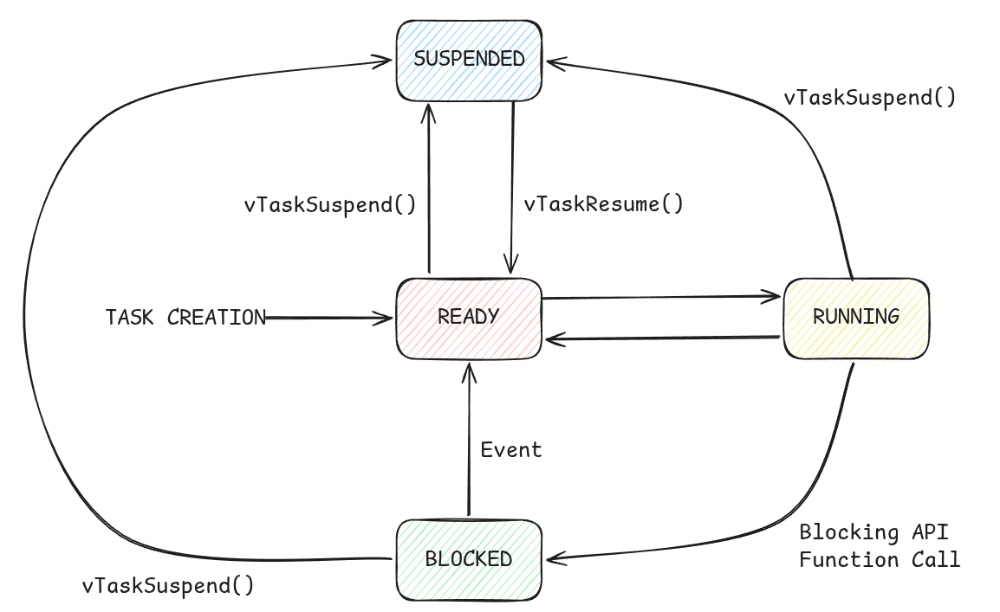
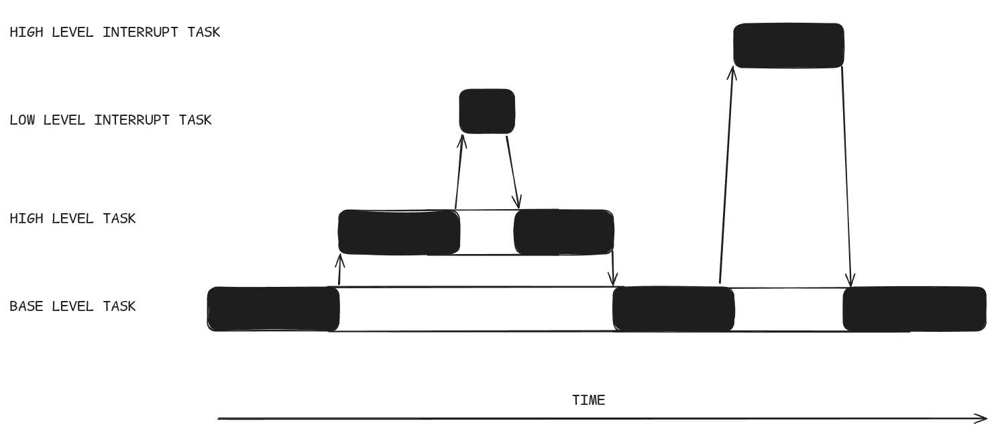
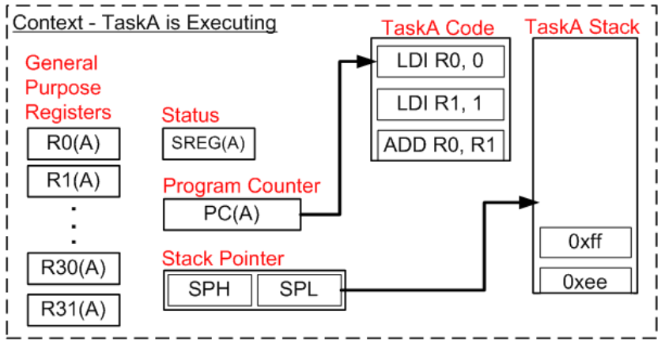
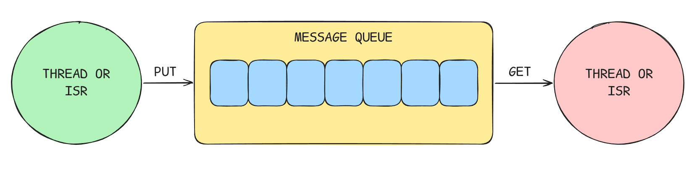

Before writing a single line of RTOS code, it's worth building a clear mental model of what the kernel (the core software engine that manages hardware resources) is actually doing. The concepts in this chapter underpin everything in the chapters that follow. Time spent here pays dividends when something misbehaves at 2am and you need to reason about why.

---
### Tasks

A task is the fundamental unit of work in an RTOS. Think of it as a function that runs as though it has the processor entirely to itself -- it has its own stack, its own local variables, and its own execution flow. It has no awareness of other tasks running alongside it.

In practice, a task usually takes one of two forms. It either runs in an infinite loop, doing something periodically:

```cpp
void imuTask(void *pvParameters) {
    while(1) {
        readIMU();
        vTaskDelay(pdMS_TO_TICKS(10));
    }
}
```

Or it performs a finite job and deletes itself when done. The periodic form is by far the more common in embedded systems.

Every task exists in one of four states at any given moment:

| State         | Meaning                                                |
| ------------- | ------------------------------------------------------ |
| **Running**   | Currently executing on the CPU                         |
| **Ready**     | Able to run, waiting for the CPU                       |
| **Blocked**   | Waiting for something -- a delay, a queue, a semaphore |
| **Suspended** | Explicitly paused, not considered for scheduling       |

Only one task can be in the Running state at a time on a single-core processor. The job of the scheduler is to decide which Ready task gets that slot.



Figure: Task state diagram showing transitions between Running, Ready, Blocked, and Suspended.

---

### The Scheduler

The scheduler is the kernel's decision-making engine. It runs constantly in the background, determining which task should be executing at any given moment. Understanding how it makes that decision is central to writing correct RTOS firmware.

#### Priority

Every task is assigned a **priority** -- a numerical value that tells the scheduler how important it is relative to other tasks. In FreeRTOS, higher numbers mean higher priority. The scheduler always runs the highest-priority task that is currently in the Ready state.

If a high-priority task becomes Ready while a lower-priority task is Running, the scheduler immediately preempts the lower-priority task and hands the CPU to the higher-priority one. This is **preemptive scheduling**, and it's the default behaviour in FreeRTOS.

Assigning priorities requires some thought. A task that responds to time-critical events -- stopping a motor when an obstacle is detected -- should have a higher priority than a task that sends diagnostic data over UART. Getting this wrong leads to the kind of subtle, timing-dependent bugs that are genuinely difficult to track down.

#### The Tick

The scheduler doesn't run continuously -- it runs on a periodic interrupt called the **tick**. Every tick, the scheduler checks whether the currently running task should continue, or whether a higher-priority task has become Ready and should preempt it.

The tick rate is configurable. FreeRTOS defaults to 1000Hz -- a tick every millisecond. This is the resolution of all time-based operations in the kernel. When you tell a task to delay for 10ms, you're really telling it to delay for 10 ticks.

A higher tick rate gives finer timing resolution but increases the overhead of the scheduler itself, since the tick interrupt fires more frequently. For most robotics applications, 1000Hz is a sensible default.

#### Cooperative vs Preemptive Scheduling

Preemptive scheduling -- where the kernel can interrupt a running task at any tick -- is the most common configuration and the one we'll use. It gives the kernel full control over task execution order.

The alternative is **cooperative scheduling**, where a task runs until it voluntarily yields the CPU. No task can be interrupted unless it chooses to give up control. This is simpler to reason about but dangerous in practice: a task that never yields will starve every other task indefinitely.

Preemptive scheduling is the right choice for the vast majority of embedded applications. Cooperative scheduling exists, but treat it as a niche option.



Figure: Timeline diagram showing preemptive scheduling -- high priority task preempting a lower priority task mid-execution.

#### Round-Robin

What happens when two tasks share the same priority? The scheduler uses **round-robin** execution -- it gives each task a single tick of CPU time in turn, cycling through them repeatedly. Neither task starves; they share the CPU equally.

### Context Switching

When the scheduler decides to switch from one task to another, it performs a **context switch**. This is the mechanism that makes multitasking possible on a single core, and it's worth understanding what actually happens.

Every task, at any moment, has a complete execution state -- the values in the CPU's registers, the program counter (which instruction it's on), the stack pointer (where its stack currently sits), and the contents of its stack. Collectively, this is called the task's **context**.

When a context switch occurs, the kernel:

1. Saves the running task's context onto that task's stack
2. Updates the task's state from Running to Ready (or Blocked, if it's waiting for something)
3. Selects the next task to run
4. Restores that task's previously saved context from its stack
5. Resumes execution at exactly the instruction the new task was on when it was last preempted

From each task's perspective, nothing happened. It was running, and then it's running again. The time in between is invisible to it.

On the Cortex-M4, the hardware assists with this process. The processor automatically saves a subset of registers onto the stack when an interrupt fires -- which is how the tick interrupt triggers the scheduler. The kernel saves the remaining registers manually. The whole operation takes on the order of tens of CPU cycles.



Figure: Diagram showing the first step of a context save and restore during a switch between Task A and Task B -- registers. You'll be able to find all steps in the following link. Image source: https://www.freertos.org/Documentation/02-Kernel/05-RTOS-implementation-tutorial/03-Detailed-example/02-Step-1

The implication of all this is that **every task needs its own stack**. When you create a task, you specify a stack size. That stack needs to be large enough to hold the task's local variables, any function call frames it generates, and the saved context during a switch. Size it too small and the task will overflow into adjacent memory, causing corruption that's extremely difficult to diagnose. We'll cover stack sizing practically in Chapter 3.

### Synchronisation Primitives

Tasks running concurrently need ways to communicate and coordinate. An RTOS provides a set of primitives for exactly this purpose. Using them correctly is what separates reliable RTOS firmware from firmware that works most of the time.

#### Queues

A queue is a fixed-size buffer through which tasks pass data. One task writes to the queue; another reads from it. The RTOS handles the mechanics -- if the queue is full, the writing task blocks until space is available; if the queue is empty, the reading task blocks until data arrives.

This is the **producer/consumer** pattern, and it's one of the most useful structures in concurrent programming.

A practical example: an IMU task reads the MPU6050 every 10ms and writes the result into a queue. A processing task reads from that queue whenever data is available and decides what to do with it. The two tasks are completely decoupled -- the IMU task doesn't care what happens to the data, and the processing task doesn't care where the data comes from.



Figure: Diagram showing producer task writing to a queue and consumer task reading from it.

#### Semaphores

A semaphore is a signalling mechanism. At its simplest, it's a counter that tasks can increment ("give") and decrement ("take"). If a task tries to take a semaphore whose count is already zero, it blocks until another task gives it.

A **binary semaphore** -- one that can only be 0 or 1 -- is the most common form. It's typically used to signal between tasks: one task gives the semaphore when an event occurs, and another task is waiting to take it.

A concrete example: an interrupt fires when the VL53L1 signals that a new measurement is ready. The interrupt handler gives a binary semaphore. A waiting task takes it and proceeds to read the measurement. The interrupt and the task are cleanly separated -- the interrupt does the minimum possible work, and the task handles everything else.

#### Mutexes

A mutex (mutual exclusion) is used to protect a shared resource from being accessed by two tasks simultaneously. Only the task that holds the mutex can access the resource. Any other task that tries to take the mutex will block until it's released.

Consider UART. If two tasks both try to write to the serial port at the same time, their output will be interleaved into gibberish. A mutex around the UART peripheral ensures that only one task transmits at a time.

```
Task A takes mutex -> transmits -> releases mutex
Task B was blocked -> now takes mutex -> transmits -> releases mutex
```

**The key distinction from a semaphore**: a mutex must be released by the same task that took it. Semaphores have no such requirement, which is why they're suited to signalling while mutexes are suited to resource protection.

### Priority Inversion

Priority inversion is one of the classic failure modes of priority-based scheduling, and it's worth understanding before you encounter it in the wild.

Imagine three tasks: Low, Medium, and High priority. Low acquires a mutex to access a shared resource. Before Low can release it, High tries to take the same mutex and blocks -- it has to wait for Low to finish. So far, this is expected behaviour.

The problem arises when Medium becomes Ready while High is blocked. Medium has no interest in the mutex, so it preempts Low and runs. Now High is blocked waiting for Low, and Low is blocked waiting for Medium. A high-priority task is being held up by a medium-priority task that has nothing to do with it. The priorities have effectively inverted.

[](https://www.youtube.com/watch?v=C2xKhxROmhA)

**Digikey** has a great guide on this subject, do check it out. 

The standard solution is **priority inheritance**: when a high-priority task blocks on a mutex held by a lower-priority task, the kernel temporarily raises the lower-priority task's priority to match. This allows it to finish quickly and release the mutex, after which its priority returns to normal.

FreeRTOS mutexes support priority inheritance. Semaphores do not -- which is one more reason to use each primitive for its intended purpose.

### Stack Sizing and Memory

Each task's stack is allocated from a region of RAM called the **heap** -- a pool of memory the RTOS manages at runtime. FreeRTOS provides several heap management schemes (heap_1 through heap_5) that differ in how they allocate and free memory. For most embedded applications, heap_4 is a sensible default -- it supports both allocation and freeing, and handles fragmentation reasonably well.

Stack sizing is part science, part experience. The stack needs to accommodate the task's local variables, the call stack of any functions it calls, and the context saved during a switch. As a starting point, 128 to 256 words (512 to 1024 bytes) is reasonable for a simple task. Tasks that call deeply nested functions or use large local buffers need more.

FreeRTOS provides a high-water mark utility that tells you how close a task has come to exhausting its stack. It's an invaluable debugging tool, and we'll use it in Chapter 3.

It's also worth briefly noting two concepts you'll encounter as you go deeper into RTOS development: **tickless idle mode**, which reduces power consumption by suppressing the tick interrupt when no tasks are Ready, and **MPU (Memory Protection Unit) support**, which can isolate tasks from each other's memory regions. Both are beyond the scope of this module, but they're worth knowing exist.

With these concepts in hand, you have the vocabulary to understand what FreeRTOS is doing at every step. Chapter 3 puts all of it into CubeIDE and onto the STM32.

---