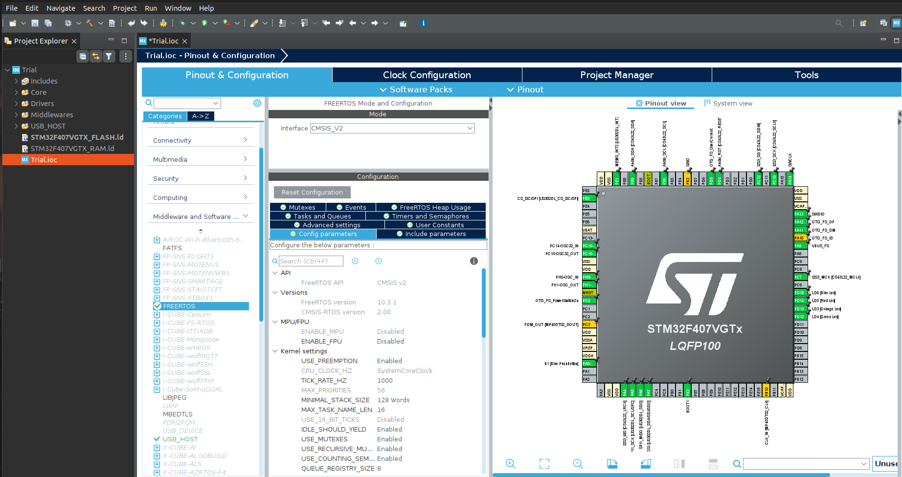
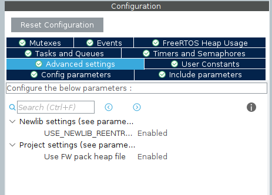
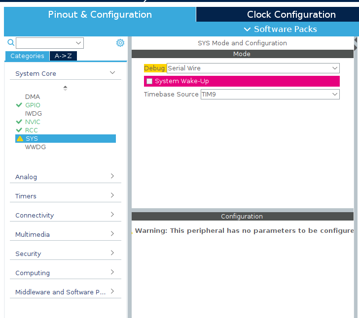
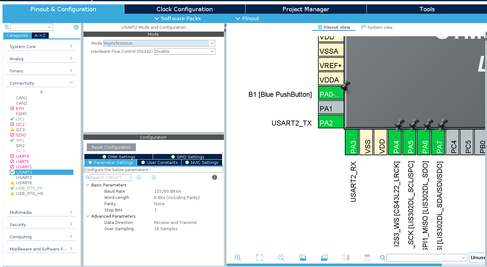

This chapter walks through setting up FreeRTOS on the STM32F4 Discovery from scratch, using STM32CubeIDE 1.19. By the end, you'll have a running project with two independent tasks blinking the Discovery's green and blue LEDs at different rates, with stack usage printing cleanly over UART. A simple result that demonstrates something genuinely important: two pieces of code running concurrently on a single processor, each unaware of the other.

Follow along in CubeIDE as you read.

---
### Creating a New Project

Open STM32CubeIDE and go to `File → New → STM32 Project`. The target board selector will open. Search for **STM32F407G-DISC1** and select it. Give your project a name and click Finish. CubeIDE will generate a base project and open the CubeMX configuration view.

---
### Enabling FreeRTOS in CubeMX

In the CubeMX view, find the **Middleware and Software Packs** section in the left-hand panel and click on **FreeRTOS**.

You'll be asked to select an interface version. Two options are available:

- **CMSIS-RTOS v1** -- an older standardised API layer defined by ARM, sitting on top of the native FreeRTOS kernel.
- **CMSIS-RTOS v2** -- the current version of the same API, with a cleaner interface and better feature coverage. This is what we'll use.

Both are abstraction layers over the native FreeRTOS kernel -- the concepts from Chapter 2 apply equally to both, and the underlying kernel behaviour is identical. CMSIS-RTOS v2 is the right choice for any new project.

Select **CMSIS-RTOS v2** and enable it.



Figure: CubeMX FreeRTOS configuration panel -- CMSIS-RTOS v2 selected.

#### Enabling Newlib Reentrancy

After enabling FreeRTOS, CubeMX will show a warning about newlib reentrancy. Go to **FreeRTOS → Advanced Settings** and enable **USE_NEWLIB_REENTRANT**.

This setting is necessary because newlib -- the C standard library used by the STM32 toolchain -- is not thread-safe by default. Functions like `printf()` maintain internal state, and if two tasks call them simultaneously without reentrancy support, that state can be corrupted. Enabling `USE_NEWLIB_REENTRANT` gives each task its own private newlib context, allocated on its stack. CubeMX will warn you that RAM usage will increase -- this is expected and accounted for in the stack sizes we'll use later.



Figure: CubeMX Advanced Settings panel showing USE_NEWLIB_REENTRANT enabled.

---
### Resolving the SysTick Conflict

Once FreeRTOS is enabled, CubeMX will show a warning about a timebase conflict. This is expected, and worth understanding.

FreeRTOS uses the **SysTick** timer to generate its kernel tick -- the periodic interrupt that drives the scheduler. The STM32 HAL library also uses SysTick as its timebase for functions like `HAL_Delay()` and `HAL_GetTick()`. Two things cannot share the same timer.

CubeMX will prompt you to move the HAL timebase to a different timer. Accept this and select any available general-purpose timer -- **TIM6** is a common choice since it's a basic timer with no other typical use. CubeMX will reconfigure the HAL timebase automatically.



Figure: CubeMX timebase conflict warning and timer selection dropdown.

Save the CubeMX configuration with `Ctrl+S` and allow it to regenerate the project code.

---
### Configuring UART

Configure USART2 for debug output. In the CubeMX pinout view, click on **PA2** and set it to `USART2_TX`. Click on **PA3** and set it to `USART2_RX`.

Then navigate to **Connectivity → USART2** in the left-hand panel and verify the following settings:

|Parameter|Value|
|---|---|
|Mode|Asynchronous|
|Baud Rate|115200|
|Word Length|8 bits|
|Parity|None|
|Stop Bits|1|

These are standard UART settings and will match the defaults in most serial terminal applications. Leave DMA and interrupt settings alone for now -- a simple polling UART is sufficient for debug output.



Figure: CubeMX USART2 configuration panel with PA2 and PA3 assigned.

Save and regenerate the project.

---
### Configuring the GPIO Pins

Configure the two LED pins. On the STM32F4 Discovery:

| LED   | Pin  |
| ----- | ---- |
| Green | PD12 |
| Blue  | PD15 |

In the CubeMX pinout view, click on **PD12** and set it to `GPIO_Output`. Do the same for **PD15**. Give them user labels -- `LED_GREEN` and `LED_BLUE` -- by right-clicking each pin after setting its mode. Save and regenerate.

---
### Understanding What CubeMX Generated

Open the project in the file explorer and look at what was generated. The important additions are in `Middlewares/Third_Party/FreeRTOS/` -- this is the kernel source. You'll also notice that `freertos.c` has appeared in your `Core/Src/` folder. This is where CubeMX expects you to write your RTOS initialisation code.

Open `main.c`. You'll find two RTOS-related calls inside `main()`:

```c
osKernelInitialize();
MX_FREERTOS_Init();
osKernelStart();
```

- `osKernelInitialize()` prepares the kernel internals before anything else runs. 
- `MX_FREERTOS_Init()` is defined in `freertos.c` -- this is where you'll create your tasks; it must be added manually to our main. 
- `osKernelStart()` hands control to the scheduler. Any code written after this line in `main()` will never execute -- once the kernel starts, it manages execution entirely. Your application logic lives in tasks.

---
### Retargeting Printf to UART

By default, `printf()` in an STM32 project has nowhere to send its output. Retargeting it to UART redirects the C standard library's output stream so that every `printf()` call transmits over USART2.

Open `Core/Src/main.c` and add the following include near the top, below the existing includes:


```c
#include <stdio.h>
```

Then add this function above `main()`, outside any generated code section boundaries:

```c
int __io_putchar(int ch) {
    HAL_UART_Transmit(&huart2, (uint8_t *)&ch, 1, HAL_MAX_DELAY);
    return ch;
}
```

This overrides the weak default implementation of `__io_putchar()` provided by the C runtime. Every character that `printf()` would normally send to stdout is passed through this function and transmitted over USART2 one byte at a time.

To verify retargeting is working before adding any tasks, add a quick test in `main()` before `osKernelStart()`:

```c
printf("UART OK -- starting scheduler\r\n");
osKernelStart();
```

Flash the board, open a serial terminal at 115200 baud, and confirm the message appears. If it does, remove the test line and move on.

---
### A Look at the FreeRTOS Configuration File

In `Core/Inc/`, you'll find **FreeRTOSConfig.h**. This file controls the kernel's behaviour at compile time. Most defaults are fine for our purposes, but a few values are worth knowing:

|Parameter|Default|Meaning|
|---|---|---|
|`configTICK_RATE_HZ`|1000|Scheduler tick rate -- one tick per millisecond|
|`configTOTAL_HEAP_SIZE`|15360|Total heap for tasks and kernel objects, in bytes|
|`configMAX_PRIORITIES`|56|Number of distinct priority levels|
|`configUSE_PREEMPTION`|1|Enables preemptive scheduling|
|`configUSE_MUTEXES`|1|Enables mutex support|

You rarely need to edit this file directly for simple projects. When you do -- for example, to increase heap size as your project grows -- be careful. Some parameters have interdependencies, and setting them incorrectly produces compiler errors or subtle runtime failures.

---
### Creating Tasks in Code

Open `freertos.c`. You'll find the generated `MX_FREERTOS_Init()` function -- this is where tasks are created before the scheduler starts.

In CMSIS-RTOS2, a task is called a **thread**, created with `osThreadNew()`. Before calling it, you define a thread attributes structure specifying the thread's name, stack size, and priority.

A note on stack sizing: with `USE_NEWLIB_REENTRANT` enabled, any task that calls `printf()` needs a generous stack allocation. Newlib initialises its reentrant context on the task's stack the first time a standard library function is called -- this is a one-time cost of several hundred bytes. A stack of **2048 bytes (512 words)** is the minimum comfortable allocation for a task using `printf()`. Smaller stacks will work until they don't, and the failure mode is difficult to diagnose.

Add the following to `freertos.c`:

```c
/* freertos.c */

#include "FreeRTOS.h"
#include "task.h"
#include "cmsis_os.h"
#include "main.h"
#include <stdio.h>

/* Declare the UART handle -- defined in main.c */
extern UART_HandleTypeDef huart2;

/* Task function prototypes */
void GreenLedTask(void *argument);
void BlueLedTask(void *argument);

/* Thread attribute structures */
const osThreadAttr_t greenTask_attributes = {
    .name       = "GreenTask",
    .stack_size = 512 * 4,   // 2048 bytes
    .priority   = (osPriority_t) osPriorityNormal,
};

const osThreadAttr_t blueTask_attributes = {
    .name       = "BlueTask",
    .stack_size = 512 * 4,   // 2048 bytes
    .priority   = (osPriority_t) osPriorityNormal,
};

void extern MX_FREERTOS_Init(void) {
    osThreadNew(GreenLedTask, NULL, &greenTask_attributes);
    osThreadNew(BlueLedTask,  NULL, &blueTask_attributes);
}
```

Both tasks are assigned `osPriorityNormal` and identical stack sizes. Since neither is more time-critical than the other, equal priorities are appropriate -- the scheduler will round-robin between them.

---
### Writing the Task Functions

Each task runs in an infinite loop, toggling its LED, sleeping for a fixed duration, and printing its stack high-water mark over UART.

```c
void GreenLedTask(void *argument) {
    for(;;) {
        HAL_GPIO_TogglePin(GPIOD, GPIO_PIN_12);
        osDelay(500);

        UBaseType_t stackRemaining = uxTaskGetStackHighWaterMark(NULL);
        printf("[GreenTask] Stack remaining: %lu words\r\n",
               (unsigned long)stackRemaining);
    }
}

void BlueLedTask(void *argument) {
    for(;;) {
        HAL_GPIO_TogglePin(GPIOD, GPIO_PIN_15);
        osDelay(250);

        UBaseType_t stackRemaining = uxTaskGetStackHighWaterMark(NULL);
        printf("[BlueTask]  Stack remaining: %lu words\r\n",
               (unsigned long)stackRemaining);
    }
}
```

`osDelay()` is the CMSIS-RTOS2 equivalent of FreeRTOS's `vTaskDelay()`. When a task calls it, the task enters the Blocked state for the specified number of milliseconds. The scheduler immediately runs the next Ready task. Neither task busy-waits; neither blocks the other.

The green LED blinks at 1Hz and reports every 500ms. The blue LED blinks at 2Hz and reports every 250ms. Your serial terminal output will look something like this:

```
UART OK -- starting scheduler
[GreenTask] Stack remaining: 478 words
[BlueTask]  Stack remaining: 478 words
[BlueTask]  Stack remaining: 383 words
[GreenTask] Stack remaining: 383 words
[BlueTask]  Stack remaining: 383 words
...
```

The first print from each task shows a higher value -- around 478 words -- because newlib hasn't yet initialised its reentrant context on that task's stack. The first call to `printf()` triggers that initialisation, consuming roughly 95 words (380 bytes) in one go. After that, the value stabilises at around 383 words, which is a healthy margin.

Build the project with `Ctrl+B`, flash it to the Discovery, and open your serial terminal at 115200 baud.


Figure: Discovery board with green and blue LEDs blinking at different rates.

---
### What's Actually Happening

Both tasks have equal priority, so the scheduler round-robins between them on each tick. Every millisecond, the tick interrupt fires. The scheduler checks whether any higher-priority task has become Ready -- none have -- and rotates between GreenLedTask and BlueLedTask, giving each a tick at a time.

When a task calls `osDelay(500)`, it moves to the Blocked state and stays there for 500 ticks. During those 500ms it consumes zero CPU time. The other task runs freely. When the delay expires, the blocked task returns to Ready and the scheduler picks it up again.

Two independent timing concerns, zero interference between them, no hand-rolled tick comparison in sight.

---
### A Note on HAL_Delay()

You may be tempted to use `HAL_Delay()` inside a task instead of `osDelay()`. Don't.

`HAL_Delay()` is a busy-wait -- it spins in a loop until the specified time has elapsed, consuming CPU cycles the entire time. Inside an RTOS task, this blocks the scheduler from running anything else for the duration of the delay. Always use `osDelay()` inside tasks. It yields the CPU to the scheduler while the task waits, which is exactly what you want.

---
### A Note on Printf and Thread Safety

With `USE_NEWLIB_REENTRANT` enabled, each task has its own private newlib context, which prevents internal library state from being corrupted across tasks. However, this doesn't make `printf()` itself atomic. If two tasks call it at exactly the same moment, their output can still interleave at the character level in the terminal.

In this chapter's example, the two tasks print infrequently enough that collisions are unlikely in practice. In Chapter 4, where multiple tasks print concurrently with more regularity, we'll wrap UART output in a mutex to guarantee clean output.

---

With a working two-task project running on the Discovery and stack usage printing cleanly over UART, the setup is behind you. Chapter 4 moves onto the Integration Board and puts the remaining hardware to work in experiments that demonstrate queues, semaphores, and real inter-task coordination.

---