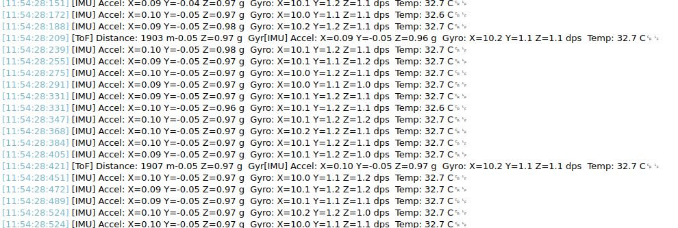
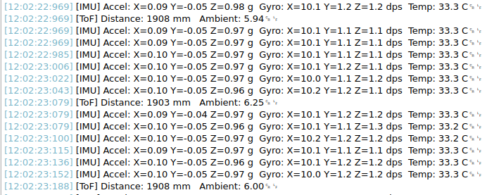

## Experiment 1: Concurrent Sensor Polling with a Shared I2C Bus

This experiment runs two tasks simultaneously -- one polling the MPU6050, another polling the VL53L1X -- and prints their results over UART. Both sensors share the `hi2c1` bus, which means uncoordinated access from two tasks will corrupt I2C transactions. A mutex protects the bus, ensuring only one task communicates over I2C at a time.

By the end, you'll have three concurrent concerns running independently: IMU polling, distance polling, and the underlying bus arbitration -- all without a super-loop in sight.

### What You'll Need

- STM32 Integration Board with MPU6050 and VL53L1X seated in their headers.
- VL53L1X API files imported into your project as described in **this** Module 5 experiment.
- MPU6050 driver files (`MPU6050.h`, `MPU6050.c`) imported into your project, as described in **this** module 5 experiment.
- USART2 configured on PA2/PA3 at 115200 baud.
- I2C1 configured at 100kHz.

---
### Project Setup

Start from the working two-task project from Chapter 3, or create a fresh project with the same CubeMX configuration:
- CMSIS-RTOS2 enabled.
-  USART2 on PA2/PA3.
- I2C1 enabled.
- `USE_NEWLIB_REENTRANT` on.
- HAL timebase moved to TIM6.

Import the MPU6050 and VL53L1X driver files into `Core/Src/` and `Core/Inc/` respectively.
Ensure the CubeIDE's build environment recognises the VL53's headers, as explained in **this** guide. 

---
### Changes to main.c

All sensor initialisation happens in `main.c` before `osKernelStart()`. The RTOS tasks only handle polling -- they must never call initialisation functions themselves, since the scheduler isn't running yet when the sensors need to be configured.

Open `main.c` and make the following additions inside the `/* USER CODE BEGIN Includes */` block:

```c
/* USER CODE BEGIN Includes */
#include "MPU6050.h"
#include "VL53L1X_api.h"
#include <stdio.h>
/* USER CODE END Includes */
```

Add the following type definitions inside `main.h` -- they'll be referenced in multiple source files.

```c
/* USER CODE BEGIN Private defines */
#define VL53L1X_DEV ((uint16_t)(0x29 << 1))
#define TIMING_BUDGET 100
#define INTER_MEAS 100
/* USER CODE END Private defines */
```

Add the following handle to `main.c`:

```c
/* USER CODE BEGIN PV */
MPU6050_Handle mpu;
/* USER CODE END PV */
```

Add the `_write()` retargeting function inside `/* USER CODE BEGIN 0 */` if it isn't already there:

```c
/* USER CODE BEGIN 0 */
int _write(int file, char *ptr, int len) {
    HAL_UART_Transmit(&huart2, (uint8_t*)ptr, len, HAL_MAX_DELAY);
    return len;
}
/* USER CODE END 0 */
```

Inside `/* USER CODE BEGIN 2 */`, add the MPU6050 and VL53L1X initialisation sequences. This entire block runs before the scheduler starts:

```c
/* USER CODE BEGIN 2 */

// --- MPU6050 Initialisation ---
HAL_StatusTypeDef status = MPU6050_Init(&mpu, &hi2c1,
                                         GYRO_FS_250,
                                         ACCEL_FS_2G);
if (status != HAL_OK) {
    printf("MPU6050 init failed.\r\n");
    while (1);
}
printf("MPU6050 ready.\r\n");

// --- VL53L1X Initialisation ---
VL53L1X_Platform_Init(&hi2c1);

uint8_t boot = 0;
printf("Waiting for VL53L1X boot...\r\n");
while (boot == 0) {
    VL53L1X_BootState(VL53L1X_DEV, &boot);
    HAL_Delay(2);
}
printf("VL53L1X boot complete.\r\n");

VL53L1X_ERROR err = VL53L1X_SensorInit(VL53L1X_DEV);
if (err != 0) {
    printf("VL53L1X init failed: %d\r\n", err);
    while (1);
}

VL53L1X_SetDistanceMode(VL53L1X_DEV, 2);
VL53L1X_SetTimingBudgetInMs(VL53L1X_DEV, TIMING_BUDGET);
VL53L1X_SetInterMeasurementInMs(VL53L1X_DEV, INTER_MEAS);
VL53L1X_StartRanging(VL53L1X_DEV);
printf("VL53L1X ready.\r\n\n");

/* USER CODE END 2 */
```

---
### Changes to freertos.c

All task creation and task function definitions live in `freertos.c`. Open it and replace its contents with the following, keeping any existing generated section markers intact:

**At the top of the file, inside the includes section:**

```c
#include "FreeRTOS.h"
#include "task.h"
#include "cmsis_os.h"
#include "main.h"
#include "MPU6050.h"
#include "VL53L1X_api.h"
#include <stdio.h>
```

**Below the includes, declare the extern handles and define the mutex handle:**

```c
/* Extern declarations -- defined in main.c */
extern UART_HandleTypeDef huart2;
extern I2C_HandleTypeDef  hi2c1;
extern MPU6050_Handle     mpu;

/* I2C bus mutex */
osMutexId_t i2cMutexHandle;
const osMutexAttr_t i2cMutex_attributes = {
    .name = "i2cMutex"
};

/* Task function prototypes */
void ImuTask(void *argument);
void ToFTask(void *argument);

/* Thread attribute structures */
const osThreadAttr_t imuTask_attributes = {
    .name       = "ImuTask",
    .stack_size = 512 * 4,
    .priority   = (osPriority_t) osPriorityNormal,
};

const osThreadAttr_t tofTask_attributes = {
    .name       = "ToFTask",
    .stack_size = 512 * 4,
    .priority   = (osPriority_t) osPriorityNormal,
};
```

**Inside `MX_FREERTOS_Init()`, create the mutex and both tasks:**

```c
void MX_FREERTOS_Init(void) {
    i2cMutexHandle = osMutexNew(&i2cMutex_attributes);

    osThreadNew(ImuTask, NULL, &imuTask_attributes);
    osThreadNew(ToFTask, NULL, &tofTask_attributes);
}
```

The mutex must be created before the tasks, since both tasks will attempt to take it as soon as they run.

**Below `MX_FREERTOS_Init()`, write the task functions:**

```c
void ImuTask(void *argument) {
    MPU6050_Data data;

    for(;;) {
        // Acquire the I2C bus
        osMutexAcquire(i2cMutexHandle, osWaitForever);
        HAL_StatusTypeDef s = MPU6050_ReadScaled(&mpu, &data);
        osMutexRelease(i2cMutexHandle);

        if (s == HAL_OK) {
            printf("[IMU] Accel: X=%.2f Y=%.2f Z=%.2f g  "
                   "Gyro: X=%.1f Y=%.1f Z=%.1f dps  "
                   "Temp: %.1f C\r\n",
                   data.accel_x, data.accel_y, data.accel_z,
                   data.gyro_x,  data.gyro_y,  data.gyro_z,
                   data.temp_c);
        } else {
            printf("[IMU] Read failed.\r\n");
        }

        osDelay(10);   // Poll at 100Hz
    }
}

void ToFTask(void *argument) {
    for(;;) {
        uint8_t ready = 0;

        // Poll until a measurement is available
        osMutexAcquire(i2cMutexHandle, osWaitForever);
        VL53L1X_CheckForDataReady(VL53L1X_DEV, &ready);
        osMutexRelease(i2cMutexHandle);

        if (!ready) {
            osDelay(5);
            continue;
        }

        // Measurement is ready -- read and clear the interrupt
        VL53L1X_Result_t result;
        VL53L1X_ERROR err;

        osMutexAcquire(i2cMutexHandle, osWaitForever);
        err = VL53L1X_GetResult(VL53L1X_DEV, &result);
        VL53L1X_ClearInterrupt(VL53L1X_DEV);
        osMutexRelease(i2cMutexHandle);

        if (err == 0 && result.Status == 0) {
            printf("[ToF] Distance: %4u mm   Ambient: %.2f\r\n",
                   result.Distance,
                   result.Ambient / 128.0f);
        }

        osDelay(INTER_MEAS);   // Respect the inter-measurement period
    }
}
```

Notice that each mutex acquire/release pair wraps the tightest possible section of I2C activity. The mutex is held only for the duration of the bus transaction itself -- not across the `osDelay()` calls, and not while printing. Holding a mutex longer than necessary is a common mistake that unnecessarily blocks other tasks.

---
### What to Expect

Flash the board and open your serial terminal at 115200 baud. You should see interleaved output from both tasks:

```
MPU6050 ready.
Waiting for VL53L1X boot...
VL53L1X boot complete.
VL53L1X ready.

[IMU] Accel: X=0.01 Y=0.00 Z=1.00 g  Gyro: X=0.2 Y=-0.1 Z=0.0 dps  Temp: 28.4 C
[IMU] Accel: X=0.01 Y=0.00 Z=1.00 g  Gyro: X=0.1 Y=-0.1 Z=0.0 dps  Temp: 28.4 C
[ToF] Distance:  342 mm   Ambient: 0.14
[IMU] Accel: X=0.01 Y=0.00 Z=1.00 g  Gyro: X=0.2 Y= 0.0 Z=0.0 dps  Temp: 28.4 C
...
```

The IMU prints far more frequently than the ToF sensor -- the MPU6050 is polled at 100Hz while the VL53L1X measurement period is 100ms. This is exactly the point: both tasks run on their own schedule, neither aware of nor blocked by the other, with the mutex handling bus arbitration invisibly in the background.



**Do you notice the corruption in the VL53's print statement?**
This is classic UART interleaving -- the ToF task and the IMU task are both calling `printf()` at the same time, and their output is colliding at the character level. The I2C mutex protects the bus, but there's nothing protecting the UART. Two tasks transmitting simultaneously produces exactly this: fragments of both messages merged into one garbled line.

To solve the interleaving, we'll use a dedicated printf wrapper function. We'll use `vsnprintf()` to format into a stack-allocated buffer and then transmit with `HAL_UART_Transmit()` directly, bypassing `_write()`. This avoids any reentrancy concerns with the underlying printf machinery. 

---
### New Files: rtos_utils.h and rtos_utils.c

Create `rtos_utils.h` in `Core/Inc/` with the following:

```c
/* rtos_utils.h */

#ifndef INC_RTOS_UTILS_H_
#define INC_RTOS_UTILS_H_

#include "cmsis_os.h"

/* Call once inside MX_FREERTOS_Init() before any tasks are created */
void rtos_utils_init(void);

/* Thread-safe printf wrapper. Use exactly like printf. */
void rtos_print(const char *fmt, ...);

#endif /* INC_RTOS_UTILS_H_ */
```

Create `rtos_utils.c` in `Core/Src/` with the following:

```c
/* rtos_utils.c */

#include "rtos_utils.h"
#include "main.h"
#include <stdio.h>
#include <stdarg.h>

#define PRINT_BUFFER_SIZE 256

extern UART_HandleTypeDef huart2;

static osMutexId_t uartMutexHandle;
static const osMutexAttr_t uartMutex_attributes = {
    .name = "uartMutex"
};

void rtos_utils_init(void) {
    uartMutexHandle = osMutexNew(&uartMutex_attributes);
}

void rtos_print(const char *fmt, ...) {
    char buf[PRINT_BUFFER_SIZE];

    va_list args;
    va_start(args, fmt);
    int len = vsnprintf(buf, sizeof(buf), fmt, args);
    va_end(args);

    if (len > 0) {
        osMutexAcquire(uartMutexHandle, osWaitForever);
        HAL_UART_Transmit(&huart2, (uint8_t*)buf, (uint16_t)len, HAL_MAX_DELAY);
        osMutexRelease(uartMutexHandle);
    }
}
```

A few things worth noting about this implementation. The mutex is acquired only after the string is fully formatted into `buf` -- formatting happens on the task's own stack and doesn't need protection. Only the transmission itself is protected, which keeps the mutex held for the shortest possible time. The buffer is 256 bytes -- if a formatted line exceeds that, `vsnprintf()` will truncate it cleanly rather than overflowing.

---
### Changes to freertos.c

Add the include at the top of `freertos.c`:

```c
#include "rtos_utils.h"
```

Call `rtos_utils_init()` at the top of `MX_FREERTOS_Init()`, before the I2C mutex and before any tasks are created:

```c
void MX_FREERTOS_Init(void) {
    rtos_utils_init();

    i2cMutexHandle = osMutexNew(&i2cMutex_attributes);

    osThreadNew(ImuTask, NULL, &imuTask_attributes);
    osThreadNew(ToFTask, NULL, &tofTask_attributes);
}
```

Then replace every `printf()` call in both task functions with `rtos_print()`. The arguments are identical -- only the function name changes:

```c
void ImuTask(void *argument) {
    MPU6050_Data data;

    for(;;) {
        osMutexAcquire(i2cMutexHandle, osWaitForever);
        HAL_StatusTypeDef s = MPU6050_ReadScaled(&mpu, &data);
        osMutexRelease(i2cMutexHandle);

        if (s == HAL_OK) {
            rtos_print("[IMU] Accel: X=%.2f Y=%.2f Z=%.2f g  "
                       "Gyro: X=%.1f Y=%.1f Z=%.1f dps  "
                       "Temp: %.1f C\r\n",
                       data.accel_x, data.accel_y, data.accel_z,
                       data.gyro_x,  data.gyro_y,  data.gyro_z,
                       data.temp_c);
        } else {
            rtos_print("[IMU] Read failed.\r\n");
        }

        osDelay(10);
    }
}

void ToFTask(void *argument) {
    for(;;) {
        uint8_t ready = 0;

        osMutexAcquire(i2cMutexHandle, osWaitForever);
        VL53L1X_CheckForDataReady(VL53L1X_DEV, &ready);
        osMutexRelease(i2cMutexHandle);

        if (!ready) {
            osDelay(5);
            continue;
        }

        VL53L1X_Result_t result;
        VL53L1X_ERROR err;

        osMutexAcquire(i2cMutexHandle, osWaitForever);
        err = VL53L1X_GetResult(VL53L1X_DEV, &result);
        VL53L1X_ClearInterrupt(VL53L1X_DEV);
        osMutexRelease(i2cMutexHandle);

        if (err == 0 && result.Status == 0) {
            rtos_print("[ToF] Distance: %4u mm   Ambient: %.2f\r\n",
                       result.Distance,
                       result.Ambient / 128.0f);
        }

        osDelay(INTER_MEAS);
    }
}
```

Now, the sensors print as intended.



Now, we'll move on to Experiment 2.

---

