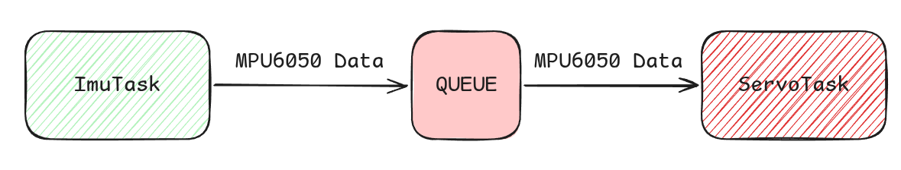
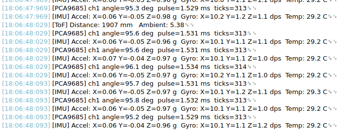
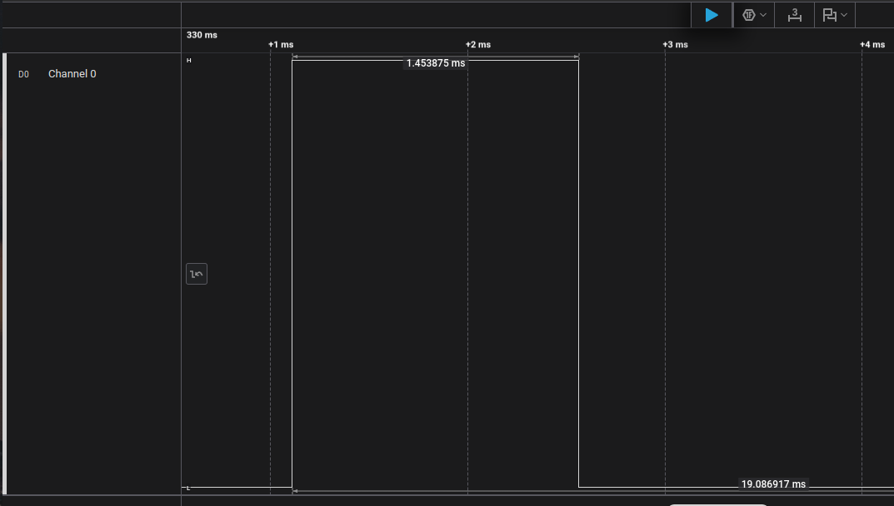
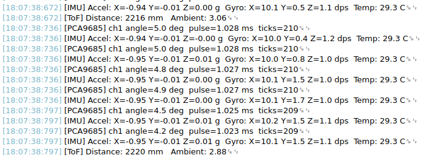
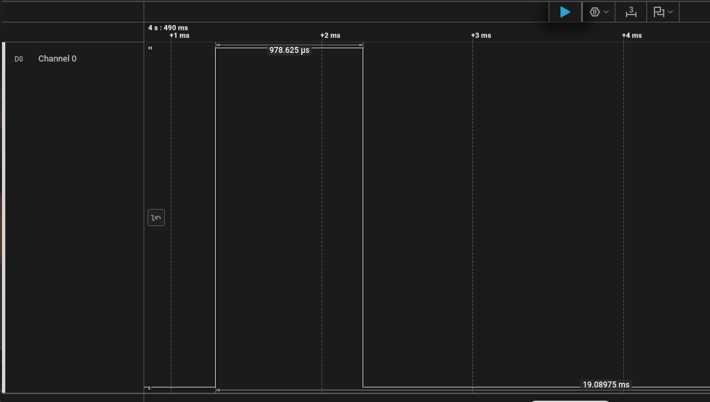
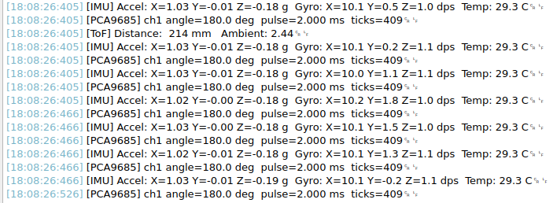
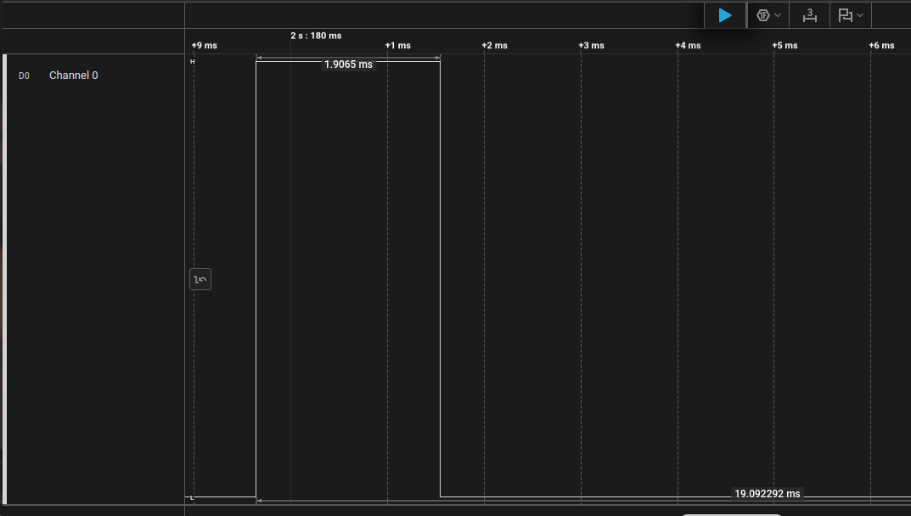

## Experiment 2: Producer/Consumer Queue with Servo Control

This experiment introduces the **queue** -- FreeRTOS's primary mechanism for passing data between tasks. An IMU task reads the MPU6050 and pushes readings into a queue. A servo task consumes those readings and drives a PCA9685 channel in response to board tilt. The two tasks are completely decoupled: the IMU task doesn't know or care what happens to its data, and the servo task doesn't know or care where the data comes from.

This pattern -- producer writing to a queue, consumer reading from it -- is one of the most common structures in real RTOS firmware. Understanding it well pays dividends in every concurrent system you'll build after this.

---
### What You'll Need

- Integration Board with MPU6050 and PCA9685 seated in their headers
- Logic analyser connected to PCA9685 channel 1
- All driver and utility files from Experiment 1 carried over

---
### The Queue as a Communication Channel

In Experiment 1, both tasks operated independently -- they read sensors and printed results, with no data flowing between them. In most real systems, tasks need to hand data to one another. Shared global variables are the naive solution, and a dangerous one: if both tasks access a global simultaneously, without synchronisation, you get a data race.

A FreeRTOS queue solves this properly. It's a thread-safe FIFO buffer managed entirely by the kernel. The sending task calls a send function; if the queue is full, it blocks until space is available. The receiving task calls a receive function; if the queue is empty, it blocks until data arrives. No shared variable, no race condition, no explicit mutex needed around the data transfer itself -- the queue handles all of that internally.

For this experiment, the queue has a depth of 1. This means it holds exactly one `MPU6050_Data` struct at a time. If the servo task hasn't consumed the previous reading before the IMU task tries to send a new one, the send will either block or overwrite -- we'll use `osMessageQueuePut()` with a timeout of zero, which discards the new reading if the queue is full. The servo always gets the latest reading the queue has room for, and stale readings don't accumulate.



---
### Changes to PCA9685.c

The driver's internal `printf()` calls need to go through `rtos_print()` so they respect the UART mutex. Open `PCA9685.c` and add the include at the top:

```c
#include "rtos_utils.h"
```

Then replace both `printf()` calls in the driver with `rtos_print()`:

In `PCA9685_Init()`:

```c
rtos_print("[PCA9685] prescale = %u (target freq = %.1f Hz)\r\n",
           prescale, pwm_freq);
```

In `PCA9685_SetServoAngle()`:

```c
rtos_print("[PCA9685] ch%u angle=%.1f deg  pulse=%.3f ms  ticks=%u\r\n",
           channel, angle,
           SERVO_MIN_MS + (angle / 180.0f) * (SERVO_MAX_MS - SERVO_MIN_MS),
           ticks);
```

This is a deliberate tradeoff worth acknowledging. Ideally a peripheral driver would have no dependency on RTOS utilities -- in a production codebase you'd abstract logging behind a function pointer or a platform logging interface, keeping the driver portable. For this course project, the direct dependency on `rtos_print()` is the pragmatic choice.

---
### Changes to main.c

Add the PCA9685 include alongside the existing includes:

```c
/* USER CODE BEGIN Includes */
#include "MPU6050.h"
#include "VL53L1X_api.h"
#include "PCA9685.h"
#include <stdio.h>
/* USER CODE END Includes */
```

Declare the PCA9685 handle in the private variables section:

```c
/* USER CODE BEGIN PV */
MPU6050_Handle  mpu;
PCA9685_Handle  pca;
```

Add the PCA9685 initialisation inside `/* USER CODE BEGIN 2 */`, after the MPU6050 init and before `osKernelStart()`:

```c
// --- PCA9685 Initialisation ---
HAL_StatusTypeDef pca_status = PCA9685_Init(&pca, &hi2c1,
                                             GPIOB, GPIO_PIN_10,
                                             50.0f);
if (pca_status != HAL_OK) {
    printf("PCA9685 init failed.\r\n");
    while (1);
}
PCA9685_Enable(&pca);
printf("PCA9685 ready.\r\n\n");
```

50Hz is the standard PWM frequency for hobby servos and is appropriate for this experiment even when monitoring with a logic analyser.

---
### Changes to freertos.c

Add the PCA9685 include at the top alongside the existing includes:

```c
#include "PCA9685.h"
```

Add the extern declaration for the PCA9685 handle alongside the existing externs:

```c
extern PCA9685_Handle pca;
```

Declare the queue handle below the existing mutex declarations:

```c
/* IMU data queue */
osMessageQueueId_t imuQueueHandle;
```

Add the servo task attributes alongside the existing thread attribute structures:

```c
const osThreadAttr_t servoTask_attributes = {
    .name       = "ServoTask",
    .stack_size = 512 * 4,
    .priority   = (osPriority_t) osPriorityNormal,
};
```

Add the servo task prototype alongside the existing prototypes:

```c
void ServoTask(void *argument);
```

Update `MX_FREERTOS_Init()` to create the queue and the new task. The queue is created before the tasks, just as the mutex was:

```c
void MX_FREERTOS_Init(void) {
    rtos_utils_init();

    i2cMutexHandle = osMutexNew(&i2cMutex_attributes);

    imuQueueHandle = osMessageQueueNew(1, sizeof(MPU6050_Data), NULL);

    osThreadNew(ImuTask,   NULL, &imuTask_attributes);
    osThreadNew(ToFTask,   NULL, &tofTask_attributes);
    osThreadNew(ServoTask, NULL, &servoTask_attributes);
}
```

Update `ImuTask()` to push readings into the queue after printing. The send uses a timeout of zero -- if the queue is full, the reading is discarded rather than blocking the IMU task:

```c
void ImuTask(void *argument) {
    MPU6050_Data data;

    for(;;) {
        osMutexAcquire(i2cMutexHandle, osWaitForever);
        HAL_StatusTypeDef s = MPU6050_ReadScaled(&mpu, &data);
        osMutexRelease(i2cMutexHandle);

        if (s == HAL_OK) {
            rtos_print("[IMU] Accel: X=%.2f Y=%.2f Z=%.2f g  "
                       "Gyro: X=%.1f Y=%.1f Z=%.1f dps  "
                       "Temp: %.1f C\r\n",
                       data.accel_x, data.accel_y, data.accel_z,
                       data.gyro_x,  data.gyro_y,  data.gyro_z,
                       data.temp_c);

            // Push to queue -- discard if full
            osMessageQueuePut(imuQueueHandle, &data, 0, 0);
        } else {
            rtos_print("[IMU] Read failed.\r\n");
        }

        osDelay(10);
    }
}
```

Add `ServoTask()` below the existing task functions:

```c
void ServoTask(void *argument) {
    MPU6050_Data data;

    for(;;) {
        // Block until a reading is available in the queue
        osStatus_t status = osMessageQueueGet(imuQueueHandle,
                                              &data, NULL,
                                              osWaitForever);
        if (status != osOK) continue;

        // Map accel_x from [-1g, +1g] to [0, 180] degrees
        float clamped = data.accel_x;
        if (clamped < -1.0f) clamped = -1.0f;
        if (clamped >  1.0f) clamped =  1.0f;

        float angle = (clamped + 1.0f) / 2.0f * 180.0f;

        // Acquire I2C bus and update servo
        osMutexAcquire(i2cMutexHandle, osWaitForever);
        PCA9685_SetServoAngle(&pca, 1, angle);
        osMutexRelease(i2cMutexHandle);
    }
}
```

A few things worth noting about `ServoTask()`. It calls `osMessageQueueGet()` with `osWaitForever` -- it blocks indefinitely until a reading arrives, consuming zero CPU while waiting. The angle mapping clamps `accel_x` to the -1g to +1g range before scaling, so readings beyond that range -- which can occur during sharp movement -- don't produce out-of-range servo commands. The I2C mutex is acquired around `PCA9685_SetServoAngle()` for the same reason as in Experiment 1 -- the PCA9685 shares `hi2c1` with the MPU6050 and VL53L1X.

---
### What to Expect

With the logic analyser connected to PCA9685 channel 1, you should see a 50Hz PWM signal whose pulse width changes as you tilt the board along its X axis. With the board flat, `accel_x` will be near 0g, producing an angle near 90 degrees and a pulse width near 1.5ms. Tilting the board toward -1g moves the pulse toward 1ms; tilting toward +1g moves it toward 2ms.

On the serial terminal, the IMU task continues printing at 100Hz. The servo task prints through `rtos_print()` via the driver's internal call each time it updates the channel -- you'll see these interleaved cleanly with the IMU output:

```
[IMU] Accel: X=0.02 Y=-0.01 Z=0.99 g  Gyro: X=0.2 Y=0.1 Z=0.0 dps  Temp: 33.1 C
[PCA9685] ch1 angle=91.8 deg  pulse=1.510 ms  ticks=307
[IMU] Accel: X=0.02 Y=-0.01 Z=0.99 g  Gyro: X=0.1 Y=0.1 Z=0.0 dps  Temp: 33.1 C
[IMU] Accel: X=0.02 Y=-0.01 Z=0.99 g  Gyro: X=0.2 Y=0.0 Z=0.0 dps  Temp: 33.1 C
...
```

The IMU prints far more frequently than the servo updates -- the queue depth of 1 means many IMU readings are discarded before the servo task gets to consume one. This is intentional: the servo doesn't need to respond to every 10ms reading, and the IMU task should never be held up waiting for the servo.



Figure: Print Result of the Experiment on Cutecom (Board Laid Flat)



Figure: Pulse Width (Board Laid Flat)



Figure: Print Result of the Experiment on Cutecom (Board Rolled CCW 90 Degrees)



Figure: Pulse Width (Board Rolled CCW 90 Degrees)



Figure: Print Result of the Experiment on Cutecom (Board Rolled CW 90 Degrees)



Figure: Pulse Width (Board Rolled CW 90 Degrees)

---